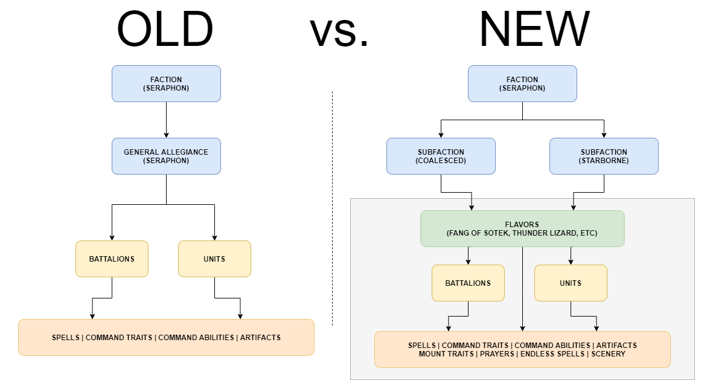

# AoS Reminders v4.0.0 - A New Approach to Data

AoS Reminders v4.0.0 has just been released - and there's a lot to talk about.

## TL;DR

- We've changed how we store our rules. Users will notice that we're doing a better job of automatically adding units/spells/command abilities/etc when appropriate.
  - For example, if you add a Mega Battalion, AoS Reminders will automatically fetch all of the required sub-battalion rules, as well as any required units, command traits, or rules that belong to those sub-battalions.
- Some **Factions** have been re-named or re-categorized:
  - `SKAVEN` -> `SKAVENTIDE`
  - `LEGIONS_OF_GRIEF` -> `LEGION_OF_GRIEF`
  - `TAMURKHANS_HORDE` -> now a **SubFaction** of `NURGLE`
  - `STORMCAST_ETERNALS_STORMKEEP` -> now a **SubFaction** of `STORMCAST_ETERNALS`
  - `BIG_WAAAGH, IRONJAWZ, BONESPLITTERZ` -> now **SubFactions** of `ORRUK_WARCLANS`
  - `GRAND_HOST_OF_NAGASH, LEGION_OF_BLOOD, LEGION_OF_SACRAMENT, LEGION_OF_NIGHT, SOULBLIGHT` -> now **SubFactions** of `LEGIONS_OF_NAGASH`
- We've added a new UI element - the **SubFaction** dropdown. This dropdown will only appear when a **Faction** can be taken in multiple configurations (see _**Introducing "SubFactions"**_ below).


- **[SUBSCRIBERS]** - We have migrated your existing saved armies - but you should still verify their accuracy.
  - To be totally transparent, we have [edited](https://github.com/daviseford/aos-reminders/pull/1074) more than 58,000 lines of code spread over 692 files.
  - Therefore, there is a non-zero chance that we missed an errant rule.
  - I would recommend just creating new saved armies to ensure everything is working as intended.

---

## What's New?

When I first began writing AoS Reminders last year, I took a few things for granted.

Mostly, I assumed that Games Workshop would continue to write books with the same general structure.

That assumption was accurate for about a year - and then it wasn't. With the release of the new Seraphon book, and the added layers of complexity in list-building today, AoS Reminders was badly in need of an update.

The ironic part of this update is that, while the update itself is **astonishingly huge** (over 58,000 lines of code updated), end-users will probably notice only three things:

1. The new **SubFaction** dropdown
2. Better auto-completion for mandatory units/artifacts/etc.
3. More accurate Warscroll Builder/Azyr PDF imports

---

## A New Data Structure

One of the more important design considerations for a project like AoS Reminders is the shape of the data. There are all sorts of arguments to be made for key-based vs index-based storage, which I won't go into here.

Suffice it to say, when you are managing thousands and thousands of rules, it is important to arrive at a data structure that is A.) easy to update and B.) easy to process (computationally). It's also important that our data structure matches the information being entered - and that's where we begin this blog post.

To give you an example of how we _used_ to describe a complex unit, I'll show you our `Morathi-Khaine` entry:

```ts
{
    name: `Morathi-Khaine`,
    effects: [
        {
            name: `Commanding Presence`,
            desc: `...`,
            when: [SHOOTING_PHASE, COMBAT_PHASE],
        }
        // more of her warscroll rules go here, etc...
        {
            name: `Black Horror of Ulgu`,
            desc: `...`,
            when: [HERO_PHASE],
            spell: true, // Note how we've declared this rule to be a spell
        },
        {
            name: `Worship Through Bloodshed`,
            desc: `...`,
            when: [HERO_PHASE],
            command_ability: true, // Note how we've declared this rule to be a command_ability
        },
    ],
},
```

This style of writing all of a character's rules in one spot _worked_, but we had to write a lot of piecemeal code to properly handle it.

For example, if you selected `Morathi-Khaine` in the UI, we had to run through _all_ of her rules, figure out which ones had special tags (like `spell` or `command_ability`), and then assign those tagged rules to the UI dropdowns so that a user knows they've been added.

We also have to make sure we _remove_ the tagged rules when Morathi is unselected from the UI - that logic could be the topic of its own blog post, so I won't go into it here - but I'm sure you can imagine the spaghetti code that resulted from all of these needs.

Now, I want to be clear - this pattern _works_. It served AoS Reminders very well for nearly two years.

And if Age of Sigmar battletomes hadn't evolved, we could have stayed with this forever.

## The Downfall of the Old Data Structure

Early Age of Sigmar Battletomes (think before Endless Spells became faction-specific (pre-Sylvaneth 2.0)) generally followed this pattern:

We had to track the following pieces of data:

```text
  - Artifacts
  - Battalions
  - Command Abilities
  - Command Traits
  - General Allegiance Traits
  - Scenery
  - Spells
  - Units
```

Units had all of the rules on their warscroll, plus whatever allegiance traits were granted to an army.

When a user selected an army, we just brought up their allegiance abilities and merged those rules with whatever else the user selected.

Keeping track of these rules was pretty trivial, to be honest. This pattern worked really well for a long time.

---

Later battletomes began to add more complex allegiance behaviors.

Kharadron Overlords is a great example of the newer style of allegiance abilities (all of the various Barak-* stuff). Ogor Mawtribes brought us even more ways to compose armies. More and more army lists began to be based around these complex allegiance behaviors.

At this point, battletomes had expanded in scope and ambition significantly, and we now had to track:

```diff
  - Artifacts
  - Battalions
  - Command Abilities
  - Command Traits
+ - Endless Spells
  - General Allegiance Traits
+ - Mount Traits
+ - Prayers (which started to be added willy-nilly to non-magical factions)
  - Scenery
+ - Specific Allegiance Traits (think Mawtribes, Hosts, Temples, Warclans, etc.)
  - Spells
  - Units
```

We could still _manage_ this - but it was getting difficult. We were doing all sorts of things to allow units to share artifacts and command traits. We were making best-effort attempts at detecting which Specific Allegiance you belonged to, but it really was getting difficult to handle all of this data.

Here's an example of a old "Specific Allegiance" entry - the Gristlegore Grand Court.

```
{
    name: `Gristlegore (Grand Court)`,
    effects: [
      {
        name: `Peerless Ferocity`,
        desc: `...`,
        when: [SHOOTING_PHASE, COMBAT_PHASE],
      },
      {
        name: `Call to War`,
        desc: `...`,
        when: [COMBAT_PHASE],
        command_ability: true,
      },
      {
        name: `Savage Strike`,
        desc: `...`,
        when: [START_OF_COMBAT_PHASE],
        command_trait: true,
      },
      {
        name: `Ghurish Mawshard`,
        desc: `...`,
        when: [START_OF_COMBAT_PHASE],
        artifact: true,
      },
    ],
  },
```

By the way, you've probably noticed that our terminology is getting pretty tough to handle.

What the heck is a "General Allegiance" vs a "Specific Allegiance"? What happens when they override each other?

## Enter... "Flavors"

**Flavors** (coined by [@exonian](https://github.com/exonian)) is the term that we now use at AoS Reminders to describe these "Specific Allegiances".

Think Kharadron Overlords Skyports, Flesh Eater Court Grand Courts, Seraphon Constellations, Stormcast Stormhosts, etc.

These **Flavors** generally apply their own artifact, command trait, and command abilities, as well as a simple rule or two.

It's a good thing we have a term to describe these types of rule-sets, because Games Workshop decided to expand their rules even more with the addition of what we call **SubFactions**.

## Introducing "SubFactions"

When Games Workshop released the new Seraphon battletome, I knew that we were in trouble.

We were already struggling to properly represent armies on the UI.

And the new Seraphon book was about to push the code to a breaking point.

---

See, a Seraphon player could now select a **Way of the Seraphon** (either **Coalesced** or **Starborne**).

The player would then select their **Constellation** - but their choice of **Constellation** depended on their **Way of the Seraphon** selection.

To make matters even more confusing, there are battalions that also depend on the **Way of the Seraphon** selection.


| Way of the Seraphon      | Constellation | Battalions |
| ----------- | ----------- | ----------- |
| Coalesced      | Koatl's Claw _or_ Thunder Lizard       | Temple-Hosts |
| Starborne   | Dracothion's Tail _or_ Fangs of Sotek        | Starhosts |

This was pretty tough to represent in code, and in the UI. We basically just shoved the **Way of the Seraphon** and **Constellation** options into the same dropdown and figured that the end-user would be intelligent enough to select everything.

That... worked. Sort of. I gritted my teeth, wrote some _really_ ugly code, and secretly prayed that the Seraphon book was a one-off.

---

A few battletome releases later, it became clear that this new style of rules was **not** an aberration.

What really pushed the codebase over the cliff was the release of the Stormcast Eternals Stormkeep.

The Stormkeep basically acted as an entirely different faction that shared many elements with the original Stormcast, but the amount of overlap was confusing and hard to represent faithfully.

In order to handle the Stormkeep properly within the application, we had to do something that I _hated_ - we created a totally new faction in AoS Reminders - `STORMCAST_ETERNALS_STORMKEEP`.

That's right - the Stormkeep represented such a departure from the rest of the Stormcast Eternals faction that _we had to create an entirely new faction to represent them_.

This was not good. I [raised this concern](https://github.com/daviseford/aos-reminders/issues/1073) with other AoS Reminders contributors over Discord and Github. We discussed current limitations of the system - we felt constrained and unable to easily represent relationships between items.

If you read [the data structure issue](https://github.com/daviseford/aos-reminders/issues/1073), you'll see us iterate through a few designs before arriving at the end result.

One thing that we had to do before proceeding -  we needed to define what exactly we are talking about!

## Factions, SubFactions, and Flavors - Oh My!

Let's get analytical here. What exactly defines these terms?

### Glossary

First, let's define a **Faction**.

- A **Faction** is the highest-level representation of an army/faction in AoS.
- A **Faction** is the aggregate set of rules that govern one or many **SubFactions**.
- If a **Faction** has multiple **SubFactions**, the user will be allowed to select a variant.

Next, **SubFactions**.

- A **SubFaction** belongs to a **Faction**.
- A **SubFaction** can dictate:
  - What **Flavors** it may contain.
  - What units/battalions/spells/etc are `available` (or `mandatory`).

Lastly in this high-level tier (but at the bottom), **Flavors**:

- These are the more "traditional" ways of configuring **Factions**.
- A **Flavor** may belong to one or many **Sub-Factions**.
- A **Flavor** can dictate:
  - What units/battalions/spells/etc are `available` (or `mandatory`).



## Bringing It All Together

Let's use Slaves to Darkness as an example.

Our **Faction** (Slaves to Darkness) contains multiple **SubFactions**: Host of the Everchosen, Cabalists, Ravagers, Knights of the Empty Throne, Idolators, etc.

We'll use the "Host of the Everchosen" **SubFaction** for this example.

Here's how we describe a **SubFaction** in our new data structure:

```ts
 'Host of the Everchosen': { // Name of the SubFaction
    effects: pickEffects(BattleTraits, [ // These are basic rules
      'Bane of the Mortal Realms',
      'Exalted Grand Marshall of the Apocalypse',
      'Fearless in His Presence',
      'The Will of the Everchosen',
      'The Eight Circles of the Varanguard',
    ]),

    mandatory: { // We can declare that certain things _must_ be taken with this SubFaction
      command_abilities: [keyPicker(CommandAbilities, ['Dark Prophecy'])],
    },

    available: { // We can also say that the following things are available
      battalions: [keyOmitter(Battalions, ["Gresh's Iron Reapers"])], // User can take any battalion _except_ "Gresh's Iron Reapers"
      flavors: [Flavors], // The various Circles
      units: [
          keyOmitter(Units, ['Idolator Lord on Chaos Chariot', 'Idolator Lord on Gorebeast Chariot']) // User can take any units _except_ these values
          // keyPicker(Units, ['Some Unit']) // We could alternatively add _only_ this unit to the mix
    ],

    },
  },
```

You'll see that we're now composing the **SubFaction** by describing how it uses other, smaller components.

Our battalions, units, and flavors follow the same pattern:

```ts
// Battalion description
"Gresh's Iron Reapers": {
    manadatory: {
      command_traits: [keyPicker(CommandTraits, ['Profane Oratory'])],
      units: [keyPicker(Units, ['Gorebeast Chariots'])],
    },
    effects: [
      {
        name: `Soulbutcher`,
        desc: `...`,
        when: [COMBAT_PHASE],
      },
    ],
},

// Unit description
'Archaon the Everchosen': {
    mandatory: {
      command_abilities: [keyPicker(CommandAbilities, ['All-seeing Dominion', 'By My Will'])],
    },
    effects: [],  // All of Archaon's effects go here
}
```

As you can see, it's a bit easier to reason about things when we've set it up this way.

The developer experience is phenomenal for this, by the way. Everything is auto-completed - setting up a complex unit feels like ordering food off of a menu.


TypeScript is amazing :)

## Speaking of TypeScript...

_If you're not a developer, or your eyes start to glaze over, I recommend skipping this section._

I consolidated a lot of types within the codebase. I cut down on the number of ad-hoc types, and forced many files and components to respect a core set of types.

I used `ts-prune` and `npx depcheck` to cut down on unnecessary dependencies and exports.

One thing I'd like to address in a future patch - the size of our application's payload.

```
File sizes after gzip:

  312.99 KB  build\static\js\main.733d2299.chunk.js // This chunk includes all rules
  181.39 KB  build\static\js\8.17b7f197.chunk.js
  126.38 KB  build\static\js\9.994ea37e.chunk.js
  87.4 KB    build\static\js\38.3b57ecda.chunk.js
  33.13 KB   build\static\js\13.f011a879.chunk.js
  31.61 KB   build\static\js\10.fdaa2884.chunk.js
  28.58 KB   build\static\js\4.548470d9.chunk.js
  24.71 KB   build\static\css\main.775c91a3.chunk.css
  20.56 KB   build\static\js\17.d7417ee3.chunk.js
  20.42 KB   build\static\js\39.783085a8.chunk.js
  13.07 KB   build\static\js\3.1bd762eb.chunk.js
  12.11 KB   build\static\js\24.f9d53378.chunk.js
  --------
  + [a bunch of sub-10kb chunks]
  ```

We can run `yarn analyze` to see how our sourcemaps are distributed - the size of our rules catalog accounts for nearly 300kb (after `gzip`).


I think there are ways that I can defer loading in all of the armies in the `main` chunk - but last time I tried that, I was left with an asynchronous, laggy-feeling mess on the front-end (since lazy-loading rules always incurs a slight delay).

I will be working hard on cutting down our `main` chunk size, and exploring other ways to compress and store text more efficiently.

## Making The Switch

We have well over 500 tests governing how AoS Reminders works. Those all had to be updated and adjusted to reflect our new data structure.

We have a ton of features - saved armies, shared armies, importing from Azyr/Warscroll Builder/Battlescribe. All of these features had to be updated as well.

I wrote migrations for armies saved on the backend as well - tracking all of these changes was tough!

We also had to move **Factions** and **SubFactions** around - most notably, the various Orruk Warclans **SubFactions** (Bonesplitterz, Ironjawz, and Big Waaagh).

Worst of all, I finally conceded my years-long grudge. Look - I think `Skaventide` is a poor substitute for `Skaven`, and I will always say `Skaven` in conversation - but I have _finally_ given in and changed the name in AoS Reminders.

It has taken over 24 days to arrive at the completion of this huge change.

It has been exhausting and rewarding!

## Future Features

Our work at AoS Reminders is never done. Beyond our continued commitment to always having up-to-date rules, we are also working hard to add useful features!

A small preview of what's to come...

- Adding rule-specific metadata _a la_ Battlescribe.

```diff
{
    name: `Glowy Lantern (Taker Tribe)`,
    desc: `...`,
+   sources: [
+         {
+           name: 'Battletome: Sons of Behemat',
+           publication_date: '20-10-17',
+           type: 'battletome',
+         },
+         {
+           name: 'Battletome: Sons of Behemat Errata, November 2020',
+           publication_date: '20-11-18',
+           type: 'errata',
+         },
+       ],
+   // The above would indicate in the UI that this rule originally came from the Battletome, but has been updated with the wording from a more recent errata.
    when: [HERO_PHASE],
},
```

- Uploading Warscroll Builder/Azyr PDFs (and Battlescribe HTML files) alongside your saved armies.
- Better downloadable PDFs.
- And much more - [check our open issues](https://github.com/daviseford/aos-reminders/issues) to see what we're working on!

## Wrapping Up

I'm probably not the first person to mention that 2020 was a rough year, so I won't dwell on it.

I'd like to thank all of the contributors who have continued to build our codebase. AoS Reminders wouldn't be the same without you!

I'd like to thank all of our subscribers - past, present, and future. While AoS Reminders will always be an open-source, totally free service, I have worked hard to add value to the application for our supporters.

If you're not subscribed - [please consider it](https://aosreminders.com/subscribe). A 12-month subscription costs $11.88 - that's 99 cents per month.

I firmly believe that the amount of time that you'll save by using our advanced features is worth a dollar.

I get amazing emails in my inbox from parents who are playing the game with their children, or their spouse.

I'm a big believer in using the Internet to spread good things - so this warms my heart.

I hope everyone has a wonderful, safe, and calm 2021 :)
