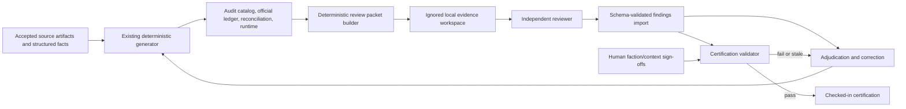
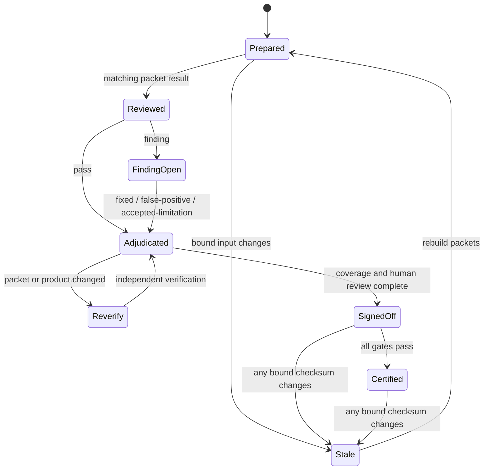

# AoS 4 Data Accuracy Certification

Phase 1 has produced a deterministic AoS 4 corpus, source ledger, reconciliation
report, audit catalog, and runtime projection. Those controls prove that the same
accepted inputs produce the same output, but they do not prove that every accepted
input was interpreted correctly. A concrete example already exists in the current
corpus: an official-PDF extraction propagated the malformed base size `2 5 m m`
for Lord-Terminos through strict generation and into the generated products.

This plan adds an independent, evidence-bound accuracy review around that
pipeline. It also applies the review to the entire current Phase 1 snapshot,
remediates the findings through source or transformation changes, and leaves a
permanent certification gate for future refreshes. It does not add an embedded
model provider, trust model output automatically, modernize packages, or change
the established UI.

## Goal Capsule

Certify that the checked-in AoS 4 Phase 1 corpus faithfully represents its
accepted Games Workshop and Wahapedia evidence, with every material discrepancy
or uncertainty reviewed, resolved, and traceable to the exact data revision that
was approved.

The certification must answer all of the following:

- Did acquisition preserve the accepted source?
- Did extraction assign the correct values to the correct entities and fields?
- Did normalization preserve meaning while producing valid structured data?
- Did reconciliation apply the documented source-authority policy correctly?
- Did generation preserve the reviewed structured facts in audit and runtime
  products?
- Were all material findings independently adjudicated and verified?
- Can a maintainer prove that sign-off still applies to the current inputs?

Success unblocks Phase 2 package modernization. Failure or stale evidence keeps
Phase 2 blocked without affecting the current production UI.

---

## Product Contract

### Actors

- **Maintainer/curator:** prepares review evidence, adjudicates findings, corrects
  source records or transformations, regenerates products, and requests
  certification.
- **Independent adversarial reviewer:** receives immutable evidence packets,
  reports passes, findings, or inability to verify, and cannot edit accepted
  inputs or generated products.
- **AoS domain/faction reviewer:** checks a stratified sample for rules meaning,
  faction coverage, and game-context correctness, then records human sign-off.
- **Generation and certification gate:** deterministically validates evidence,
  coverage, resolutions, sign-offs, and exact input checksums.

### User and System Flows

#### F1 — Prepare immutable review evidence

1. The maintainer starts from a fully generated candidate corpus.
2. The review command inventories official facts, Wahapedia records, policies,
   overrides, reconciliation decisions, audit output, and runtime output.
3. It writes deterministic review packets to the ignored review workspace.
4. Each packet identifies its exact source records, locators, checksums,
   structured values, generated destinations, authority class, and rubric
   version.
5. Re-running the command against unchanged inputs produces the same packet IDs
   and semantic payloads.

#### F2 — Perform and import an independent review

1. A reviewer works from the packets without write access to accepted data.
2. For each assigned packet, the reviewer records `pass`, `finding`, or
   `cannot-verify`.
3. Findings identify the affected canonical entity and field, evidence locator,
   observed value, expected interpretation, severity, confidence, and rationale.
4. The import command rejects malformed results, unknown packets, stale packet
   checksums, missing evidence, and unrecognized reviewer metadata.
5. Importing a finding does not change the candidate corpus.

#### F3 — Adjudicate, correct, and re-verify

1. The maintainer assigns each finding a resolution: `fixed`,
   `false-positive`, or `accepted-limitation`.
2. Fixes are made in accepted structured inputs, extractors, normalizers,
   reconciliation policy, or review overrides—not in generated products.
3. The corpus and review packets are regenerated.
4. Any changed packet is reviewed again.
5. Blocker and major resolutions are verified by someone other than the
   originating reviewer and cannot be self-approved by the resolver.

#### F4 — Human sign-off and certification

1. Human reviewers inspect the required faction/context sample and all blocker or
   major corrections.
2. The certification gate verifies coverage, finding resolution, reviewer
   separation, sign-offs, and every bound checksum.
3. A passing summary is written for the exact corpus revision.
4. The checked-in certification validator runs without the ignored raw cache and
   fails if the accepted structured artifacts or generated products drift.

#### F5 — Refresh the data later

1. A new source manifest or accepted fact makes the previous certification stale.
2. The full local generator prepares the candidate and changed review cohorts.
3. Review, adjudication, regeneration, and sign-off repeat for the changed
   evidence plus permanent high-risk controls.
4. Nothing is accepted merely because it existed in the previous version or
   passed a prior checksum.

### Requirements

#### Evidence and reviewer contract

- **R1:** Review packets must bind canonical IDs, source record IDs, source
  locators, source checksums, structured values, generated destinations,
  authority class, game context, and review-rubric version.
- **R2:** Packet IDs and semantic contents must be deterministic for unchanged
  inputs. Timestamps and run-local paths must not affect identity.
- **R3:** Source excerpts needed during review must remain under
  `.cache/aos4/review/`. Checked-in certification artifacts must contain only
  checksums, locators, structured facts, non-verbatim findings, dispositions,
  sign-offs, and summaries.
- **R4:** Reviewer results must record reviewer identity, reviewer kind
  (human/agent), tool or model identity where applicable, protocol and prompt
  version, packet checksum, review time, outcome, and evidence-based rationale.
- **R5:** The reviewer interface must be provider-neutral JSON validated by the
  repository. No model SDK, remote runtime dependency, or automatic write-back
  may be added.
- **R6:** Reviewer output is advisory evidence. It must never directly modify,
  promote, or certify game data.

#### Review coverage and resolution

- **R7:** The current corpus review must cover all 1,350 official ledger records,
  including the 1,303 effective and 47 superseded records, and verify their
  source extraction and application status.
- **R8:** All 669 official-versus-secondary discrepancies and all 12 official
  profile-only facts in the current reconciliation report must receive an
  individual review outcome and disposition.
- **R9:** The secondary-source semantic review must cover every faction and
  supported game context. It must account for every source record represented in
  the audit catalog (currently 17,443) and verify the disposition of every ignored
  record (currently 18,897), using deterministic shards where needed. It must also
  give focused review to every high-risk cohort: policies and overrides,
  ambiguous identities, aliases and renames, reactions, phase/timing conflicts,
  unknown or incomplete fields, official overrides, duplicate candidates, and
  current/seasonal/Spearhead/Legends/historical boundaries.
- **R10:** Human review must sample every faction/context stratum and must inspect
  every blocker or major correction and every accepted limitation before sign-off.
  At minimum, the deterministic sample must contain one source-to-runtime packet
  for every faction in every supported context and one packet from each high-risk
  cohort; one packet may satisfy multiple strata. The sample manifest and
  rationale must be checked in.
- **R11:** Every finding must have an explicit disposition and rationale. Open
  blocker or major findings prevent certification. `accepted-limitation` is
  restricted to non-material limitations that do not make the runtime rule or
  characteristic misleading.
- **R12:** Blocker and major findings require independent resolution
  verification. The originating reviewer and the resolver cannot be the sole
  verifier.
- **R13:** Corrections must update the accepted input, extractor, normalizer,
  policy, or override and then regenerate all products. Generated files must
  never be hand-corrected.
- **R14:** Confirmed defects must become compact regression fixtures or golden
  truth cases, preserving evidence locators and expected structured meaning
  without checking in prohibited source bodies.

#### Automated gates and certification

- **R15:** A deterministic pathology validator must reject clearly impossible or
  malformed structured values and flag suspicious values for review. It must
  operate on explicitly decoded UTF-8 data rather than terminal-rendered text.
- **R16:** At minimum, pathology checks must cover malformed measurement tokens,
  replacement/control characters, invalid base-size shapes, invalid weapon or
  characteristic shapes, unresolved placeholders, and suspicious single-letter
  token runs. Heuristics must create findings rather than silently rewriting
  uncertain values.
- **R17:** Certification must bind the accepted manifest, corpus review, audit
  catalog, reconciliation report, official ledger, runtime catalog, review
  protocol, rubric, findings, resolutions, and sign-offs by checksum.
- **R18:** Any bound checksum change must invalidate the certification. Missing,
  malformed, stale, or partially imported review artifacts must fail closed.
- **R19:** A checked-in-only certification command must run in CI without the
  ignored PDF/HTML cache. Full source replay and packet preparation remain
  explicit local maintenance commands.
- **R20:** The current Phase 1 snapshot must receive a complete passing
  certification and any required corrections before Phase 2 begins.
- **R21:** Future candidates must pass the same review cycle. Prior findings and
  golden cases remain regression controls, but prior certification cannot be
  transferred to changed evidence.
- **R22:** The certification summary must report revision, bound checksums,
  coverage by source/context/faction, outcome counts, severity counts, open
  limitations, correction verification, human sign-offs, and pass/fail status.

#### Product and source-policy boundaries

- **R23:** Games Workshop remains authoritative when an applicable official
  source exists. Wahapedia remains the preferred coherent secondary source for
  discovery and broad coverage. Disagreements must remain visible and
  dispositioned.
- **R24:** No v3 behavior, compatibility adapter, or legacy-data fallback may be
  preserved merely to make a review pass.
- **R25:** This work must not reskin or otherwise change the established UI/UX.
- **R26:** Package modernization and unrelated dependency upgrades remain Phase 2
  work.
- **R27:** Raw PDFs, raw HTML, full source text, and copyrighted review packets
  must not be committed.
- **R28:** Before full-corpus findings are accepted, each reviewer configuration
  must pass a calibration set containing known passes, known defects, source
  disagreements, and insufficient-evidence cases. Calibration results and rubric
  version must be recorded; calibration does not count toward corpus coverage.
  Passing requires finding every seeded blocker/major defect, proposing no
  unsupported expected value, and returning `cannot-verify` for every seeded
  insufficient-evidence case. Blind control packets must remain interspersed in
  each review batch. Any reviewer tool/model, prompt, protocol, or rubric change
  requires recalibration.
- **R29:** Source excerpts and acquired markup must be treated as untrusted data,
  never as reviewer instructions. External-agent assignments require a declared
  provider/recipient, explicit maintainer approval for that recipient, minimized
  excerpts, and a read-only reviewer environment without repository mutation or
  unrelated tools. Imported results must bind the approved assignment metadata.
- **R30:** Final certification must compare the accepted source manifest with an
  independently produced current inventory from the Games Workshop and Wahapedia
  discovery surfaces. Missing, unexpectedly added, inaccessible, or ambiguously
  scoped sources must block certification or receive an explicit non-material
  disposition. The inventory and observation time must be checksum-bound.
- **R31:** For fields where the evidence can independently determine structured
  meaning, the first review pass must derive the expected interpretation without
  exposing the generated answer. A separate comparison pass then evaluates that
  interpretation against source, audit, and runtime values. Exceptions must be
  explicit when blind derivation is impossible.

### Acceptance Scenarios

- **A1 — Known malformed base size:** A candidate containing Lord-Terminos base
  size `2 5 m m` is blocked by the pathology validator. The correction is made
  in the official extraction/normalization path, generated outputs are rebuilt,
  the packet is re-reviewed, and a regression case preserves `25mm`.
- **A2 — Stale reviewer response:** A result whose packet checksum differs from
  the current packet is rejected without importing any of its findings.
- **A3 — Source disagreement:** An official-versus-Wahapedia discrepancy packet
  presents both structured values and evidence locators. The reviewer checks
  extraction fidelity; the existing authority policy determines the winner, and
  the disagreement remains in the audit trail.
- **A4 — Unverifiable fact:** A reviewer may return `cannot-verify`. The
  certification remains blocked until the fact is supported, removed from the
  accepted current scope, or documented as a non-material accepted limitation
  with human approval.
- **A5 — Changed source manifest:** A passing certification becomes stale when
  the manifest checksum changes, even if the generated aggregate counts stay the
  same.
- **A6 — Reviewer independence:** Certification fails when a blocker or major
  finding lacks a distinct resolution verifier.
- **A7 — Generated-file edit:** Editing a runtime or audit product without
  changing its reviewed upstream inputs causes checksum validation to fail.
- **A8 — Deterministic packets:** Two preparations from the same accepted inputs
  and protocol produce identical packet IDs, cohort membership, and semantic
  content.
- **A9 — Current-corpus completion:** Certification cannot pass until every
  official record, reconciliation discrepancy, high-risk cohort, and required
  faction/context sample has a valid outcome.
- **A10 — Clean CI checkout:** The checked-in certification validator succeeds
  using committed structured artifacts and fails closed without attempting
  network access or requiring ignored source files.
- **A11 — Reviewer calibration failure:** A reviewer configuration that misses a
  seeded material defect or invents an unsupported correction cannot contribute
  corpus outcomes until it is recalibrated and passes.
- **A12 — Incomplete accepted manifest:** Every listed artifact passes review, but
  independent source discovery finds an applicable current official document or
  Wahapedia cohort absent from the manifest. Certification remains blocked.
- **A13 — Prompt injection in source markup:** A source excerpt contains text that
  tells the reviewer to ignore the rubric or modify a repository file. The text
  is treated only as evidence content, the reviewer produces schema-bound output,
  and no repository mutation is possible.
- **A14 — Confirmation-bias control:** A blind source-interpretation pass derives
  a value that differs from the generated value. The comparison creates a finding
  rather than replacing the independent interpretation with the generated answer.

### Out of Scope

- Selecting or hosting a particular LLM provider.
- Automatically accepting or applying model-proposed corrections.
- Replacing Games Workshop or Wahapedia acquisition workflows.
- Committing raw or full-text source material.
- Phase 2 dependency upgrades or broad code modernization.
- UI redesign, reskinning, or unrelated product work.
- AoS v3 compatibility, migrations for saved v3 data, or legacy fallbacks.
- New AoS 4 content beyond what is needed to correct or certify the current
  Phase 1 scope.

---

## Planning Contract

### Current-State Evidence

- `data/aos4/reviews/corpus-2026-07-27.json` pins aggregate counts and checksums,
  but it has no independent reviewer identity, finding lifecycle, coverage
  proof, or certification status.
- `src/aos4/generate/corpusCommand.ts` validates exact artifacts and aggregate
  reconciliation checksums, but does not verify that extracted structured
  meaning matches the source.
- `src/aos4/generate/integrity.ts` covers domain errors, dispositions, untrusted
  sources, unknown timing, unsafe HTML, and reconciliation errors, but has no
  source-fidelity or certification checks.
- The current strict catalog test covers 28 factions, 1,268 warscrolls, 1,002
  profiles, 4,260 abilities, 2,247 weapons, 104 artifacts, 17,443 source records,
  and 18,897 ignored records.
- The official ledger currently contains 1,350 records: 1,303 effective and 47
  superseded, with 928 applied, 12 profile-only, and 363 represented as other
  structured official facts.
- The reconciliation report contains 669 discrepancies: 225 notes, 165 regiment
  options, 143 base sizes, 110 names, 25 points, and one unit-size discrepancy.
- Strict generation currently accepts at least one demonstrably malformed
  official extraction: Lord-Terminos base size `2 5 m m`.
- `.github/workflows/nodejs.yml` runs lint, tests, and build, but does not
  validate a checked-in data certification.

### High-Level Technical Design

The repository will own deterministic evidence preparation, schema validation,
finding lifecycle, and certification. The actual adversarial review may be
performed by a human or an external agent, but it operates through the same
immutable packet/result contract.



Review packets are projections of existing evidence, not a second data model or
an alternative generator. Checked-in certification artifacts establish why a
particular generated revision is trustworthy; ignored packets provide the
reviewer enough source context without violating the repository's source-storage
rules.



### Proposed Output Structure

```text
src/aos4/review/
  records.ts
  packets.ts
  findings.ts
  pathology.ts
  certification.ts
  packetCommand.ts
  certificationCommand.ts

data/aos4/certifications/aos4-corpus-2026-07-28/
  manifest.json
  findings.json
  resolutions.json
  signoffs.json
  summary.json

docs/data/
  aos4-accuracy-review.md
```

The revision directory name is human-readable; the manifest inside it is the
canonical identity and binds all required artifacts by checksum. If remediation
changes the current corpus, the final revision name and manifest must reflect the
regenerated accepted revision rather than retaining a misleading date.

### Key Technical Decisions

| ID | Decision | Status | Rationale |
|---|---|---|---|
| KTD1 | Use deterministic, provider-neutral JSON packets and reviewer results; keep reviewer orchestration outside the runtime and package graph. | session-settled: user-approved — chosen over an embedded model SDK/provider-specific mutator because the neutral contract preserves auditability and defers provider/package coupling | The user wants an adversarial reviewer, but Phase 2 owns package modernization. This keeps the evidence review reproducible and avoids coupling certification to one model vendor. |
| KTD2 | Treat reviewer output as findings only; corrections and acceptance occur through an explicit resolution workflow. | session-settled: user-approved — chosen over reviewer auto-mutation because an independent reviewer must not silently alter the evidence it assesses | Findings remain independently inspectable, and every accepted correction retains an explicit human-controlled resolution trail. |
| KTD3 | Bind certification to exact source, review, reconciliation, audit, runtime, protocol, findings, resolutions, and sign-off checksums. | user-approved | Aggregate counts can stay constant while meaning changes. Exact binding makes stale approval detectable and fail-closed. |
| KTD4 | Store review source excerpts and complete packets only in `.cache/aos4/review/`; commit structured, non-verbatim audit metadata. | accepted | This preserves reviewer evidence while honoring the existing rule against committing raw PDFs, HTML, or full source text. |
| KTD5 | Use three materiality levels: `blocker`, `major`, and `minor`; allow `accepted-limitation` only when runtime meaning is not misleading. | accepted | A small, explicit severity model supports a decisive release gate without inventing a complex issue taxonomy. |
| KTD6 | Require full machine/agent review of official facts, reconciliation decisions, current source/ignored records, and high-risk cohorts, plus stratified human review across every faction/context and every material correction. | session-settled: user-approved — chosen over machine-only certification because the confirmed scope includes human/faction sign-off for domain meaning | Automated review provides breadth; human domain review remains the ground-truth check for game meaning and source ambiguity. |
| KTD7 | Convert confirmed defects into compact golden truth cases and static pathology regression checks. | accepted | The review should permanently improve the pipeline rather than produce a one-time checklist. |
| KTD8 | Make suspicious-value detection report evidence instead of performing broad automatic correction. Only structurally impossible values are hard errors. | accepted | OCR and typography heuristics can identify risk, but silent rewriting can manufacture plausible, incorrect rules. |
| KTD9 | Provide two gates: full local source replay/packet preparation and a committed-artifact certification check suitable for clean CI. | accepted | Ignored source caches must not be committed merely to make CI replay acquisition. CI can still prove that the checked-in certification matches the checked-in corpus. |
| KTD12 | Require independent verification for blocker and major resolutions, while allowing one reviewer to cover multiple packets. | accepted | Separation at the material finding boundary gives useful independence without making every low-risk record require two complete reviews. |
| KTD13 | Calibrate every reviewer configuration against a seeded golden set before accepting its full-corpus results. | accepted | Reviewer independence alone does not establish competence or rubric compliance. Calibration exposes systematic misses and unsupported guessing before they contaminate coverage. |
| KTD14 | Use a blind evidence-interpretation pass before revealing generated values wherever the source can independently determine the expected structure. | accepted | Showing a reviewer the pipeline answer first encourages confirmation rather than adversarial interpretation. A paired comparison preserves independence without building a second generator. |
| KTD15 | Certify a checksum-bound source snapshot observed during the review campaign, and independently check source-inventory completeness immediately before final sign-off. | accepted | Local checksums cannot detect an applicable remote source that was never acquired or changed after the last discovery run. The certification claim must be both temporally explicit and inventory-complete. |

### Agent-Native Assessment

Agent-native support is required because an adversarial agent is an intended
reviewer. The capability is intentionally exposed as durable files and CLI
commands instead of an agent-only hidden pathway:

- An agent and a human receive the same immutable packet schema and rubric.
- Review progress is resumable through stable packet IDs and imported outcomes.
- Packet checksums prevent an agent from reviewing stale evidence.
- `cannot-verify` is a first-class result, so uncertainty is not coerced into a
  fabricated correction.
- Agents can report findings but cannot certify or write accepted data directly.
- Human sign-off remains required for the domain sample and material corrections.
- Tests exercise packet preparation, result import, adjudication, and
  certification as a complete agent workflow.

### Review Rubric

Each packet must direct the reviewer to evaluate only evidence-grounded questions:

1. **Identity:** Does the source fact belong to the canonical faction,
   warscroll/profile, ability, weapon, or artifact selected by the pipeline?
2. **Source fidelity:** Do the structured source values match the cited page,
   record, and locator?
3. **Semantics:** Are timing, phase, reaction, effect, target, restrictions,
   characteristics, and game context represented without changing meaning?
4. **Authority:** Was the Games Workshop/Wahapedia conflict policy applied to the
   correct field and context?
5. **Projection:** Did the reviewed value reach the expected audit and runtime
   locations without loss or unsafe markup?
6. **Completeness:** Is anything material missing, duplicated, ambiguously
   matched, or left current when it belongs to a different season/context?

The rubric must include examples of a pass, a material finding, a formatting-only
finding, and `cannot-verify`. It must forbid guessing beyond the evidence and
must require a locator-backed rationale for any proposed expected value.
Evidence text must be clearly delimited as untrusted content. On blind packets,
the reviewer derives expected structure before receiving any generated value;
the comparison step uses the saved derivation rather than asking the reviewer to
start over with the answer visible.

---

## System-Wide Impact

### Data lifecycle and state

The certification is a new state layer around the existing immutable candidate
pipeline; it is not a replacement for the accepted review file or generator.

- A **candidate revision** may be generated and reviewed but cannot become the
  accepted certified revision while any required evidence is missing.
- A **packet result** is valid only for its packet checksum and reviewer protocol.
- A **finding resolution** remains historical evidence even when a corrected
  packet supersedes the finding; the old outcome is not counted as current
  coverage.
- A **certification** is valid only while every bound artifact matches. It has no
  grace period and cannot be patched in place after data drift.
- A **future refresh** creates a new candidate and review delta. It does not
  mutate or erase the previous certification directory.
- A **remote-source observation** is part of the certified snapshot. CI proves
  that the repository still matches that observation; it does not claim that a
  remote site has not changed since the recorded observation time.

Large review campaigns must be resumable by packet/cohort. Import is atomic per
validated result batch, and coverage is recalculated from durable ledgers rather
than an in-memory run. An interrupted reviewer or maintainer session therefore
loses only unexported work, not previously validated outcomes.

### Entry points and interfaces

- `package.json` gains candidate packet-preparation and certification-validation
  entry points under the existing `data:aos4:*` namespace.
- The generation command reads certification only at the accepted-revision gate;
  acquisition and candidate preparation remain usable before certification.
- CI adds the committed-artifact gate but does not gain network, PDF, HTML, or
  model dependencies.
- `AGENTS.md` and the maintenance guide become the policy interfaces for future
  maintainers and agents.
- Runtime application components continue to consume only the existing generated
  catalog shape. No review or certification records enter UI state or bundles.

### Failure propagation and recovery

- Packet preparation failure leaves accepted inputs and existing certification
  untouched.
- Reviewer-result validation is all-or-nothing for the submitted batch; invalid
  data produces diagnostics without partial ledger changes.
- An upstream correction marks affected packet outcomes and the certification
  stale before regeneration can be accepted.
- Failed regeneration leaves generated-file drift detectable by existing and new
  no-write checks.
- A failed certification attempt writes no passing summary. Diagnostic reports
  may be produced locally, but only a schema-valid manifest with status `pass`
  can be treated as certified.
- Recovery always resumes from accepted inputs and durable ledgers. It never
  copies a value out of a finding directly into generated output.

### Security, privacy, and source handling

Review packets can contain source excerpts that must be treated like the existing
ignored acquisition cache. Commands must avoid printing complete packet bodies
in routine logs, and documentation must warn reviewers not to paste them into an
unapproved external service. Checked-in reviewer metadata must use stable
project-safe identifiers rather than credentials or unnecessary personal data.
No API keys, provider tokens, source bodies, or model conversations belong in
certification artifacts.

Acquired text and markup are an untrusted input boundary even when the publisher
is trusted for game rules. Packet templates must isolate that content from the
rubric, and an external reviewer must have only the packet and output schema—not
repository write access or unrelated tools. Assignment metadata records the
approved recipient so result import can reject an unattributed or unauthorized
review path.

---

## Risks and Dependencies

| Risk | Impact | Mitigation and early signal |
|---|---|---|
| Reviewer confidently agrees with a wrong extraction. | A false pass creates unwarranted trust. | KTD13 calibration, adversarial examples, `cannot-verify`, human faction/context sampling, and independent verification for material fixes. Track seeded miss and unsupported-claim rates before accepting outcomes. |
| Reviewer anchors on the generated answer. | Independent review becomes a restatement of current behavior. | KTD14 derives expected structure from source evidence before a separate comparison reveals the generated value. |
| One rubric or reviewer has a correlated blind spot. | Broad machine coverage can still miss one class of semantic error. | Version the rubric, separate material verification, use human domain review, and group findings by field/cohort so suspicious zero-finding cohorts are visible. |
| Full-corpus review volume becomes unmanageable. | Phase 1 stalls or reviewers rush. | Deterministic sharding, resume by packet, cohort coverage dashboards, compact packets, and prioritized official/high-risk campaigns. Coverage requirements remain fixed; batching changes, not the gate. |
| Review packets leak copyrighted source text. | Repository or external-service policy violation. | Keep excerpts under ignored `.cache/aos4/review/`, commit only non-verbatim structured audit data, minimize routine logging, and document approved review handling. |
| Source content injects instructions into an agent review. | The reviewer ignores the rubric, leaks data, or attempts mutation. | R29 treats excerpts as delimited untrusted data, requires an approved recipient and read-only environment, and regression-tests instruction-shaped source content. |
| The accepted manifest omits an applicable current source. | Every reviewed record can pass while the corpus remains incomplete. | KTD15 independently inventories discovery surfaces immediately before sign-off and binds the observation to certification. |
| Certification logic becomes a parallel generator. | Two competing interpretations drift and certification proves only itself. | Packets project existing source/audit/runtime records and add evidence links; expected truth comes from reviewer evidence and golden cases, not independent regeneration logic. |
| A maintainer “fixes” generated JSON to close a finding. | The next regeneration reintroduces the defect and provenance is lost. | R13 upstream-only correction, checksum binding, no-write generation, and generated-file drift tests. |
| CI cannot replay ignored source artifacts. | Teams weaken the gate or commit prohibited cache files. | KTD9 splits full local replay from a committed-artifact certification validator; CI validates exact checked-in products and ledgers without pretending to re-fetch truth. |
| A source refresh changes meaning without changing counts. | Aggregate pins continue to pass. | KTD3 binds individual artifacts and protocol inputs by checksum; any checksum drift invalidates sign-off. |
| Human sign-off is nominal rather than evidence-based. | The human gate adds ceremony without accuracy. | Deterministic sample manifest, locator-backed rubric outcomes, named sign-offs, all material corrections in scope, and coverage assertions in certification. |
| Ambiguous official layouts cannot be resolved mechanically. | The pipeline may invent certainty or remain blocked. | First-class `cannot-verify`, curator escalation, explicit non-material limitation criteria, and no certification when runtime meaning would be misleading. |
| Phase 2 work overlaps before certification. | Dependency upgrades obscure data corrections and expand review scope. | Treat R20 as a hard milestone; keep package changes out of the certification branch except scripts using the existing toolchain. |
| Source pages or PDFs disappear later. | Future reviewers cannot reproduce an old decision. | Preserve publisher, authority, version/date, URL, checksum, locator, and non-verbatim structured fact records already required by repository policy; retain prior certifications immutably. |

Dependencies are intentionally limited to the current TypeScript/Node toolchain,
the accepted local source cache, available Games Workshop/Wahapedia evidence, and
human AoS reviewers. No new hosted service is required for the certification
machinery.

---

## Implementation Units

### U1 — Review domain, schemas, and durable serialization

**Purpose:** Establish the provider-neutral contract before any reviewer is run.

**Files:**

- Add `src/aos4/review/records.ts`
- Add `src/aos4/review/findings.ts`
- Add `src/aos4/review/index.ts`
- Add `src/tests/aos4/reviewFindings.test.ts`

**Work:**

- Define versioned records for packets, assignments, reviewer metadata, outcomes,
  findings, dispositions, verification, sign-offs, and certification manifests.
- Record an approved recipient and source-handling attestation for every external
  reviewer assignment.
- Use canonical source and entity IDs already produced by the generator.
- Define stable IDs from semantic identity and bound checksums.
- Validate every imported enum, checksum, evidence reference, relationship, and
  reviewer role at the repository boundary.
- Keep timestamps as audit fields but exclude them from semantic packet identity.
- Reject duplicate outcomes, unresolved references, invalid status transitions,
  and reviewer/resolver/verifier conflicts.
- Add deterministic serialization and checksum helpers consistent with existing
  generation conventions.
- Validate calibration results and prevent uncalibrated reviewer configurations
  from contributing current coverage.

**Tests:**

- Round-trip every record type.
- Prove stable serialization and IDs across equivalent object ordering.
- Reject stale checksums, duplicate IDs, illegal dispositions, missing evidence,
  and insufficient reviewer separation.
- Prove a failed import does not partially update the ledger.
- Reject full-corpus outcomes from an uncalibrated reviewer configuration.
- Reject external results that do not match an approved assignment/recipient.

**Requirements:** R1-R6, R11-R12, R17-R18, R28-R29.

**Settled decisions:** KTD1-KTD2.

### U2 — Deterministic packet builder and ignored review workspace

**Purpose:** Give reviewers sufficient evidence to check source-to-runtime meaning
without committing raw source bodies.

**Files:**

- Add `src/aos4/review/packets.ts`
- Add `src/aos4/review/packetCommand.ts`
- Add `src/tests/aos4/reviewPackets.test.ts`
- Update `package.json`
- Update `.gitignore` only if the chosen workspace is not already covered by
  `.cache`

**Work:**

- Build packet cohorts for official facts, reconciliation discrepancies,
  secondary-source semantic facts, high-risk categories, human samples, and
  golden truth cases.
- Build a blind source-interpretation view and a paired comparison view for
  independently derivable structured fields.
- Include source values, locators/checksums, normalized values, authority
  decisions, audit/runtime destinations, and nearby source excerpts only in the
  ignored workspace.
- Generate a committed-safe packet index containing IDs, checksums, cohort tags,
  faction/context coverage, and assignment status.
- Add a preparation command that requires the local accepted-source cache and
  writes only to `.cache/aos4/review/` unless explicitly exporting
  schema-validated reviewer results.
- Add a deterministic sampler seeded by the corpus revision. The sample must
  include every faction/context stratum and overweight high-risk cohorts.
- Build a seeded calibration cohort with known pass, defect, disagreement, and
  insufficient-evidence cases; keep it separate from live coverage metrics and
  intersperse blind controls in every review batch.
- Delimit excerpts as untrusted data, minimize them for the assigned question,
  and export them only through an explicitly approved assignment.
- Ensure packet contents do not confuse generated outputs with independent
  expected truth.

**Tests:**

- Snapshot packet/index semantic shapes using compact fixtures.
- Prove deterministic cohort membership and sampling.
- Prove excerpts never appear in committed-safe indexes.
- Prove all required official, reconciliation, faction, context, and high-risk
  records are assigned.
- Prove missing cache artifacts fail with an actionable error rather than falling
  back to the network.
- Prove calibration packets cannot be counted as reviewed corpus records.
- Prove generated values are absent from blind packet views and that saved blind
  interpretations drive the comparison pass.
- Prove instruction-shaped evidence cannot alter the packet rubric or result
  schema and that unapproved export metadata is rejected.

**Requirements:** R1-R5, R7-R10, R14, R27-R31.

**Settled decisions:** KTD1, KTD6.

### U3 — Pathology checks and golden truth regressions

**Purpose:** Catch deterministic extraction artifacts before they need reviewer
judgment and preserve every confirmed accuracy defect as a regression.

**Files:**

- Add `src/aos4/review/pathology.ts`
- Add `src/tests/aos4/pathology.test.ts`
- Update `src/aos4/data/gamesWorkshop/battleProfiles.ts`
- Update `src/tests/aos4/battleProfiles.test.ts`
- Update `src/aos4/generate/integrity.ts`
- Update `src/tests/aos4/catalogIntegrity.test.ts`

**Work:**

- Add explicit UTF-8 string and control-character validation at structured-data
  boundaries.
- Validate base sizes, numeric measurements, weapon/profile characteristics,
  required text, and placeholder-free generated values.
- Separate hard structural failures from heuristic review flags.
- Add review flags for suspicious token splitting and other OCR/layout patterns
  without globally replacing them.
- Fix the Lord-Terminos `2 5 m m` extraction through the smallest upstream
  parsing/normalization correction supported by the official evidence.
- Add a golden truth fixture binding that source locator to the corrected `25mm`
  structured value.
- Feed heuristic flags into review cohorts and certification coverage.

**Tests:**

- Reproduce the current Lord-Terminos failure and prove the regenerated value.
- Cover valid multi-base entries so the fix does not collapse legitimate values.
- Distinguish actual UTF-8 corruption from a terminal decoding artifact.
- Reject impossible structured values and emit deterministic flags for suspicious
  but potentially valid values.

**Requirements:** R13-R16, R20.

### U4 — Findings import, adjudication, and certification gate

**Purpose:** Turn review results into a fail-closed, checksum-bound release
decision.

**Files:**

- Add `src/aos4/review/certification.ts`
- Add `src/aos4/review/certificationCommand.ts`
- Add `src/tests/aos4/certification.test.ts`
- Update `src/aos4/generate/corpusCommand.ts`
- Update `src/tests/aos4/corpusGeneration.test.ts`
- Update `package.json`
- Update `.github/workflows/nodejs.yml`

**Work:**

- Import reviewer results atomically after schema, packet, checksum, reviewer, and
  evidence validation.
- Require a passing calibration record for the exact reviewer/protocol
  configuration before importing its corpus outcomes.
- Record dispositions and verification as append-only audit events or equivalent
  history-preserving records.
- Calculate coverage by cohort, faction, context, source class, outcome, and
  severity.
- Bind all accepted inputs and products listed in R17.
- Mark certification stale whenever any bound checksum, protocol, rubric,
  finding, resolution, or sign-off changes.
- Add a full local command that validates source replay and review evidence.
- Add a checked-in-only certification command that verifies the committed
  manifest, ledgers, sign-offs, and data-product checksums without network or raw
  cache access.
- Make normal no-write generation require a current passing certification once
  the initial certification directory exists; provide an explicit candidate
  workflow for preparing a not-yet-certified revision.
- Run the checked-in certification command in CI before build.

**Tests:**

- Exercise pass, open finding, stale packet, stale product, missing sign-off,
  unverified material fix, accepted limitation, partial import, and clean
  certification.
- Prove candidate preparation remains possible while accepted generation fails
  closed on stale certification.
- Prove the CI-mode validator never reads the network or ignored source cache.

**Requirements:** R4-R6, R11-R13, R17-R22, R28-R29.

**Settled decisions:** KTD1-KTD2.

### U5 — Full official-source and reconciliation audit

**Purpose:** Apply the independent review to the highest-authority evidence and
correct the current official extraction/reconciliation defects.

**Files:**

- Update `data/aos4/reviews/corpus-2026-07-27.json` or its regenerated successor
- Update `data/aos4/reports/corpus-2026-07-27-official-facts.json` or its
  regenerated successor
- Update `data/aos4/reports/corpus-2026-07-27-reconciliation.json` or its
  regenerated successor
- Update relevant files under `src/aos4/data/gamesWorkshop/`
- Update relevant files under `src/tests/aos4/`
- Add the current revision's `findings.json` and `resolutions.json` under
  `data/aos4/certifications/`

**Work:**

- Prepare and independently review all 1,350 official ledger records.
- Independently inventory the applicable current Games Workshop discovery
  surfaces and reconcile that inventory to the accepted official manifest.
- Review the 47 superseded records for correct supersession and exclusion from
  current runtime data.
- Review all 669 discrepancies and 12 profile-only facts individually.
- Confirm that each of the 928 applied official facts reaches the correct
  canonical field and context.
- Adjudicate every finding; fix source locators, extraction, identity matching,
  transformations, policies, or overrides as evidence requires.
- Regenerate every affected report and product; never edit generated JSON.
- Re-review changed packets and independently verify all material corrections.
- Turn each confirmed parser or matching defect into a regression/golden case.

**Tests and evidence:**

- Machine coverage must be 100% for the official ledger, discrepancies, and
  profile-only facts.
- Human verification must cover every blocker/major correction plus a stratified
  official-source sample.
- The resulting findings/resolutions ledger must have no open material items.

**Requirements:** R7-R8, R11-R14, R20, R23, R30-R31.

**Settled decisions:** KTD6.

### U6 — Full secondary-source semantic and faction/context audit

**Purpose:** Challenge the broad Wahapedia-derived corpus and all inherited game
structure assumptions without treating v3 behavior as a baseline.

**Files:**

- Update relevant policies, overrides, and structured review inputs under
  `data/aos4/`
- Update relevant acquisition, normalization, and generation files under
  `src/aos4/`
- Update relevant tests under `src/tests/aos4/`
- Update the current revision's `findings.json`, `resolutions.json`, and
  `signoffs.json` under `data/aos4/certifications/`

**Work:**

- Review every high-risk cohort listed in R9 and investigate all pathology flags.
- Review every audit-catalog source record and ignored-record disposition, using
  deterministic sharding without reducing record-level coverage.
- Independently inventory the applicable current Wahapedia discovery surfaces and
  reconcile that inventory to the accepted secondary-source manifest.
- Review the source-to-runtime semantics of phase, timing, reaction, target,
  effect, restrictions, characteristics, and game context.
- Ensure every faction and supported context is represented in packet coverage
  and human sampling.
- Explicitly challenge structures inherited from v3; absence of a difference is
  not evidence of AoS 4 correctness.
- Have human reviewers inspect the deterministic faction/context sample and all
  material fixes.
- Adjudicate findings and make the smallest evidence-supported upstream changes.
- Regenerate and re-review every changed cohort.

**Tests and evidence:**

- Coverage reports show no missing faction or supported context.
- No accepted current record depends solely on a v3 assumption.
- Every audit-catalog source record and ignored disposition has a current outcome;
  aggregate packet passes cannot conceal missing record-level coverage.
- Every human sample item has reviewer identity, packet checksum, result, and
  sign-off.
- No open blocker/major findings or misleading accepted limitations remain.

**Requirements:** R9-R14, R20, R23-R24, R30-R31.

**Settled decisions:** KTD6.

### U7 — Final Phase 1 certification and maintenance workflow

**Purpose:** Publish a reproducible pass decision and make the same standard
permanent for future data refreshes.

**Files:**

- Add the final revision directory under `data/aos4/certifications/`
- Add `docs/data/aos4-accuracy-review.md`
- Update `docs/data/aos4-maintenance.md`
- Update `AGENTS.md`
- Update `src/tests/aos4/catalogIntegrity.test.ts`

**Work:**

- Regenerate the accepted audit and runtime products from the corrected inputs.
- Produce the final certification manifest and summary with all R22 metrics.
- Run the full source replay, packet coverage, findings, correction verification,
  human sign-off, independent source-inventory, catalog integrity, and checked-in
  certification gates.
- Document the independent reviewer role, rubric, packet preparation, result
  import, adjudication, re-review, sign-off, staleness, and refresh workflows.
- Document which artifacts are ignored, which are committed, and how to handle an
  unverifiable or disputed source fact.
- Update repository guidance so future agents cannot treat v3 data, prior
  certification, or model output as accepted truth.
- Mark Phase 1 complete only after every Definition of Done item passes.

**Verification:**

- The final manifest reports `pass` and binds the source observations, accepted
  inputs, review ledgers, sign-offs, audit output, and runtime output.
- Re-running the committed-artifact gate from a clean checkout reproduces the
  pass without network or ignored cache access.
- Changing any bound fixture in a test copy makes the certification stale and
  produces a specific diagnostic.
- The complete repository verification suite passes after the final regeneration.

**Requirements:** R17-R31.

### Dependency Order

```text
U1 ──> U2 ──> U4 ──> U5 ──┐
 │      │       │           ├──> U7
 └──> U3       └──> U6 ────┘
```

- U1 establishes the contract used everywhere else.
- U2 and U3 can proceed after the domain records are stable.
- U4 must exist before importing the real full-corpus review.
- U5 and U6 are separate review campaigns but share the same gate.
- U7 begins only when all current-corpus findings have been adjudicated and
  re-verified.

---

## Verification Contract

### Automated Verification

Run the repository's normal checks plus the new data-review gates:

- `yarn lint`
- `yarn tsc --noEmit`
- `yarn test --run`
- `yarn build`
- `yarn data:aos4:generate`
- New local review-packet preparation command
- New full local certification command
- New checked-in-only certification command

The final command names should follow the existing `data:aos4:*` convention.
Exact names are an implementation detail, but CI must invoke the
checked-in-only gate and must not require ignored source artifacts.

### Required Coverage Assertions

- 1,350/1,350 official ledger records have valid review outcomes.
- 669/669 reconciliation discrepancies have valid outcomes and dispositions.
- 12/12 official profile-only facts have valid outcomes and dispositions.
- 17,443/17,443 current audit-catalog source records have valid review coverage,
  adjusted only if remediation regenerates a different final count.
- 18,897/18,897 current ignored records have validated dispositions, adjusted
  only if remediation regenerates a different final count.
- All effective official facts are either applied to the expected field/context
  or explicitly dispositioned.
- Every faction and supported game context appears in machine review and the
  human sample.
- Every high-risk cohort has complete review coverage.
- Every blocker/major correction has independent verification.
- Every checked-in finding has an evidence locator and matching packet checksum.
- No bound certification checksum is stale.
- Independent Games Workshop and Wahapedia inventories match the accepted
  manifest or have explicit non-material dispositions.
- No prohibited source excerpt or raw source file is checked in.

### Manual and Domain Verification

- Independently inspect the generated sample manifest before review begins to
  ensure it represents every faction/context and is not cherry-picked.
- Have domain reviewers use the same rubric and record why a sampled rule is
  faithful, not merely that it “looks right.”
- Verify each reviewer configuration against the seeded calibration cohort before
  accepting its corpus outcomes.
- Confirm external-agent assignments use only approved recipients and a read-only
  evidence boundary.
- Compare material official extraction fixes against the authoritative Games
  Workshop page/PDF and record the exact locator.
- Review every accepted limitation and reject any limitation that could show a
  player an incorrect rule, timing, characteristic, or current-game status.
- Verify the established UI against the accepted runtime data only as a
  regression check; do not make visual changes in this work.

### Adversarial Failure Tests

- Substitute a valid result from a different packet.
- Change a source record without changing aggregate counts.
- Remove one faction from the human sample.
- Import half of a reviewer result batch.
- Reuse one person as reviewer, resolver, and verifier for a major defect.
- Change the rubric after sign-off.
- Add a plausible but unsupported reviewer correction.
- Put reviewer instructions inside a source excerpt.
- Reveal the generated answer before a blind source interpretation is saved.
- Omit an applicable current source from an otherwise internally consistent
  manifest.
- Hand-edit a generated catalog value.
- Run certification without the ignored cache.
- Render correct UTF-8 through a mismatched terminal encoding and prove the data
  validator does not report false corruption from display alone.

### Review Metrics

The final summary must include:

- Coverage by cohort, source authority, faction, and game context.
- Coverage of current audit-catalog source records and ignored dispositions.
- Pass, finding, and cannot-verify counts.
- Finding counts by severity and affected field class.
- Resolution and independent-verification counts.
- Human sample size and sign-off coverage.
- Number of confirmed pipeline defects converted to regression cases.
- Accepted limitations with rationale and owner.
- Exact bound revision and certification status.

These metrics describe evidence coverage and outcomes; they are not accuracy
percentages unless a statistically justified sampling design is added later.

---

## Definition of Done

Phase 1 accuracy certification is complete only when:

- [ ] The provider-neutral review schemas, packet builder, findings lifecycle,
      pathology checks, and certification gate are implemented and tested.
- [ ] Every reviewer configuration contributing corpus outcomes has a passing,
      recorded calibration for the current rubric version.
- [ ] Blind source interpretations precede generated-value comparisons wherever
      the source independently determines the expected structure.
- [ ] The current official ledger has 100% valid review coverage.
- [ ] All 669 current discrepancies and 12 profile-only facts are individually
      reviewed and dispositioned.
- [ ] Every faction, supported context, and high-risk cohort has complete required
      coverage.
- [ ] Every current audit-catalog source record and ignored-record disposition has
      a valid review outcome.
- [ ] Independently produced Games Workshop and Wahapedia inventories match the
      accepted source manifest or have explicit non-material dispositions.
- [ ] The faction/context human sample and all material corrections have signed
      human review records.
- [ ] Every blocker and major finding is fixed or rejected with evidence and
      independently verified.
- [ ] No misleading accepted limitations remain.
- [ ] The Lord-Terminos malformed base size is corrected upstream, regenerated,
      re-reviewed, and protected by a regression case.
- [ ] Generated audit/runtime products match the corrected reviewed inputs.
- [ ] A passing checksum-bound certification is checked in for the final Phase 1
      revision.
- [ ] CI validates the checked-in certification without network or ignored cache
      access.
- [ ] Full local source replay and review preparation pass from the accepted
      source cache.
- [ ] Lint, TypeScript, tests, and build are green.
- [ ] Maintenance and repository guidance describe the permanent review workflow,
      source hierarchy, clean-cut v4 policy, and stale-certification behavior.
- [ ] No raw source bodies, review excerpts, provider dependency, v3 fallback,
      package-modernization work, or UI change has entered the scope.
- [ ] Phase 2 remains blocked until every item above is satisfied.

---

## Sources and Research

### Repository sources

- `AGENTS.md` — authoritative/secondary source hierarchy, provenance,
  reconciliation, deterministic generation, testing, and no-auto-accept rules.
- `docs/data/aos4-maintenance.md` — current acquisition, refresh, generation, and
  integrity workflow.
- `docs/plans/2026-07-27-001-refactor-aos4-domain-and-data-pipeline-plan.md` —
  implemented Phase 1 architecture and settled data-pipeline boundaries.
- `src/aos4/generate/corpusCommand.ts` — current manifest/review/cache loading,
  official extraction, reconciliation, validation, and serialization flow.
- `src/aos4/generate/integrity.ts` — current domain and source-trust gates.
- `src/aos4/data/gamesWorkshop/battleProfiles.ts` — coordinate-based official PDF
  extraction and current exact-text repair rules.
- `src/tests/aos4/catalogIntegrity.test.ts` — current corpus counts and strict
  integrity expectations.
- `data/aos4/reviews/corpus-2026-07-27.json` — accepted aggregate review and
  checksum pins.
- `data/aos4/reports/corpus-2026-07-27-reconciliation.json` — field-level
  official-versus-secondary discrepancies.

### External primary guidance

- [OpenAI evaluation guide](https://developers.openai.com/api/docs/guides/evals)
  — representative datasets, explicit criteria, structured test items, and human
  ground truth.
- [OpenAI trustworthy third-party evaluations
  playbook](https://openai.com/index/trustworthy-third-party-evaluations-foundations/)
  — explicit evaluation claims, validity evidence, harness documentation, and
  reproducible environment details.
- [NIST AI RMF Core](https://airc.nist.gov/airmf-resources/airmf/5-sec-core/) —
  independent assessment, objective and repeatable testing, domain experts, and
  documented human oversight.
- [OpenAI GDPval](https://openai.com/index/gdpval/) — detailed rubrics and blind
  expert grading as complements to automated graders rather than replacements
  for them.

### Research conclusions applied

- Independent review requires role separation and evidence-bound findings, not
  merely a second invocation of the same generator.
- Reviewer instructions and outputs need versioned, structured contracts so that
  the certification claim is reproducible.
- Automated breadth is useful, but domain-expert review is still necessary for
  rules meaning and source ambiguity.
- Certification must describe the exact evidence and harness it validates; an
  unbound “reviewed” label is not sufficient.
