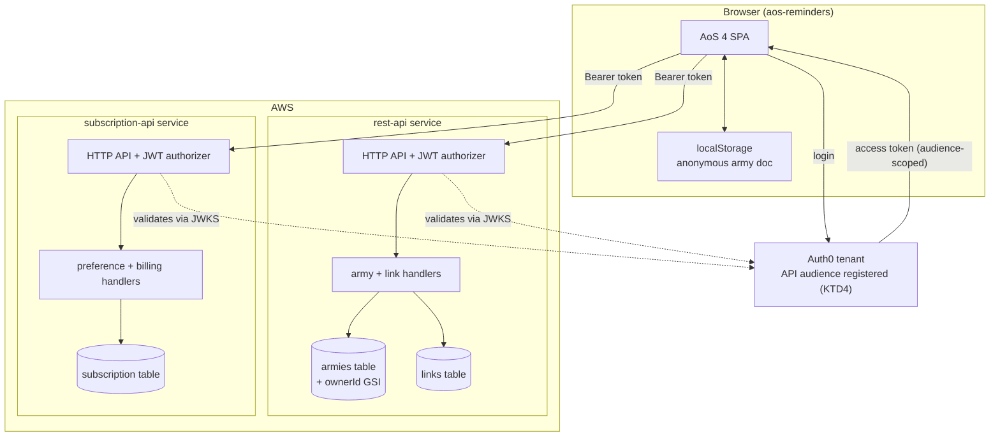
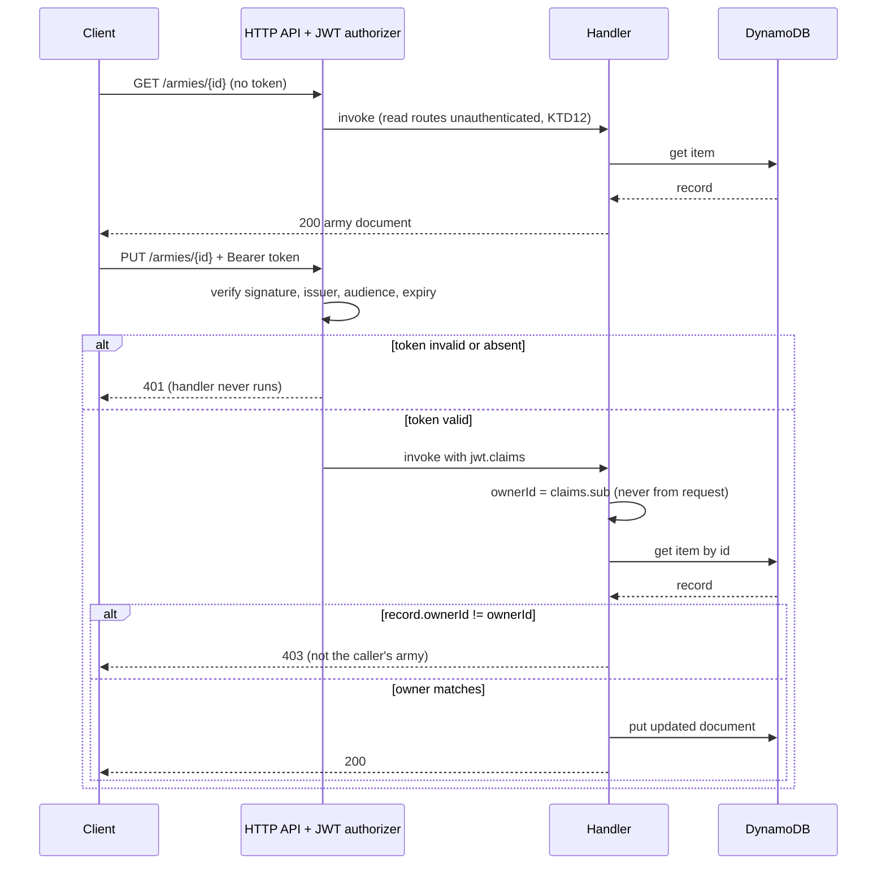

# AoS 4 User Accounts

Signed-in users must be able to save and update armies and preferences against the AoS 4 domain,
and the account APIs behind them must authorize requests properly. Today neither is true: the
saved-army client was removed in the AoS 4 cutover, and both backend services authorize with a
shared key that ships in the browser bundle.

**Repository convention.** This plan spans three repositories. Paths are repo-relative and prefixed
by target repo: `rest-api:` for `aos-reminders-rest-api`, `sub-api:` for
`aos-reminders-subscription-api`, and unprefixed for this repository (`aos-reminders`, branch
`aos4-migration`).

---

## Goal Capsule

**Objective.** Restore working user accounts for AoS 4 — authenticated army save/update as a
collection, preferences, and share links — and close the production-launch blocker stated in
`AGENTS.md` by verifying Auth0 bearer tokens, deriving ownership server-side, and rejecting
cross-account access.

**Authority hierarchy.** `AGENTS.md` migration constraints outrank this plan. This plan outranks
implementer judgment on the decisions it records. Implementer judgment governs everything the plan
leaves open.

**Stop conditions.** Stop and ask when: a change would push or merge `master` (production deploy);
an AWS deploy is required; an Auth0 tenant, Stripe, or AWS console change is required (see Operator
Prerequisites — these are human-gated and cannot be executed by an agent); or a decision would
translate AoS 3 data into AoS 4 shapes, which the cutover forbids.

**Execution profile.** Backend security work is test-first: the negative authorization tests are the
proof the launch blocker is closed, so they are written to fail before the authorizer lands.

**Tail ownership.** Each unit lands as a PR against its own repo's default integration branch —
`aos4-migration` for this repo, `master` for the two API repos (which have no migration branch).
Deployment of either API is a separate, user-authorized step.

---

## Product Contract

### Summary

Restore working accounts across the existing service split: armies and share links stay in the REST
API, preferences and subscriptions stay in the subscription API. Armies become a named collection
rather than today's single browser document. Authorization effort concentrates where it matters —
subscription and payment operations get real Auth0 verification with server-derived ownership, while
army reads stay open by design. Army writes are authenticated so a user's armies are theirs to edit.
Legacy AoS 3-schema records are retained untouched and never surfaced.

### Problem Frame

The AoS 4 cutover removed the saved-army client from the browser. `src/api/` now holds only
`subscriptionApi.ts`, and army state lives entirely in `localStorage` under a single document key
(`src/aos4/runtime/armyStorage.ts`). A signed-in user has an account that tracks subscription
status and theme, but cannot save an army at all.

The APIs behind those accounts were last touched in 2021 and were never authorized. The subscription
API checks a shared constant, `UI_AUTH_KEY`, hardcoded in `src/utils/env.ts:14` and shipped in the
browser bundle, and it derives ownership from a client-supplied `{ id, userName }` pair — so any
visitor can read a subscription by email and call cancel, grant, or redeem against another account.
`AGENTS.md:83-88` records this as a production-launch blocker and instructs that the current API must
not be described as secure.

The REST API applies no authorization at all: `rest-api: items/create.js` takes `userName` from the
request body and writes it. Army data is deliberately treated as non-sensitive (KTD12), so open reads
are acceptable and are not a launch blocker. Writes still need an owner, or a saved army belongs to
nobody and any caller can overwrite it — that is a functional requirement of "accounts work", not a
security posture.

Two constraints make this more than an auth retrofit. Both services pin `nodejs12.x` on a
Serverless Framework version below 3.0, and AWS Lambda has since blocked updates to every runtime
through Node 20 — so neither service can be deployed at all in its current form. And all 27 handler
files across the two repos call `require('aws-sdk')` without declaring the dependency, relying on a
bundled SDK v2 that no longer exists on modern runtimes.

### Requirements

**Identity and authorization**

R1. An Auth0 API (audience) is registered, and the SPA requests access tokens scoped to it. Today
`src/auth_config.json` carries only `domain` and `clientId`, so Auth0 issues no verifiable JWT.
R2. Every authenticated endpoint verifies the bearer token's signature, issuer, audience, and expiry
before handler code runs. Authenticated endpoints are: all subscription and preference operations,
and all army and share-link writes.
R3. On authenticated endpoints, ownership is derived server-side from verified token claims. No
authenticated endpoint accepts an identity supplied in a request body, path, or query parameter.
R4. A request bearing a valid token for account A cannot read, update, or delete account B's
subscription or preference records, and cannot update or delete account B's armies.
R5. `UI_AUTH_KEY` is removed from the frontend bundle and from every handler that checks it.
R6. Administrative endpoints (`admin_create`, `admin_gift`, `create_coupon`) are not reachable with
an end-user token.
R7. Negative authorization tests cover missing, malformed, expired, wrong-audience, wrong-issuer,
and valid-but-foreign tokens, and they run in CI for both services.

**Army persistence**

R8. A signed-in user can create, list, rename, update, and delete multiple named armies.
R9. Saved armies serialize the AoS 4 army document contract defined in
`src/aos4/state/armyDocument.ts`, carrying `AOS4_ARMY_DOCUMENT_SCHEMA_VERSION`.
R10. The server rejects an army payload that fails AoS 4 document validation rather than storing it.
R11. Signed-out use keeps working against `localStorage`, unchanged.
R12. Existing AoS 3-schema records (`schemaVersion: 4`) are retained untouched, are never
translated, and are never returned to the AoS 4 client.

**Preferences**

R13. Theme and favorite-faction preferences persist per authenticated user through the subscription
API, with ownership derived from the token.
R14. Subscriber theme behavior on the established account surfaces is unchanged.

**Share links**

R15. Creating a share link requires authentication and records the creating owner.
R16. Reading a share link stays unauthenticated — a share link is meant to be opened by people
without accounts.

**Runtime and platform**

R17. Both services target the `nodejs22.x` Lambda runtime.
R18. Both services run on a Serverless Framework version that can deploy today, with CLI
authentication available to CI.
R19. All handler AWS calls use AWS SDK v3 with the dependency declared in `package.json`.
R20. Both services have a test harness and a CI workflow that runs it.

**Secret hygiene**

R21. The live Stripe secret key is rotated, and no credential is read from a committed file.
R22. `sub-api: config.dev.json` and `sub-api: config.prod.json` are removed from the working tree
and purged from git history.
R23. Hardcoded migration keys in `rest-api: items/migrate.js`, `rest-api: items/migrate_v4.js`, and
`sub-api: migrations/migrate_v4.js` are removed along with their endpoints, which served the 2021
migration and have no remaining purpose.
R26. The unauthenticated `rest-api: save` endpoint is removed. It writes arbitrary client JSON to a
public S3 bucket with no caller, size limit, or validation — dead code and an unmetered write
primitive, independent of any question about army privacy.
R27. Army reads stay public by design. Listing and fetching an army does not require a token, and no
work in this plan adds one.

**Continuity**

R24. Account navigation, Auth0 hosted login, subscription status and cancellation, and the saved-army
interaction pattern match the live site. No redesign.
R25. `src/aos4/` continues to depend only on its own modules, Node built-ins, and third-party
packages, per the dependency boundary enforced by `src/tests/aos4/legacyIsolation.test.ts`.

### Scope Boundaries

**In scope.** Auth0 audience registration and token acquisition; JWT verification and ownership on
subscription and preference operations and on army and share-link writes; the army collection model
and its client; share links; the runtime, framework, and SDK upgrades that make deployment possible;
secret rotation and history purge; restoring the saved-army UI on established surfaces.

**Non-goals.**

- Protecting army or share-link data from being read. Deliberately rejected — see KTD12.
- Consolidating armies and preferences into one service. Deliberately rejected — see KTD1.
- Changing subscription, Stripe, or PayPal business logic. Authorization hardening only.
- Rate limiting, abuse controls, or audit logging on public endpoints.
- Any redesign of account surfaces.
- Any AoS 3 compatibility path, importer, or data translation.

#### Deferred to Follow-Up Work

- Phase 2 frontend modernization (React, Vite, TypeScript, Sass, PWA tooling) and the jsPDF rewrite.
- Deciding the long-term fate of retained AoS 3-schema records — whether they are eventually
  exported, surfaced read-only, or deleted.
- Migrating the frontend off Node 20 (`.nvmrc`, CI), which went EOL 2026-04-30.
- Offline-first conflict resolution. This plan uses last-write-wins (KTD8).

---

## Planning Contract

### Key Technical Decisions

KTD1. **Armies and share links stay in the REST API; preferences stay in the subscription API.**
(session-settled: user-directed — chosen over consolidating account data into one service: avoids
migrating preference records, at the cost of implementing and maintaining verification in two
codebases.) Both services therefore need the same authorizer configuration and the same ownership
helper. Keep the helper's shape identical across repos so the pair stays reviewable together.

KTD2. **Revive the REST API rather than retire it.** (session-settled: user-directed — chosen over
retiring the service: working accounts require saved armies, and the service already holds the
table, index, and share-link surface.)

KTD3. **Move both services from REST API (v1) `http:` events to HTTP API (v2) `httpApi:` events and
use the native JWT authorizer.** HTTP APIs are the only API Gateway flavor with a built-in JWT
authorizer; it validates signature, issuer, audience, and expiry with no custom authorizer code, at
roughly a sixth of the REST API request cost and lower latency. The alternative — keeping v1 and
writing a Lambda authorizer — means authoring and testing signature-verification code that AWS
already provides. Consequence: both services get new endpoint URLs, so the frontend endpoint
constants change and the frontend and API deploys must be coordinated.

KTD4. **Register an Auth0 API and request tokens for its audience.** Without an `audience`, Auth0
returns a token intended for the SPA, not a JWT an API can validate — so this is a hard prerequisite
for every other authorization requirement, not a configuration detail.

KTD12. **Army and share-link data is treated as non-sensitive; only subscription and payment data is
protected.** (session-settled: user-directed — chosen over uniformly authorizing every endpoint:
army lists are trivial, publicly shareable game data, and spending authorization effort defending
them buys nothing.) Reads on armies and links stay open. Writes stay authenticated so records have an
owner and cannot be clobbered by another caller — an integrity requirement of working accounts, not a
confidentiality one. This scopes the negative-authorization gate (R7) to subscription and preference
operations plus army writes, and it matches `AGENTS.md:83-88`, whose blocker language is about the
subscription API's account operations.

KTD5. **On authenticated endpoints, ownership always derives from verified token claims, but the
claim differs by service.**
New army records write an `ownerId` attribute from the `sub` claim and are queried through a new GSI
on it — `sub` is stable and immutable, unlike email. Existing subscription and preference records are
already keyed on `userName` (email) and cannot be re-keyed without a billing-data migration, so those
handlers derive ownership from the token's verified `email` claim instead. Both are server-derived
from a validated token; neither accepts client-supplied identity, which is what R3 requires. The
residual risk is that an Auth0 email change orphans a subscription record; backfilling `ownerId` onto
subscription records is deferred follow-up work, not a launch blocker.

Legacy army records carry no `ownerId`, so they fall out of every owner-scoped query — precisely the
retention behavior R12 requires, achieved by the access path rather than by a delete.

KTD6. **Target the `nodejs22.x` runtime.** As of 2026-07-01 AWS Lambda no longer permits updating
functions on Node 20, and Node 18 and 16 support ended 2026-03-09. Node 22 is the current supported
runtime. This is a precondition for deploying anything, not an upgrade for its own sake.

KTD7. **Upgrade to Serverless Framework v4 rather than migrating to another IaC tool.** v4
introduces no breaking changes for existing AWS projects; the cost is that its CLI requires
authentication, so CI needs a license key in secrets. Migrating to SAM or CDK would mean rewriting
both service definitions for no benefit this plan needs.

KTD8. **Last-write-wins on army sync, scoped per army.** A saved army is edited by one person on one
device at a time; full conflict resolution is disproportionate. The client sends the whole document
and the server stores it with a server-assigned `updatedAt`.

KTD9. **Legacy AoS 3-schema records are retained, untranslated, and unsurfaced.**
(session-settled: user-directed — chosen over deleting them or exposing a read-only archive:
preserves user data without violating the cutover's no-translation rule.)

KTD10. **Share-link reads stay public; share-link creation requires a token.** A share link exists to
be opened by someone without an account, so requiring auth on read would break the feature. Creation
is owner-scoped so links are attributable and revocable.

KTD11. **Migrate to AWS SDK v3 as part of the runtime upgrade, not as a separate pass.** All 27
handler files call `require('aws-sdk')` without declaring it, which works only because Lambda used to
bundle SDK v2. On `nodejs22.x` that bundle is gone, so the functions would fail at import. The SDK
migration and the runtime bump must land together or the service is broken between them.

### High-Level Technical Design

Service topology after the change. Preferences and armies stay in separate services (KTD1); both sit
behind their own HTTP API with the same Auth0 JWT authorizer configuration.

Authorization splits across two layers. The gateway proves the token is authentic; the handler proves
the caller owns the record. Both are required — a valid token for account A is still authentic when
it asks for account B's army, and only the handler can reject that.

Reads need no token and no ownership check; writes need both. On the subscription service the same
two-layer shape applies to every operation, and a foreign record returns `404` rather than `403`
there — subscription existence is worth not disclosing even though army existence is not.

### Operator Prerequisites (human-gated)

These require console or credential access an implementing agent does not have. They block the units
named and should be done first.

1. **Register an Auth0 API** in the tenant, note its identifier (audience), and enable RS256. Blocks
   U1 and every authorization unit.
2. **Create a Serverless Framework license key** and add it to CI secrets for both API repos. Blocks
   U2, U3.
3. **Rotate the live Stripe secret key** in the Stripe dashboard and store the replacement in SSM
   Parameter Store. Blocks U11.
4. **Authorize each AWS deploy.** Every unit touching a service definition is code-complete at PR;
   deploying is a separate approval.

### Assumptions

- The Auth0 tenant permits registering a new API. If the plan's tenant is on a legacy free plan with
  an API limit, U1 stalls and needs a tenant decision.
- The existing DynamoDB tables can take an added GSI in place. If provisioned-throughput limits
  block it, U5 needs a table-rebuild path instead.
- The `aos-reminders-link-api` table has no consumer outside the REST API.
- Production traffic is low enough that a coordinated frontend and API cutover (KTD3) can happen in
  one window rather than needing both API versions live simultaneously.

---

## Implementation Units

### Unit Index

| U-ID | Title | Primary files | Depends on |
|---|---|---|---|
| U1 | Auth0 audience and token acquisition | `src/auth_config.json`, `src/main.tsx`, `src/utils/authToken.ts` | — |
| U2 | REST API runtime, framework, SDK v3, test harness | `rest-api: serverless.yml`, `package.json`, all handlers | — |
| U3 | Subscription API runtime, framework, SDK v3, test harness | `sub-api: serverless.yml`, `package.json`, all handlers | — |
| U4 | REST API HTTP API migration and JWT authorizer on writes | `rest-api: serverless.yml`, `util/auth.js` | U1, U2 |
| U5 | Army collection model and owner-scoped writes | `rest-api: items/*.js`, `serverless.yml` | U4 |
| U6 | Share links under ownership | `rest-api: links/*.js` | U4 |
| U7 | Subscription API HTTP API migration and JWT authorizer | `sub-api: serverless.yml`, `util/auth.js` | U1, U3 |
| U8 | Preferences ownership and shared-key removal | `sub-api: user/*.js`, `subscription/*.js`, `paypal/grant.js` | U7 |
| U9 | Privileged and dead endpoint removal | `sub-api: subscription/adminCreate.js`, `rest-api: items/migrate*.js`, `rest-api: save/create.js` | U4, U7 |
| U10 | Negative authorization test suites | `rest-api: tests/`, `sub-api: tests/` | U5, U8 |
| U11 | Secret rotation, history purge, SSM wiring | `sub-api: config.*.json`, `util/env.js`, `serverless.yml` | U8 |
| U12 | Frontend army API client and collection sync | `src/api/armyApi.ts`, `src/aos4/runtime/armyStorage.ts` | U1, U5 |
| U13 | Saved-armies UI on established account surfaces | `src/components/`, `src/aos4/view/` | U12 |

### U1. Auth0 audience and token acquisition

**Goal.** Make the SPA obtain a verifiable, audience-scoped JWT that the APIs can validate.

**Requirements.** R1, R2.

**Dependencies.** Operator prerequisite 1.

**Files.** `src/auth_config.json`, `src/main.tsx`, `src/utils/authToken.ts` (new),
`src/tests/aos4/accountShell.test.tsx`.

**Approach.** Add `audience` to the auth config and pass it through `Auth0Provider`'s
`authorizationParams`. Introduce a single token accessor wrapping `getAccessTokenSilently` so no
component calls Auth0 directly, and so a failed silent refresh has one place to be handled. Do not
change login, logout, or navigation behavior.

**Patterns to follow.** `src/context/useSubscription.tsx` for the existing `useAuth0` consumption
shape; keep the new accessor consistent with it.

**Test scenarios.**
- Signed-in render requests a token with the configured audience.
- Signed-out render requests no token and surfaces no error.
- A rejected silent token refresh leaves the account shell rendered and surfaces a recoverable state
  rather than throwing.
- Covers R24: account navigation and login/logout affordances are unchanged.

**Verification.** `yarn lint`, `yarn test --run`, `yarn build` clean; a signed-in session produces a
JWT whose `aud` matches the registered API.

### U2. REST API runtime, framework, SDK v3, test harness

**Goal.** Make the REST API deployable and testable at all.

**Requirements.** R17, R18, R19, R20.

**Dependencies.** Operator prerequisite 2.

**Files.** `rest-api: serverless.yml`, `rest-api: package.json`, all 11 handler files calling
`require('aws-sdk')`, `rest-api: util/`, `rest-api: .github/workflows/` (new).

**Approach.** Move the runtime to `nodejs22.x` and the framework to v4, then replace every
`require('aws-sdk')` DocumentClient with `@aws-sdk/client-dynamodb` plus `@aws-sdk/lib-dynamodb`,
declared as real dependencies. The SDK swap must land in the same change as the runtime bump — the
old bundled SDK is absent on Node 22, so splitting them leaves the service broken in between
(KTD11). Add a test runner and a CI workflow that installs, lints, and tests. Behavior stays
identical; this unit changes no endpoint contract.

**Execution note.** Characterize the existing handler responses with tests before the SDK swap —
these handlers have never had tests, and the DocumentClient call shapes differ between v2 and v3 in
ways that are easy to get subtly wrong.

**Test scenarios.**
- Each converted handler returns the same response body and status as before the SDK swap, for both
  its success and its error path.
- A DynamoDB error surfaces as the service's existing error response rather than an unhandled
  rejection.
- CI fails when a handler imports `aws-sdk`.

**Verification.** Test suite green in CI; `serverless package` succeeds on the v4 CLI; no `aws-sdk`
import remains.

### U3. Subscription API runtime, framework, SDK v3, test harness

**Goal.** Same as U2, for the subscription service.

**Requirements.** R17, R18, R19, R20.

**Dependencies.** Operator prerequisite 2.

**Files.** `sub-api: serverless.yml`, `sub-api: package.json`, all 16 handler files calling
`require('aws-sdk')`, `sub-api: util/`, `sub-api: .github/workflows/` (new).

**Approach.** As U2. Additionally raise the `stripe` dependency to a version supported on Node 22,
treating the Stripe API version pin as a compatibility question to resolve during the work — the
installed client is from 2021 and its bundled API version may lag the account's. Do not change
billing behavior.

**Execution note.** Characterization tests first, as in U2. Billing paths are the highest-cost place
in this plan to regress silently.

**Test scenarios.**
- Each converted handler preserves response body and status on success and error paths.
- Subscription lookup, cancel, and renew return unchanged shapes to the existing client.
- PayPal webhook handlers parse an unchanged sample payload identically.
- CI fails when a handler imports `aws-sdk`.

**Verification.** Test suite green in CI; `serverless package` succeeds; billing handler
characterization tests pass unchanged.

### U4. REST API HTTP API migration and JWT authorizer on writes

**Goal.** Put REST API write endpoints behind a verified token, leaving reads open.

**Requirements.** R2, R7, R27.

**Dependencies.** U1, U2.

**Files.** `rest-api: serverless.yml`, `rest-api: util/auth.js` (new).

**Approach.** Convert `http:` events to `httpApi:` and declare a JWT authorizer bound to the Auth0
issuer and the registered audience (KTD3). Apply it to write routes only — army create, update, and
delete, and share-link create. Army reads, share-link reads, and error reporting stay unauthenticated
(KTD12, KTD10, R27). Add an ownership helper that extracts `sub` from
`event.requestContext.authorizer.jwt.claims` and throws when absent, so no authenticated handler
reads identity from a request body. This unit wires the authorizer and helper; U5 and U6 apply them.

**Execution note.** Write the missing-token and wrong-audience cases first and watch them fail
against the pre-migration stack.

**Test scenarios.**
- A write request with no `Authorization` header is rejected before handler code runs.
- A token signed by a different issuer is rejected on a write route.
- A token for a different audience is rejected on a write route.
- An expired token is rejected on a write route.
- A structurally malformed bearer value is rejected on a write route.
- The ownership helper throws when claims are absent rather than returning a falsy owner.
- Covers R27: an unauthenticated army read succeeds.

**Verification.** Negative cases on write routes return 401 with no handler invocation; a valid token
reaches the handler with `sub` available; read routes remain open.

### U5. Army collection model and owner-scoped writes

**Goal.** Turn single-item army storage into an owner-scoped collection that stores AoS 4 documents.

**Requirements.** R3, R4, R8, R9, R10, R12, R27.

**Dependencies.** U4.

**Files.** `rest-api: items/create.js`, `items/get.js`, `items/update.js`, `items/delete.js`,
`rest-api: items/list.js` (new), `rest-api: user/get.js`, `rest-api: serverless.yml`,
`rest-api: util/armyDocument.js` (new).

**Approach.** Add an `ownerId` attribute written from the verified `sub` on create, and a GSI on it
for listing (KTD5). Update and delete load the record and compare `ownerId` to the caller's before
acting, so a user can only modify their own armies. Reads — get, list, and the existing
`user/{userName}` listing — stay unauthenticated and unfiltered (KTD12, R27); leave that endpoint in
place. Validate incoming payloads against the AoS 4 document contract and reject on failure. Legacy
records have no `ownerId`, so exclude them from AoS 4 read paths by schema, not by owner (KTD9).

**Patterns to follow.** The AoS 4 document contract in `src/aos4/state/armyDocument.ts`; keep the
server-side validator's accepted shape aligned with `deserializeAos4ArmyDocument`.

**Test scenarios.**
- Create stores the caller's `sub` as `ownerId` and ignores any owner field in the request body.
- Update and delete on another account's army are rejected.
- Update and delete on a nonexistent id are rejected.
- A payload failing AoS 4 document validation is rejected and nothing is written.
- A legacy `schemaVersion: 4` record is never returned by list or get.
- Covers R12: no code path translates a legacy record into an AoS 4 document.
- Covers R27: an unauthenticated caller can list and fetch any account's armies.

**Verification.** A user cannot modify another user's armies; reads remain open; legacy records
remain in the table and unreturned by AoS 4 read paths.

### U6. Share links under ownership

**Goal.** Make link creation attributable while keeping link reads public.

**Requirements.** R15, R16.

**Dependencies.** U4.

**Files.** `rest-api: links/create.js`, `rest-api: links/get.js`, `rest-api: serverless.yml`.

**Approach.** Require a token on create and record `ownerId`; leave the read path unauthenticated
(KTD10). Reads return link content only — never the owner identity — so a shared link does not leak
the sharer's account.

**Test scenarios.**
- Creating a link without a token is rejected.
- A created link records the caller's `sub`.
- Reading a link without a token succeeds.
- A link read response contains no owner identity or email.

**Verification.** Anonymous read works; anonymous create is rejected; no owner field appears in read
responses.

### U7. Subscription API HTTP API migration and JWT authorizer

**Goal.** Put subscription and preference endpoints behind a verified token.

**Requirements.** R2, R7.

**Dependencies.** U1, U3.

**Files.** `sub-api: serverless.yml`, `sub-api: util/auth.js` (new).

**Approach.** Mirror U4 exactly, including the helper's shape, so the two services stay reviewable
as a pair (KTD1). Apply the authorizer to user-facing endpoints. PayPal webhook endpoints receive
calls from PayPal, not from users, and must not take the user authorizer — secure them by verified
webhook signature instead, and treat that as part of this unit.

**Test scenarios.**
- Missing, expired, wrong-issuer, and wrong-audience tokens are rejected on user endpoints.
- The ownership helper throws when claims are absent.
- A webhook endpoint rejects an unsigned or wrongly-signed payload.
- A webhook endpoint accepts a correctly signed payload without a user token.

**Verification.** User endpoints reject unauthenticated calls; webhook paths remain callable by
PayPal.

### U8. Preferences ownership and shared-key removal

**Goal.** Derive preference and subscription ownership from the token, and delete the shared key.

**Requirements.** R3, R4, R5, R13, R14.

**Dependencies.** U7.

**Files.** `sub-api: user/theme.js`, `sub-api: user/favorite.js`, `sub-api: user/get.js`,
`sub-api: subscription/cancel.js`, `sub-api: subscription/coupon.js`,
`sub-api: subscription/gift.js`, `sub-api: paypal/grant.js`, `sub-api: util/env.js`,
`src/utils/env.ts`, `src/api/subscriptionApi.ts`.

**Approach.** Replace every `authKey !== UI_AUTH_KEY` check with token-derived ownership, and stop
reading `{ id, userName }` from request bodies for authorization. Remove `SUBSCRIPTION_AUTH_KEY`
from `src/utils/env.ts` and stop sending `authKey` from the client. Subscription lookup keys on the
caller's own identity rather than a supplied username, which closes the current enumeration.

**Test scenarios.**
- Updating theme or favorite faction for another account returns 404.
- Subscription lookup returns only the caller's subscription regardless of any supplied username.
- Cancel, redeem, and grant reject a request whose body names a different account.
- A request carrying the old `authKey` field and no token is rejected.
- Covers R14: subscriber theme behavior on the account surfaces is unchanged for the owning user.

**Verification.** No occurrence of `UI_AUTH_KEY` or `SUBSCRIPTION_AUTH_KEY` remains in either repo;
cross-account preference writes fail.

### U9. Privileged and dead endpoint removal

**Goal.** Close the remaining publicly reachable privileged and orphaned surfaces.

**Requirements.** R6, R23, R26.

**Dependencies.** U4, U7.

**Files.** `sub-api: subscription/adminCreate.js`, `sub-api: subscription/gift.js`,
`sub-api: subscription/coupon.js`, `sub-api: migrations/migrate_v4.js`,
`rest-api: items/migrate.js`, `rest-api: items/migrate_v4.js`, `rest-api: save/create.js` (deleted),
both `serverless.yml` files.

**Approach.** Delete three dead surfaces outright: the migration endpoints and their hardcoded keys,
which served a 2021 migration and have no remaining caller; and the `save` endpoint, which writes
arbitrary client JSON into the public `aos-reminders-army-lists` bucket with no caller, validation, or
size limit. `save` is removed as dead code with an unmetered cost tail, not on privacy grounds — army
data being public is fine (KTD12); an unauthenticated unbounded write into your S3 bill is not. Drop
the bucket's `s3:PutObject` grant from the service IAM role in the same change.

Remove the HTTP events from the admin operations rather than adding an admin claim. These mint
subscriptions and gifts, so they are payment surfaces and stay protected under KTD12. They run rarely
enough to invoke directly, and deleting the public route is a stronger guarantee than a claim check
on a route that stays reachable.

**Test scenarios.**
- Migration, `save`, and admin routes are absent from the deployed route table.
- No hardcoded key literal remains in either repo.
- The service IAM role no longer grants `s3:PutObject` on the army-lists bucket.
- Admin operations remain invocable directly for an operator.

**Verification.** Route tables contain none of the removed paths; grep finds no migration key
literal; the IAM policy no longer references the public bucket.

### U10. Negative authorization test suites

**Goal.** Prove the launch blocker is closed, as a durable gate rather than a one-time check.

**Requirements.** R7, R4.

**Dependencies.** U5, U8.

**Files.** `rest-api: tests/authorization.test.js` (new), `sub-api: tests/authorization.test.js`
(new), both CI workflows.

**Approach.** Consolidate authorization coverage into one suite per service, enumerating the
token-failure matrix against every route that is supposed to be authenticated — all subscription and
preference operations, and army and share-link writes (KTD12). Maintain an explicit list of routes
that are intentionally public so the suite fails when a new route appears in neither list.

**Execution note.** The subscription-side suite is the evidence `AGENTS.md:83-88` asks for. Treat a
gap there as a launch blocker; gaps on the army side are ordinary test debt.

**Test scenarios.**
- Every subscription and preference route rejects: no token, malformed token, expired token, wrong
  issuer, wrong audience, and a valid token belonging to another account.
- Every army and share-link write route rejects the same matrix.
- A new route belonging to neither the authenticated nor the intentionally-public list fails the
  suite.
- Intentionally-public routes (army reads, share-link read, error reporting) remain reachable without
  a token.

**Verification.** Both suites green in CI and required for merge.

### U11. Secret rotation, history purge, SSM wiring

**Goal.** Remove committed credentials and stop reading secrets from files in the repo.

**Requirements.** R21, R22.

**Dependencies.** U8, operator prerequisite 3.

**Files.** `sub-api: config.dev.json`, `sub-api: config.prod.json`, `sub-api: util/env.js`,
`sub-api: serverless.yml`, `sub-api: .gitignore`.

**Approach.** Source the Stripe key from SSM Parameter Store at deploy time instead of a committed
JSON file, delete both config files, and purge them from history. Rotate the live key first so the
purge is a cleanup of an already-dead credential rather than the control that protects it — history
rewrite does not invalidate a key, and clones and forks may retain it.

**Execution note.** History rewrite is coordinated: it changes every commit hash on both repos'
default branches. Confirm no open work depends on the current hashes before rewriting.

**Test scenarios.**
- No credential literal remains in the working tree or in history.
- A deploy resolves the Stripe key from SSM.
- A missing SSM parameter fails the deploy loudly rather than deploying a service with an undefined
  key.

**Verification.** Secret scan clean across history; deploy succeeds against SSM; the rotated key is
the only one that works.

### U12. Frontend army API client and collection sync

**Goal.** Give the AoS 4 client a real persistence layer for multiple armies.

**Requirements.** R8, R9, R11, R25.

**Dependencies.** U1, U5.

**Files.** `src/api/armyApi.ts` (new), `src/aos4/runtime/armyStorage.ts`,
`src/context/useArmyCollection.tsx` (new), `src/tests/aos4/armyStorage.test.ts`.

**Approach.** Add an authenticated client mirroring `src/api/subscriptionApi.ts`'s structure, and a
context owning the collection and its sync. Signed-out behavior keeps using `localStorage`
unchanged; signing in adds the remote collection alongside it. Keep all network logic outside
`src/aos4/` to preserve the dependency boundary — the domain layer must not depend outward (R25).

**Patterns to follow.** `src/api/subscriptionApi.ts` for client shape; `src/context/useSubscription.tsx`
for the context and loading-state pattern.

**Test scenarios.**
- A signed-out session reads and writes `localStorage` and makes no network call.
- A signed-in session lists, creates, renames, updates, and deletes armies.
- Every request carries a bearer token.
- A 401 surfaces a recoverable signed-out state rather than discarding local work.
- A network failure leaves the local document intact.
- Covers R25: `src/tests/aos4/legacyIsolation.test.ts` still passes, proving no outward dependency
  was introduced.

**Verification.** `yarn lint`, `yarn test --run`, `yarn build` clean; isolation test green.

### U13. Saved-armies UI on established account surfaces

**Goal.** Restore the saved-army experience without redesigning anything.

**Requirements.** R8, R24.

**Dependencies.** U12.

**Files.** `src/components/` (army list and save controls), `src/aos4/view/`,
`src/tests/aos4/accountShell.test.tsx`.

**Approach.** Rebuild save, load, rename, and delete affordances using the established visual
primitives, matching the live site's placement and interaction. Compare against the live site at
desktop and mobile widths before accepting, per the continuity constraint. Bind the AoS 4 document to
presentation through view models rather than reaching into domain modules from components.

**Patterns to follow.** Existing account surfaces in `src/components/routes/Profile.tsx` and the
established card and control primitives already used for reminders and selections.

**Test scenarios.**
- A signed-in user sees their army list and can load one into the active document.
- Saving a renamed army updates the list without a reload.
- Deleting prompts and removes the army from the list.
- A signed-out user sees the established signed-out affordances and no army list.
- Account navigation landmarks remain present and unchanged.

**Verification.** `yarn lint`, `yarn test --run`, `yarn build` clean; visual comparison against the
live site at both widths shows no unintended delta.

---

## Verification Contract

**This repository.** `yarn lint`, `yarn test --run`, and `yarn build` must pass — the same gate
`.github/workflows/nodejs.yml` runs on pull requests. `src/tests/aos4/legacyIsolation.test.ts` must
stay green throughout; it enforces the AoS 4 dependency boundary and the absence of retired paths.

**Both API repositories.** Each needs a test command and a CI workflow, neither of which exists today
(U2, U3). Once present: install, lint, and test must pass, and `serverless package` must succeed on
the v4 CLI without deploying.

**Authorization gate.** The U10 suites are the release gate for the launch blocker. Both must be
green and required for merge before any deploy is proposed.

**Manual verification.** A signed-in session on a preview build can create, list, update, and delete
armies; a second account cannot see the first account's armies through any endpoint; account
surfaces match the live site at desktop and mobile widths.

**Not automated.** Auth0 tenant configuration, Stripe key rotation, SSM parameter creation, and AWS
deploys are operator steps confirmed by hand.

---

## Definition of Done

**Global.**

- Every requirement R1-R27 is satisfied or explicitly deferred in writing.
- No shared authorization key exists in any repository or bundle.
- No authenticated endpoint derives identity from client-supplied input.
- The U10 negative authorization suites pass in CI for both services, covering subscription and
  preference operations and army and share-link writes.
- Army reads still work without a token — the open-read posture (KTD12) is intact, not quietly
  tightened during implementation.
- No credential literal remains in either API repo's working tree or history.
- Both services deploy on `nodejs22.x` with SDK v3 and declared dependencies.
- `AGENTS.md:83-88` is updated to reflect the closed blocker — and not before the U10 suites prove
  it, since that passage instructs that the API must not be described as secure while the work is
  outstanding.
- Legacy AoS 3-schema records remain present, untranslated, and unreachable from the AoS 4 client.
- Abandoned or experimental code from approaches that did not pan out is removed, not left in the
  diff.

**Per unit.** Its test scenarios are implemented and passing, its verification statement holds, and
it lands as its own PR against the target repo's integration branch.

**Explicitly not done here.** Deploying either service, pushing or merging `master` in this
repository, and the Phase 2 modernization deferred above.

---

## Open Questions

All are deferred — none blocks implementation.

- **Backfilling `ownerId` onto subscription and preference records.** KTD5 keys those handlers on the
  verified email claim because the records predate `sub`. A backfill would make identity uniform
  across services and survive an Auth0 email change. Deferred until accounts are working.
- **Unmetered public write endpoints.** The `errors` reporting endpoint accepts unauthenticated
  writes and must stay open to capture failures from signed-out users. Under KTD12 that is accepted;
  if cost or abuse ever becomes real, rate limiting is the answer, not authentication.
- **Long-term fate of retained AoS 3-schema records.** KTD9 retains them unsurfaced; whether they are
  eventually exported, shown read-only, or deleted is a product decision for after launch.

---

## Risks and Dependencies

| Risk | Impact | Mitigation |
|---|---|---|
| Auth0 tenant cannot register a new API | Blocks the entire plan at U1 | Confirm tenant plan limits before starting U2-U13 |
| Endpoint URLs change with the HTTP API migration (KTD3) | Old clients break at cutover | Coordinate frontend and API deploys in one window; keep the old stack deployed until the new one is verified |
| SDK v2 to v3 call-shape differences | Silent behavior change in untested handlers | Characterization tests before the swap (U2, U3 execution notes) |
| Stripe client is four years stale | Billing regression during the runtime upgrade | Treat billing characterization tests as a hard gate in U3 |
| History rewrite in U11 | Invalidates existing clones and hashes | Rotate the key first so the purge is cleanup, not the protecting control |
| Adding a GSI to a live table | Backfill time and throughput cost | Verify table size and provisioned capacity before U5; fall back to a rebuild path if blocked |
| Serverless v4 CLI authentication | CI cannot deploy without a license key | Operator prerequisite 2, ahead of U2 |
| Two auth implementations (KTD1) | Drift between services | Keep helper shape identical; U10 enumerates the same matrix against both |

---

## System-Wide Impact

**Auth boundary.** This plan introduces the first real authorization boundary in the system, drawn
deliberately narrow (KTD12): subscription and preference operations, plus army and share-link writes,
move from unauthenticated or shared-key access to per-user token verification with server-derived
ownership. Army reads stay open. The boundary's position is a recorded decision — a future change
that widens or narrows it should update KTD12 rather than drift.

**Data lifecycle.** Army records gain an `ownerId` attribute and a GSI. Legacy records are retained
without it, which removes them from every owner-scoped access path without deleting anything.

**Identity semantics.** Account identity moves from email to the Auth0 `sub` claim. Email becomes
display-only. Any future feature keying on email should key on `sub` instead.

**Deployment.** Both services become deployable again after years of drift, and both acquire CI. The
frontend gains a coordinated-deploy dependency on the APIs it did not previously have.

**Documentation.** `AGENTS.md:83-88` and `AGENTS.md:122` both need updating once the blocker closes —
the first to retire the warning, the second because Phase 2's backend line is largely consumed by
this plan.

---

## Sources and Research

**Repository evidence.**

- `AGENTS.md:83-88` — the production-launch blocker this plan closes.
- `AGENTS.md:122` — Phase 2's only backend line.
- `src/utils/env.ts:14` — the shared key literal shipped in the browser bundle.
- `src/api/subscriptionApi.ts` — current client; every mutating call sends `authKey`.
- `src/auth_config.json` — carries `domain` and `clientId` only; no audience.
- `src/aos4/state/armyDocument.ts` — the AoS 4 document contract the server must validate.
- `src/aos4/runtime/armyStorage.ts` — current single-document local persistence.
- `rest-api: items/create.js` — writes `userName` straight from the request body.
- `rest-api: user/get.js` — unauthenticated listing of an account's armies by email. Retained as-is
  under the open-read posture (KTD12).
- `rest-api: save/create.js` — unauthenticated write of arbitrary client JSON to a public S3 bucket,
  with no frontend caller. Removed as dead code with a cost tail (R26).
- `sub-api: user/favorite.js` — shared-key check with client-supplied ownership.
- `sub-api: serverless.yml` — `admin_create` and `admin_gift` as public HTTP endpoints.

**External guidance.**

- [AWS Lambda runtimes](https://docs.aws.amazon.com/lambda/latest/dg/lambda-runtimes.html) and
  [Node 20 EOL timing](https://www.cloudquery.io/blog/aws-lambda-nodejs-20-eol) — Node 20 function
  updates blocked from 2026-07-01; Node 22 is current (KTD6).
- [Securing AWS HTTP APIs with JWT authorizers](https://auth0.com/blog/securing-aws-http-apis-with-jwt-authorizers/)
  and [AWS HTTP APIs guide](https://www.serverless.com/guides/aws-http-apis) — native JWT authorizers
  are HTTP-API-only and remove custom authorizer code (KTD3).
- [Auth0 custom authorizers for API Gateway](https://auth0.com/docs/customize/integrations/aws/aws-api-gateway-custom-authorizers)
  — the REST API v1 alternative rejected in KTD3.
- [Upgrading to Serverless Framework v4](https://www.serverless.com/framework/docs/guides/upgrading-v4)
  and [license keys](https://www.serverless.com/framework/docs/guides/license-keys) — no breaking
  changes for existing AWS projects; CLI authentication required (KTD7).
