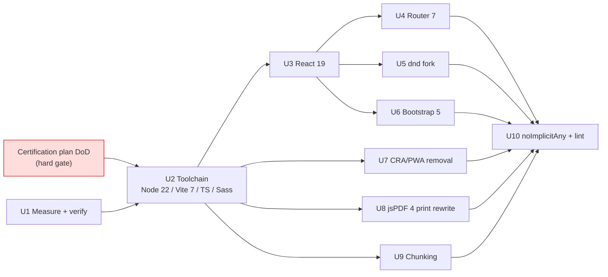

# Phase 2 Frontend Modernization

Phase 2 as defined in `AGENTS.md:113-131`: modernize the frontend shell — frameworks, toolchain,
styling, PWA remnants, print engine, bundle, and compiler strictness — while leaving the AoS 4
domain and generated-data contracts untouched. This plan is the "measure and plan dependency/
framework upgrades before changing packages" pass the Phase 1 handoff prescribes, taken to
implementation-ready.

---

## Goal Capsule

**Objective.** Move the frontend from React 17-era CRA remnants to a current, maintained stack —
React 19, react-router 7, Vite 7, TypeScript current, Bootstrap 5, jsPDF 4 — remove everything the
AoS 3 retirement orphaned, and enable the strictness Phase 1 deferred, with zero unapproved change
to what users see.

**Authority hierarchy.** `AGENTS.md` outranks this plan except where a session-settled KTD below
records a user-directed exception (KTD1, KTD2); those exceptions also amend `AGENTS.md` as part of
the work (U6, U7). This plan outranks implementer judgment on recorded decisions.

**Stop conditions.** Stop and ask when: execution would begin before the data-accuracy
certification gate (below) is cleared; a change would alter AoS 4 generated-data contracts or the
`src/aos4/` dependency boundary; a visual delta appears that is not attributable to the approved
Bootstrap 5 migration; or a change would push or merge `master`.

**Hard gate.** `yarn data:aos4:verify:beta` must pass before Phase 2 execution begins. This plan may
be reviewed and revised freely while the gate is red; only U1 (measurement with no package
changes) may run early.

**Execution profile.** Upgrade steps are smoke-first: the proof for a toolchain or framework bump
is the full gate (`yarn lint`, `yarn test --run`, `yarn build`) plus a live-site visual comparison,
not new unit coverage. The print rewrite (U8) is the exception — it is test-first against the
existing print test suite.

**Tail ownership.** Each unit lands as its own PR to `aos4-migration`, never `master`.

---

## Product Contract

### Summary

Ten dependency-ordered units: measure and verify first; then toolchain (Node 22 CI, Vite 7,
TypeScript current, Sass modern API); then React 19 and its cascade (router 7, maintained dnd
fork); the user-approved Bootstrap 5 migration with pixel-parity discipline; CRA/PWA removal
including the service worker; the jsPDF 4 print rewrite; conservative chunking; and strictness
last. Dead packages (redux family, react-dropzone) are removed where measurement proves them
unused.

### Problem Frame

The shell is frozen in 2021-2022: React 17 with the legacy `render` API, react-router 5,
react-bootstrap 1.x on Bootstrap 4, a hand-rolled CRA service worker referencing `PUBLIC_URL` that
Vite never populates, `target: es5` with core-js polyfills, and `noImplicitAny` disabled.
`react-beautiful-dnd` is archived upstream. jsPDF 1.5.3 uses APIs removed in 2.x and drags the
`canvg → jsdom 8.5.0` chain behind the open advisory Dependabot #1712 could not fix. The redux
family survives in `package.json` with zero source imports. Node 20 — in `.nvmrc` and CI — went
EOL 2026-04-30.

Session measurements sharpen the picture: `react-bootstrap` is imported in exactly one file (a
single `Dropdown`), Bootstrap-4-specific utility classes appear on only ~42 JSX lines, and the
production build's largest chunks are `index` at 2,185 kB (550 kB gzip) with the generated Home
chunk near 11.5 MB pre-gzip.

### Requirements

**Toolchain and runtime**

R1. CI and `.nvmrc` target Node 22 (Node 20 is EOL).
R2. Vite moves to 7.x and vitest to a 7-compatible release; the sass integration uses the modern
compiler API Vite 7 requires.
R3. TypeScript moves to the current 5.x release; `target` rises from `es5` to at least `es2020`.
R4. `core-js` and `string.prototype.matchall` polyfills are removed if the raised target and
supported browsers make them dead, verified rather than assumed.

**Framework migration**

R5. React and react-dom move to 19.x; the entry point uses `createRoot`; `@types/react` matches.
R6. Routing moves from `react-router-dom` 5.3.0 to `react-router` 7 (single-package form),
including `Switch`→`Routes`, hook replacements, and retirement of the custom history in
`src/utils/history.ts`.
R7. `react-beautiful-dnd` is replaced by `@hello-pangea/dnd` 18.x in `src/components/info/reminders.tsx`.
R8. Remaining React-ecosystem packages (`@auth0/auth0-react`, `react-select`, `react-modal`,
`react-switch`, `react-icons`, `react-copy-to-clipboard`, `react-ga4`) are raised to
React-19-compatible releases.

**Styling**

R9. Bootstrap moves from 4.6 to 5.3 SCSS with `src/css/theme.scss` variable overrides ported.
R10. `react-bootstrap` is removed entirely; its single `Dropdown` is rebuilt on the established
visual primitives.
R11. The ~42 lines of renamed v4 utility classes (`ml-*`/`mr-*`→`ms-*`/`me-*`, `badge-*`,
`sr-only`, `text-left`, `font-weight-*`, `custom-control`, `pl-*`) are migrated.
R12. Every account and reminder surface passes a live-site comparison at desktop and mobile
widths; deltas beyond documented Bootstrap 5 rendering differences are defects.

**CRA and PWA cleanup**

R13. Superseded 2026-07-31 by issue #1801. The orphaned CRA layer named here —
`src/service-worker.ts`, `src/serviceWorkerRegistration.ts`, the registration call in
`src/main.tsx`, and `src/utils/installNewWorker.ts` — was deleted as specified, but it is replaced
by a vite-plugin-pwa worker rather than left absent, so no unregister shim ships. The new worker is
named `service-worker.js` precisely so the stale registrations this requirement worried about are
taken over in place. See `docs/plans/2026-07-31-002-feat-pwa-install-and-offline-plan.md`.
R14. Remaining CRA remnants go: `PUBLIC_URL` references, `cra.link` comments, `homepage` in
`package.json` if Vite config supersedes it.

**Dead package removal**

R15. `redux`, `react-redux`, `@reduxjs/toolkit`, `redux-persist`, and `react-dropzone` are removed
(zero source imports, verified this session; re-verify at execution).
R16. `pdfjs-dist` and `parse5` stay — they serve the Node-side AoS 4 data pipeline
(`src/aos4/data/gamesWorkshop/pdfText.ts`), not the browser. `superagent` stays — the accounts
plan owns `src/api/subscriptionApi.ts`'s shape.

**Print engine**

R17. `src/aos4/print/pdf.ts` is rewritten against jsPDF 4.x (current: 4.2.1) — `setFontStyle` and
positional `text()` are gone — clearing the `canvg → jsdom 8.5.0` advisory chain from the tree.
R18. Print output is verified against the existing print test suite and a manual PDF comparison;
`docs/printing.md` is updated.

**Bundle**

R19. Conservative chunking only: route-level lazy loading and vendor `manualChunks`. The generated
catalog's loading shape is untouched (KTD4).

**Strictness (last)**

R20. `noImplicitAny` is enabled and the fallout fixed.
R21. Lint tightening that the eslint 9 flat config already supports is applied; rules that would
fight the migration land after it.

**Constraints**

R22. `src/tests/aos4/legacyIsolation.test.ts` stays green throughout — the `src/aos4/` boundary
and retired-path absence are non-negotiable.
R23. Generated AoS 4 data contracts and checksums are byte-identical before and after every unit.
R24. `AGENTS.md` is amended where KTD1/KTD2 supersede its continuity language, in the same PR as
the change it describes.

### Scope Boundaries

**Non-goals.**

- Any redesign beyond Bootstrap 5's own rendering differences. The migration target is
  pixel-parity, not refresh.
- Catalog/data-driven code splitting (KTD4 defers it).
- Rules/data corrections of any kind — Phase 2 stays separate per `AGENTS.md:402`.
- The accounts plan's frontend units (U12/U13 there) and `subscriptionApi.ts`'s client shape.
- The API repositories (modernized under plan 2026-07-28-002, units U2/U3).

#### Deferred to Follow-Up Work

- Catalog splitting — lazy per-rules-context loading of generated data; the largest remaining
  bundle win after this plan.
- Vite 8 / Rolldown — stable only since 2026-04; adopt after the ecosystem settles (KTD5).
- Sass `@import`→`@use` migration for `src/css/*.scss` — blocked in part on Bootstrap's own SCSS
  still being `@import`-based; silence deprecation warnings until then.
- `pdfjs-dist` upgrade for the data pipeline (Node-side; no browser exposure).
- Replacing `superagent` with fetch once the accounts plan settles the API client shape.

---

## Planning Contract

### Key Technical Decisions

KTD1. **Migrate to Bootstrap 5.3 and remove react-bootstrap.** (session-settled: user-directed —
chosen over staying on Bootstrap 4 with pinned visuals: accepts a bounded visual-delta risk to get
off an unmaintained major.) Research shrank the cost: one `Dropdown` is the entire react-bootstrap
surface, and ~42 JSX lines carry renamed utilities. The discipline is R12's live-site comparison;
this decision supersedes `AGENTS.md`'s "treat every visible UI delta as a code smell" for
Bootstrap-attributable deltas only (R24 amends it).

KTD2. **Superseded 2026-07-31 — the service worker is rebuilt on vite-plugin-pwa, not deleted.**
This entry previously recorded a user-directed decision to delete the worker outright, accepting the
loss of install and offline behavior. Issue #1801 reverses it: the app is now an installable,
offline-capable PWA. See `docs/plans/2026-07-31-002-feat-pwa-install-and-offline-plan.md`, which
carries the current decisions, and `docs/pwa.md` for how the rebuilt worker is put together. The
orphaned CRA layer named in R13 was still deleted; only the "and do not replace it" half is gone.

KTD3. **Rewrite the print render loops on jsPDF 4.x, keeping `layout.ts`.**
(session-settled: user-directed — chosen over switching to pdfmake: smallest blast radius; the
layout engine already makes every layout decision and `pdf.ts` only draws.) Current major is 4
(4.2.1), not the 2.x/3.x older docs mention; the `setFontStyle` and positional-`text()` rewrites
called out in `docs/printing.md` apply the same.

KTD4. **Conservative chunking only.** (session-settled: user-directed — chosen over splitting the
generated catalog: catalog splitting touches the aos4 loading boundary and carries contract risk;
deferred, not rejected.)

KTD5. **Target Vite 7, not 8.** Vite 8 stabilized 2026-04 on the Rolldown bundler — a bundler
swap three months old is churn this migration doesn't need. Vite 7 also forces the sass
modern-compiler API move (legacy API removed), which R2 absorbs now.

KTD6. **React 19 in one hop, no 18 stopover.** The 17→18 breaking surface (`createRoot`,
automatic batching) must be crossed either way; 18→19 removes already-deprecated APIs this
codebase's grep shows little exposure to. Ecosystem support is confirmed for the packages that
matter (dnd fork 18.x, router 7, react-bootstrap removed entirely).

KTD7. **Router goes 5→7 directly** using the documented two-step API map (Switch→Routes,
useHistory→useNavigate, single `react-router` package). A v6 stopover would pay the same breaking
surface twice.

KTD8. **Raise `target` to es2020 and remove polyfills, measured not assumed.** Browserslist's
production query already excludes dead browsers; U1 verifies what `core-js` actually covers before
U2 removes it.

### Assumptions

- `react-select` 5.x, `react-modal`, `react-switch`, `react-icons`, and `react-ga4` have
  React-19-compatible releases; U1 confirms exact versions. Any package without one gets an
  explicit decision at execution, not a silent pin.
- The machine certification gate passes before execution begins; if modernization stalls long enough
  that verified versions drift, U1 re-verifies before U2 starts.
- Bootstrap 5.3's SCSS variable surface covers the overrides in `src/css/theme.scss` (31 lines of
  theming before the bootstrap import); renamed variables are ported by name, not dropped.

### High-Level Technical Design

Dependency shape — measurement gates everything; React 19 gates the ecosystem cascade;
strictness lands last so it types the migrated code, not the code being replaced:

U1 may run before the gate (measurement only). U4/U5/U6 are independent of each other and may land
in any order after U3; U7/U8/U9 need only U2.

---

## Implementation Units

### U1. Measurement baseline and dead-package verification

**Goal.** Turn this plan's session measurements into committed evidence, and pin the exact target
versions.

**Requirements.** R4, R15; feeds every KTD.

**Dependencies.** None — may run before the certification gate (no package changes).

**Files.** `docs/data/phase2-baseline.md` (new), `package.json` (no changes yet).

**Approach.** Produce a committed baseline: bundle-size table from a production build
(`vite build` output plus a visualizer treemap), a verified-unused list (grep plus a build with
the redux family and `react-dropzone` temporarily aliased out), polyfill reachability for R4/KTD8,
and the resolved current version for every upgrade target in R1-R11/R17. Record the live-site
screenshot set (desktop and mobile, every route) that the U3/U6/U7/U9 comparisons will diff
against — full-page, not viewport-cropped, and scoped to what a retired AoS 3 live site can
actually anchor.

**Test scenarios.** Test expectation: none — measurement and documentation only; the committed
baseline is the artifact.

**Verification.** Baseline document reviewed; screenshot set stored; version table has no "TBD".

### U2. Toolchain: Node 22, Vite 7, TypeScript current, Sass modern API

**Goal.** Current build platform under the unchanged React 17 app.

**Requirements.** R1, R2, R3, R4.

**Dependencies.** U1; certification gate.

**Files.** `.nvmrc`, `.github/workflows/nodejs.yml`, `package.json`, `vite.config.mts`,
`tsconfig.json`, `src/main.tsx` (polyfill imports).

**Approach.** One PR, three commits: (1) Node 22 in `.nvmrc`/CI; (2) Vite 7 + matching vitest +
`@vitejs/plugin-react-swc` current, sass on the modern compiler API; (3) TypeScript current with
`target: es2020` and polyfill removal per U1's evidence. React stays 17 here — this unit proves
the platform, not the framework.

**Test scenarios.**
- Full gate green (`yarn lint`, `yarn test --run`, `yarn build`) on Node 22 locally and in CI.
- Built app boots and renders the default army in a browser smoke check.
- Sass emits no legacy-API warnings; `@import` deprecation warnings are silenced with a scoped
  quiet-deps setting, not globally.

**Verification.** CI green on Node 22; bundle diff vs U1 baseline shows no unexplained growth.

### U3. React 19

**Goal.** React 19.2.x with the modern root API, everything else equal.

**Requirements.** R5, R8.

**Dependencies.** U2.

**Files.** `package.json`, `src/main.tsx`, `src/tests/**` (render API in test setup), any file the
type bump flags.

**Approach.** `react`/`react-dom`/`@types/react`/`@types/react-dom` to 19.2.x; `render` →
`createRoot` in `src/main.tsx`; ecosystem packages from R8 to the versions U1 pinned. Fix type
fallout (`@types/react` 19 removed implicit children, `JSX` namespace moves) mechanically without
behavior change.

**Test scenarios.**
- Full gate green; `src/tests/aos4/accountShell.test.tsx` and browser continuity tests unchanged.
- Covers R22: `legacyIsolation.test.ts` green.
- Smoke: login flow, reminder rendering, print preview all function under 19.

**Verification.** No console errors from React in dev mode on the main routes; visual comparison
vs U1 screenshots shows no delta (React itself should cause none).

### U4. Router 7

**Goal.** `react-router` 7 in library mode, custom history retired.

**Requirements.** R6.

**Dependencies.** U3.

**Files.** `package.json`, `src/main.tsx`, `src/utils/history.ts` (deleted), `src/components/App.tsx`
and route components, `src/components/page/navbar.tsx`.

**Approach.** Single-package `react-router`; `BrowserRouter` replaces the history-prop pattern;
`Switch`→`Routes`, `useHistory`→`useNavigate`, `Redirect`→`Navigate`. The Auth0
`onRedirectCallback` in `src/main.tsx` currently uses the custom history — rework it on
`useNavigate` per the Auth0 SDK's v7 guidance.

**Test scenarios.**
- Every route in the app renders at its path (Home, Profile, Subscribe, Join, Redeem, FAQ).
- Auth0 redirect returns to the originally requested route.
- Unknown paths land wherever the current app sends them (characterize first, preserve).
- Shared-army URL parameters (`/?army=...`) keep working.

**Verification.** Full gate green; manual pass through login-redirect and share-link flows.

### U5. Drag-and-drop fork

**Goal.** Maintained dnd under React 19.

**Requirements.** R7.

**Dependencies.** U3.

**Files.** `package.json`, `src/components/info/reminders.tsx`.

**Approach.** `@hello-pangea/dnd` 18.x is API-compatible with `react-beautiful-dnd` — an import
swap plus type nits. Remove `@types/react-beautiful-dnd`.

**Test scenarios.**
- Reminder reordering by drag works and persists through the existing preference path.
- Keyboard drag (the library's accessibility affordance) still functions.

**Verification.** Full gate green; manual drag check at desktop width.

### U6. Bootstrap 5 and react-bootstrap removal

**Goal.** Bootstrap 5.3 SCSS with pixel-parity, react-bootstrap gone.

**Requirements.** R9, R10, R11, R12, R24; KTD1.

**Dependencies.** U3 (lands in any order relative to U4/U5).

**Files.** `package.json`, `src/css/theme.scss`, `src/css/index.scss`, ~42 identified JSX lines
across `src/components/`, the single react-bootstrap `Dropdown` consumer, `AGENTS.md` (continuity
amendment), `docs/data/phase2-baseline.md` (comparison results).

**Approach.** Three commits: (1) bootstrap 5.3 with `theme.scss` variable overrides ported by
name; (2) utility-class renames from U1's inventory; (3) rebuild the lone `Dropdown` on the
established primitives and drop `react-bootstrap`. Then the R12 comparison against U1's
screenshot set; every delta is either attributed to a documented Bootstrap 5 rendering change or
fixed. Amend `AGENTS.md`'s continuity passage in the same PR (KTD1 exception, scoped to
Bootstrap-attributable deltas).

**Execution note.** Compare screenshots after each commit, not once at the end — attributing
deltas is tractable per-change and hopeless in aggregate.

**Test scenarios.**
- Full gate green after each commit.
- Covers R12: desktop and mobile comparison of every route against the U1 set.
- The rebuilt dropdown matches the old one's interactions: open, select, close on outside click,
  keyboard navigation.
- Dark/subscriber theme still applies (theme variables survived the port).

**Verification.** Comparison log committed with zero unattributed deltas; `react-bootstrap`
absent from the tree.

### U7. CRA removal

**Goal.** No CRA remnants. (Superseded in part 2026-07-31: the PWA-removal half is reversed — see
KTD2. The worker is rebuilt, not left absent.)

**Requirements.** R13, R14, R24; KTD2.

**Dependencies.** U2.

**Files.** `src/service-worker.ts` (deleted), `src/serviceWorkerRegistration.ts` (deleted),
`src/utils/installNewWorker.ts` (deleted if orphaned), `src/main.tsx`, `index.html`,
`package.json`, `AGENTS.md` and `docs/` PWA references.

**Approach.** Superseded 2026-07-31 by issue #1801 and delivered there — the CRA removal half of
this unit is done. The orphaned worker, its registration, `installNewWorker`, the `PUBLIC_URL`
references, the `cra.link` comments, and `homepage` are all gone, and `AGENTS.md`/docs are updated.
No unregister shim ships: the worker is rebuilt on vite-plugin-pwa instead, keeping the
`service-worker.js` path so stale registrations update in place. See
`docs/plans/2026-07-31-002-feat-pwa-install-and-offline-plan.md`.

**Test scenarios.**
- A client with the old worker installed is taken over by the rebuilt worker, which is served at the
  same `/service-worker.js` path (verifiable in devtools Application panel).
- Built asset URLs resolve correctly from the production deploy path.
- No `PUBLIC_URL` or CRA-era serviceWorker reference remains.

**Verification.** Full gate green; fresh-profile load registers the rebuilt worker; no `PUBLIC_URL`
survives in the built bundle.

### U8. jsPDF 4 print rewrite

**Goal.** Modern print engine; advisory chain gone.

**Requirements.** R17, R18.

**Dependencies.** U2.

**Files.** `package.json`, `src/aos4/print/pdf.ts`, `src/tests/aos4/printPdfRenderer.test.ts`,
`src/tests/aos4/printLayout.test.ts`, `docs/printing.md`, `@types/jspdf` (deleted — jsPDF 4 ships
types).

**Approach.** Rewrite `renderPrintPlanToPdf()`'s draw calls per `docs/printing.md`'s API map:
`setFontStyle(style)` → `setFont(family, style)`, positional `text(text, x, y, null, null, align)`
→ options-object `text(text, x, y, { align })`, preserving the inches/A4 document setup and the
rule that `pdf.ts` draws but never lays out. `layout.ts` is untouched (KTD3). Removing jspdf 1.5.3
drops `canvg` and `jsdom` 8.5.0 from the tree — verify with the lockfile diff.

**Execution note.** Test-first: run the existing print suite against the rewrite before any
manual check; it encodes the layout contract.

**Test scenarios.**
- Existing `printLayout` and `printPdfRenderer` suites pass unmodified, or with changes that are
  each attributable to a jsPDF API difference and reviewed.
- A generated PDF for a representative army matches the current output in page count, column
  layout, heading repetition on break, watermark, and page numbers (manual diff).
- Lockfile no longer contains `canvg` or `jsdom@8`.

**Verification.** Suites green; manual PDF comparison recorded in `docs/printing.md`'s changelog
section.

### U9. Conservative chunking

**Goal.** Smaller initial payload without touching data loading.

**Requirements.** R19; KTD4.

**Dependencies.** U2.

**Files.** `vite.config.mts`, route-level `lazy()` wrappers in `src/components/`.

**Approach.** Route-level `React.lazy` for the account routes (Profile, Subscribe, Join, Redeem,
FAQ) and vendor `manualChunks` for stable large dependencies. Do not touch how `src/aos4/`
generated modules import — the catalog's shape is deferred work.

**Test scenarios.**
- Each lazied route still renders, including on direct URL load and after auth redirect.
- Covers R23: generated-data checksums identical.
- Bundle table vs U1 baseline shows initial-load bytes reduced and no chunk regressing past the
  baseline's largest.

**Verification.** Committed bundle comparison in the baseline doc; full gate green.

### U10. Strictness: noImplicitAny and lint

**Goal.** The compiler settings Phase 1 deferred, applied to the migrated codebase.

**Requirements.** R20, R21.

**Dependencies.** U4, U5, U6, U7, U8, U9 — last, so it types the final code.

**Files.** `tsconfig.json`, `eslint.config.js`, fallout across `src/`.

**Approach.** Enable `noImplicitAny`, fix fallout with real types (no `any` casts to silence —
`unknown` plus narrowing where genuine). Land lint-rule tightening that eslint 9 flat config
supports. Split into reviewable commits by directory if fallout is large.

**Test scenarios.**
- Full gate green with `noImplicitAny: true`.
- No new `as any` or `@ts-ignore` introduced to pass the gate (grep-diff check).

**Verification.** `tsconfig.json` shows the flag on; gate green; grep check clean.

---

## Verification Contract

- **Per unit:** `yarn lint`, `yarn test --run`, `yarn build` — the `.github/workflows/nodejs.yml`
  gate, on Node 22 from U2 onward.
- **Boundary invariant:** `src/tests/aos4/legacyIsolation.test.ts` green on every PR (R22).
- **Data invariant:** generated AoS 4 catalog checksums identical before/after every unit (R23);
  any diff is a defect in the unit, full stop.
- **Continuity gate:** live-site comparison at desktop and mobile widths for U3, U6, U7, U9
  against U1's committed screenshot set; U6 additionally logs per-delta attribution.
- **Print gate:** existing print suites plus manual PDF diff for U8.
- **Not automated:** the live-site screenshot capture and comparisons; PDF visual diff.

---

## Definition of Done

- The certification gate was verified cleared before U2 began.
- R1-R24 each satisfied or explicitly moved to Deferred with reason.
- No package in `package.json` is unused (U1's verification method re-run at the end).
- React 19, react-router 7, Vite 7, Bootstrap 5.3, jsPDF 4.x resolved in the lockfile; `canvg`,
  `jsdom@8`, `react-bootstrap`, `react-beautiful-dnd`, redux family, `react-dropzone` absent.
- `noImplicitAny: true` in `tsconfig.json`.
- `AGENTS.md` continuity language amended per KTD1/KTD2, and its Phase 2 section updated to
  reflect what shipped.
- The U1 baseline doc contains the final bundle comparison.
- Every unit landed as its own PR to `aos4-migration`; `master` untouched.
- Abandoned experiments removed from the diff.

---

## Risks and Dependencies

| Risk | Impact | Mitigation |
|---|---|---|
| Certification gate stalls; verified versions drift | Plan executes against stale targets | U1 re-verifies versions when the gate clears (recorded assumption) |
| An R8 package lacks a React-19 release | U3 blocked on one dependency | U1 pins exact versions early; per-package decision (replace/vendor/defer) rather than silent pin |
| Bootstrap 5 rendering deltas exceed "attributable" | Continuity gate fails, U6 balloons | Per-commit comparison discipline; variable port by name; the 42-line utility inventory bounds the class surface |
| Service-worker change strands installed clients on stale caches | Users see old app indefinitely | Resolved 2026-07-31: the rebuilt worker keeps the `/service-worker.js` path, so stale registrations update in place instead of being orphaned |
| jsPDF 4 output differs subtly (fonts, metrics) | Print regression for subscribers | Test-first against existing suites; manual PDF diff; A4/inches setup preserved verbatim |
| `target: es2020` breaks an old device someone uses | Runtime error unseen in CI | Browserslist production query already excludes dead browsers; U1 documents the supported floor |
| Router 7 changes redirect semantics under Auth0 | Login loop or lost deep link | U4 characterizes current redirect behavior before migrating; manual auth-flow pass |
| Accounts plan (2026-07-28-002) lands U12/U13 concurrently | Merge conflicts in components/context | Both plans PR into `aos4-migration`; sequence account-surface units with the accounts plan's frontend work rather than interleaving |

---

## Sources and Research

**Repository evidence (verified this session).**

- `AGENTS.md:113-131` — Phase 2 definition; `:352` — `noImplicitAny` deferral; `:402` — Phase 2
  separation rule.
- `docs/handoffs/2026-07-28-aos4-phase-1.md:182-191` — measure-first sequencing, 11.5 MB Home
  chunk note.
- `docs/printing.md` — jsPDF API map for the rewrite, layout/draw separation.
- Session measurements: react-bootstrap = one `Dropdown` import; ~42 Bootstrap-4 utility lines;
  redux family and `react-dropzone` zero imports; `pdfjs-dist` Node-side only; `target: es5`,
  `noImplicitAny: false` in `tsconfig.json`; build output chunk sizes.

**External (web-verified 2026-07-28).**

- [React versions](https://react.dev/versions) / [React releases](https://github.com/facebook/react/releases) — 19.2.x current.
- [Vite 7 announcement](https://vite.dev/blog/announcing-vite7) and migration guide — legacy Sass
  API removed; Vite 8 (Rolldown) stable 2026-04 (KTD5).
- [Sass: @import is deprecated](https://sass-lang.com/blog/import-is-deprecated/) — since dart-sass 1.80.
- [react-router v7 upgrade path](https://reactrouter.com/upgrading/v7) and
  [v5→v6 guide](https://reactrouter.com/6.30.2/upgrading/v5) — single-package form, API map (KTD7).
- [jspdf on npm](https://www.npmjs.com/package/jspdf) — current 4.2.1 (KTD3).
- [@hello-pangea/dnd](https://www.npmjs.com/package/@hello-pangea/dnd) — 18.x, React 19 supported (R7).
- [react-bootstrap releases](https://github.com/react-bootstrap/react-bootstrap/releases) — React
  19 support work; moot once removed (KTD1).
