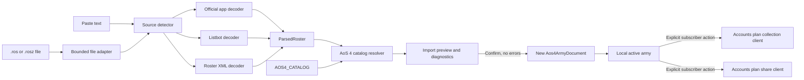

# Phase 2 Capability Restoration

Restore the useful account and roster workflows removed by the AoS 4 hard cutover without restoring
AoS 3 code or making claims the product cannot support. The resulting product keeps local army
building, notes, and printing free; offers current-format import, cloud army collections, share-link
creation, and subscriber themes to active subscribers; and lets anyone open a shared army.

This plan complements, rather than replaces, the existing
`2026-07-28-002-feat-aos4-user-accounts-plan.md` and
`2026-07-28-003-refactor-phase2-frontend-modernization-plan.md`.

**Repository convention.** This plan spans three repositories. Paths are repo-relative and prefixed
by target repo: `rest-api:` for `aos-reminders-rest-api`, `sub-api:` for
`aos-reminders-subscription-api`, and unprefixed for this repository (`aos-reminders`).

---

## Goal Capsule

**Objective.** Rebuild the removed roster-import, cloud collection, and sharing capabilities against
the AoS 4 army-document and catalog contracts, and make `/subscribe` an accurate description of the
shipped free and subscriber experiences.

**Authority hierarchy.** `AGENTS.md` migration constraints outrank this plan. This plan outranks
implementer judgment on the decisions it records. Implementer judgment governs details the plan
leaves open.

**Stop conditions.** Stop and ask before:

- pushing or merging `master`, deploying a frontend or API, or changing production services;
- changing the subscriber/free product boundary recorded here;
- adding an importer-specific alias, typo, or deprecation table;
- accepting an ambiguous or unknown imported selection;
- changing the accepted AoS 4 corpus, its generated products, or its beta certification;
- changing the public-read decision for share links; or
- reintroducing any retired AoS 3 module, data shape, importer, or fixture.

**Execution profile.** Implement with fixtures and contract tests first. Import parsing, resolution,
and army-document creation must be testable without React, browser storage, or network access.

**Tail ownership.** Land each frontend unit as a focused sub-PR targeting `aos4-migration`, after its
stated dependencies are present there. The entitlement and share-token changes in U6/U7 also land as
focused PRs in `aos-reminders-rest-api` and `aos-reminders-subscription-api` against their integration
branches. This plan creates no permission to merge the long-lived migration PR or deploy production.

---

## Product Contract

### Summary

AoS Reminders remains immediately useful without an account: a visitor can build one local AoS 4
army, add reminder notes, hide or reorder reminders, and download the existing PDF. An active
subscriber additionally gets convenience and continuity features: import a current roster, manage a
named cloud collection, create share links, and persist subscriber themes. A share recipient does
not need an account or subscription.

Imports recognize current interchange formats, not retired product brands. The first supported
sources are official Warhammer Age of Sigmar app text, Listbot text, and New Recruit/BSData
`.ros`/`.rosz` rosters. Importers use names only as temporary matching evidence and emit stable
canonical AoS 4 IDs. They never import third-party rules text into the accepted catalog.

### Problem Frame

The AoS 4 migration deliberately removed the old Azyr, Warscroll Builder, BattleScribe, Warhammer
App, saved-army, share, and attachment implementations. That preserved the hard edition boundary,
but it also reduced the product to a single local army document.

The visible subscription offer did not make the same cutover. `src/components/routes/Subscribe.tsx`
still promises imports from Azyr, Warscroll Builder, BattleScribe, and the "new Warhammer App"; cloud
save from any device "even offline"; and sharing. Its demo media shows removed workflows. It also
advertises notes as a subscriber benefit even though notes are currently part of the free local
experience, and lists custom reminders and attachments as "coming soon" despite neither belonging
to this Phase 2 scope.

The external roster landscape has also changed:

- Games Workshop retired Warscroll Builder in June 2024 and now provides Storm Forge in the
  official AoS app.
- New Recruit is the preferred application for the community-maintained AoS 4 BSData catalog and
  supports `.ros` and `.rosz` interoperability.
- The AoS 4 BSData project explicitly says BattleScribe is abandonware and no longer supported.
- Listbot 4.0 remains an AoS-specific builder used in organized-play workflows.

Restoring the historical code would therefore recreate obsolete source assumptions and violate the
edition boundary. Phase 2 needs a new composition-only import boundary and needs the Subscribe page
to claim capabilities only after they ship.

### Actors

| Actor | State | Expected capability |
| --- | --- | --- |
| Visitor | Signed out | Build and retain one local army; use notes and PDF; open a public share link |
| Account holder | Signed in, inactive subscription | Same free local behavior; see a clear subscribe prompt for paid actions |
| Subscriber | Signed in, active subscription | Free behavior plus import, cloud collection, share creation, and theme persistence |
| Share recipient | Any auth state | Preview and open a valid shared AoS 4 army without mutating their local army accidentally |

### Requirements

#### Free experience and entitlement

R1. Local AoS 4 army building, reminder notes, hide/show, ordering, and PDF download remain usable
without signing in or subscribing.

R2. The import UI, cloud collection management, and share-link creation require both an authenticated
user and an active subscription. Cloud mutations and share creation enforce the entitlement on the
server as well as in the UI. The locally delivered import parser is not a DRM boundary; its
subscriber restriction is an application interaction policy.

R3. A signed-out user who invokes a paid action is sent through the established Auth0 login
interaction. A signed-in non-subscriber sees a Subscribe call to action without losing local work.

R4. Subscriber theme behavior remains unchanged.

R5. Opening a public share link does not require authentication or a subscription.

#### Import sources and input safety

R6. The import surface accepts pasted roster text from the current official Warhammer Age of Sigmar
app when its selectable labels are in the accepted catalog's English language.

R7. The import surface accepts pasted Listbot 4.0 roster text when its selectable labels are in the
accepted catalog's English language.

R8. The import surface accepts New Recruit/BSData `.ros` XML and `.rosz` ZIP rosters through a
native file input.

R9. The product does not advertise or implement dedicated Azyr, Warscroll Builder, PDF, HTML, or
BattleScribe adapters. A structurally compatible `.ros` or `.rosz` file may work regardless of the
application that produced it, but the UI describes the format rather than promising BattleScribe
support. Localized selection names that do not match the English catalog are not supported in the
first release.

R10. Text and compressed-file size limits are enforced before parsing. ZIP expansion is bounded,
encrypted archives and multi-roster ambiguity are rejected, and XML containing a doctype or entity
declaration is rejected.

R11. Import processing is local to the browser. Raw roster text and files are not sent to analytics,
error-reporting, or API endpoints.

R12. `.ros` and `.rosz` inputs contribute roster composition and source metadata only. Embedded
descriptions, profiles, rules text, points, and characteristics never override or extend the
accepted AoS 4 catalog.

#### Import resolution and application

R13. All source adapters emit one provider-neutral parsed-roster contract containing only source
metadata, a proposed name, an optional declared rules context/faction, and typed selection labels.

R14. Resolution occurs against the checked-in `AOS4_CATALOG`. It narrows candidates by rules
context, faction reachability, and canonical entity kind before comparing normalized display text.

R15. Name normalization is limited to Unicode normalization, case, punctuation, whitespace,
provider formatting, model counts, and points suffixes. There are no importer correction, typo,
historical-name, or deprecation tables.

R16. Provider IDs and imported names are never persisted as identity. A successful import emits
only canonical IDs in a schema-valid `Aos4ArmyDocument`.

R17. An unknown, inapplicable, or ambiguous recognized selection is an error. The preview identifies
the source line and reason, and confirmation remains disabled until the error is resolved by a
different input or by choosing a supported context and re-running resolution.

R18. Duplicate roster entries that resolve to the same canonical selectable entity collapse to one
explicit selection. Model counts and reinforcement quantities do not duplicate reminders.

R19. A declared supported rules context is honored. A declared unsupported or retired context is an
error. If a source omits context, preview uses the application's accepted default context and shows
a warning before confirmation. Importable contexts have catalog status `current`, `seasonal`, or
`legends`; a `historical` context remains available to the runtime for provenance but is not accepted
from an import.

R20. Before presenting a successful preview, the resolver runs the normal AoS 4 selection graph and
army-document validation. Invalid relationships, exclusions, or missing selections block import.

R21. Applying an import is atomic. It creates a new local document ID and proposed name, uses the
resolved context and selection IDs, starts with empty reminder preferences, and replaces neither the
active local document nor a cloud record until the user confirms.

R22. Applying an import does not automatically save it to the subscriber's cloud collection.

#### Cloud army collection

R23. The army collection API, state, and baseline UI are supplied by U12/U13 of the AoS 4 User
Accounts plan. This plan does not create a second persistence client or collection state owner.

R24. Once that collection UI exists, create, load, rename, update, and delete cloud actions are
presented only to active subscribers. Create, rename, update, and delete also fail closed on the REST
API unless the verified caller currently has an active subscription. Public army reads remain as
settled in the accounts plan; the paid benefit is collection management and continuity, not army
confidentiality. Signed-out and inactive users retain their local document and receive the
entitlement behavior in R3.

R25. Loading a cloud army validates the AoS 4 document and runs the normal selection graph in its
declared context before offering to replace the current local document. Schema, missing-ID,
wrong-context, relationship, or exclusion failure leaves local work unchanged.

R26. Saving an imported or shared army to the cloud is a separate, explicit collection action.

#### Share creation and public loading

R27. The share-link API and ownership mechanics are supplied by U6 of the AoS 4 User Accounts plan.
This plan owns the browser create/copy/open experience.

R28. An active subscriber can create a share link for the current schema-valid AoS 4 document and
copy the resulting URL from an established modal pattern. The REST API independently verifies the
current subscription before writing the link.

R29. A share URL uses a cryptographically random token with at least 128 bits of entropy in
`?army=<token>`. It contains no serialized army, email, Auth0 subject, or owner name. The retired
`shortid` generator is not used. Link creation uses a conditional write and regenerates on the
vanishingly unlikely token collision.

R30. On `?army=<token>`, the browser fetches and validates the shared AoS 4 document, runs the normal
selection graph in its declared context, then presents a preview with army name, faction, and rules
context before replacing the active local document. Confirmation clones the shared content under a
fresh local document ID while preserving its name, context, selections, and reminder preferences.

R31. Cancelling, receiving an HTTP error, or receiving an invalid/incompatible document preserves
the active local document and displays an actionable message.

R32. The router captures the `army` token into memory and removes that query parameter before page
analytics or any unrelated external request can observe it. The token is removed for loading,
success, cancellation, invalid-token, and request-error paths. Other recognized query parameters are
preserved.

#### Subscribe truth and continuity

R33. Before restoration work begins, `/subscribe` removes claims for missing imports, cloud
collections, sharing, offline cloud access, retired products, custom reminders, and attachments.

R34. Until the paid capabilities ship, `/subscribe` advertises only current behavior: supporting the
project and the existing subscriber theme benefit. Notes and PDF remain visible elsewhere as free
features, not paid benefits.

R35. Stale import/save demo media is removed from the page in the truth-cleanup unit. Unreferenced
obsolete media is deleted after confirming it has no other consumers.

R36. After import, cloud collection, and sharing pass their release gates, `/subscribe` is updated
again to describe those capabilities using current source names and newly captured media or static
examples. It never claims full offline cloud sync.

R37. The established dark-blue masthead, typography, spacing, edit/play control, faction selector,
teal cards, reminder cards, navbar/account shell, footer, responsive layout, and print behavior are
preserved.

R38. All feature tests use small checked-in synthetic fixtures. Tests never require live builder
sites, live official app output, or network availability.

R39. No unit changes accepted AoS 4 source data or generated products. Every implementation unit
must leave `yarn data:aos4:verify:beta` green.

### Key Flows

#### Import a roster

1. The user selects **Import Army**.
2. Signed-out users authenticate; authenticated inactive users see the Subscribe prompt.
3. An active subscriber pastes text or selects one `.ros`/`.rosz` file.
4. The browser detects exactly one supported adapter and parses a provider-neutral roster.
5. The resolver selects context and faction candidates, maps recognized roster selections to
   canonical IDs, and runs the normal AoS 4 selection graph.
6. The modal shows source, proposed name, faction, context, matched selections, warnings, and
   line-scoped errors.
7. Confirmation is enabled only when there are no errors.
8. Confirm creates a fresh local AoS 4 document atomically. Cloud save remains a separate action.

#### Save and load a cloud army

1. The account plan's army collection provider supplies remote collection state.
2. An active subscriber chooses Save, Update, Load, Rename, or Delete from the familiar army
   collection surface.
3. Load validates the remote document and asks for confirmation before replacing local state.
4. A request or validation failure leaves local work intact and can be retried.
5. An inactive account sees the Subscribe prompt instead of initiating the remote operation.

#### Share an army

1. An active subscriber selects **Share Army**.
2. A modal discloses that the snapshot includes notes, hidden state, and ordering.
3. The user selects **Create Link**; the document is validated and posted through the accounts plan's
   authenticated share client.
4. The modal displays a copyable opaque URL with a selectable fallback if clipboard access fails.
5. A recipient opens the URL without authenticating.
6. The recipient previews the fetched army before confirming it as their local active document.
7. Importing that shared army into the recipient's cloud collection is an explicit subscriber action.

### Acceptance Examples

**Official app happy path**

```gherkin
Given an active subscriber has a local army they do not want to lose
When they paste a supported official app list for Stormcast Eternals
Then the preview names the detected source, faction, and rules context
And each recognized selection is shown with its canonical match
And the existing local army is unchanged until they confirm
And confirming creates a new local AoS 4 document with no inherited reminder preferences
```

**Ambiguous name fails closed**

```gherkin
Given a parsed selection label has two applicable catalog matches
When import resolution runs
Then the line is reported as ambiguous
And no canonical selection is guessed
And confirmation is disabled
And the current local document is unchanged
```

**Safe roster archive**

```gherkin
Given a selected .rosz file expands beyond the configured limit
When the file adapter inspects it
Then it rejects the file before XML resolution
And it reports that the roster is too large
And it does not upload or retain the raw archive
```

**Inactive account**

```gherkin
Given a signed-in user does not have an active subscription
When they choose Import Army, Save Army, or Share Army
Then no parser or remote mutation starts
And the established Subscribe call to action is shown
And their local army remains usable
```

**Public share**

```gherkin
Given a signed-out visitor opens a valid ?army=<token> URL
When the shared army passes schema and catalog validation
Then the visitor sees a preview without being asked to log in
And their current local army is not replaced until confirmation
And the query token is captured and removed before loading or analytics begins
```

**Truthful Subscribe page**

```gherkin
Given a capability has not passed its release gate
When a visitor opens /subscribe
Then the page does not claim that capability
And it does not name Azyr, Warscroll Builder, or BattleScribe as supported importers
And it does not promise cloud use while offline
```

### Success Criteria

- Supported official-app, Listbot, `.ros`, and `.rosz` fixtures produce deterministic canonical
  selections and valid AoS 4 documents.
- Unknown, ambiguous, wrong-context, unsafe XML, and oversized input fixtures fail without mutating
  local state.
- Active subscribers can complete import, cloud collection, and share-create flows; inactive and
  signed-out actors see the specified entitlement behavior.
- Anyone can open and preview a valid public share link.
- `/subscribe` contains no unsupported or retired capability claims at any intermediate release
  point.
- Existing local build, notes, theme, PDF, account shell, responsive, and print tests remain green.
- The accepted corpus beta checksum and certification remain unchanged and verified.

### Scope Boundaries

**In scope.**

- Official AoS app and Listbot pasted-text adapters.
- New Recruit/BSData `.ros` and `.rosz` adapter.
- Provider-neutral import contracts, resolution, diagnostics, preview, and atomic apply.
- Subscriber entitlement UX for import, cloud collection actions, share creation, and themes.
- Frontend share creation/copy and public share-link preview/apply.
- Subscribe copy/media cleanup and final accurate capability publication.
- Regression coverage for already-restored notes, themes, and PDF.

**Non-goals.**

- AoS 3 compatibility, saved-army translation, or any retired importer implementation.
- PDF or HTML roster import.
- Dedicated Azyr, Warscroll Builder, or BattleScribe support.
- Importing points, profiles, characteristics, ability text, or rules from third-party rosters.
- Army legality validation or reproducing a full list builder.
- Custom reminders, file attachments, or an advanced statistics route.
- Full offline/PWA cloud sync, conflict resolution, or background synchronization.
- Editing the canonical catalog, accepted manifest, generated runtime, or rules data.
- API authorization mechanics, database schema, and base cloud collection state already owned by
  the AoS 4 User Accounts plan.
- Broad visual redesign or new design language.

#### Deferred Follow-Up Work

- Advanced reminder statistics.
- Custom user-authored reminders.
- Attachments to cloud armies.
- Offline-first cloud collections with explicit conflict resolution, if a future PWA strategy
  justifies them.
- Additional roster sources based on measured unsupported-input demand and available stable samples.
- Army legality or points checking, which is a different product responsibility from reminders.

### Dependencies

- The accepted AoS 4 beta gate must pass before each unit.
- U2-U8 should build on the final stack produced by
  `2026-07-28-003-refactor-phase2-frontend-modernization-plan.md`; do not pin this plan to package
  versions that may move during that work.
- Cloud collection behavior depends on U12/U13 of
  `2026-07-28-002-feat-aos4-user-accounts-plan.md`.
- Share behavior depends on the same plan's U6 share API and U1/U4/U7/U8/U10 authorization work.
- Server-enforced paid writes require the accounts plan's authenticated current-user subscription
  lookup and the REST API's fixed subscription-service base URL in each environment.
- Production release of any paid account capability remains blocked until the accounts plan closes
  the Auth0 authorization blocker and the upgraded APIs have completed their separately authorized
  deployment verification.
- `fflate` is the proposed lazy-loaded ZIP implementation for `.rosz`; its exact version is chosen
  against the post-modernization lockfile during U4.

---

## Planning Contract

### Key Technical Decisions

#### KTD1. Keep capability restoration in a separate plan

**Decision.** This document owns restoration of removed product capabilities. The frontend
modernization and user-accounts documents retain ownership of their framework and baseline API work;
this plan owns only the incremental subscription-entitlement and share-token changes required by the
confirmed paid capability boundary.

**Why.** Import parsing, entitlement behavior, share-link UX, and subscription truth form a coherent
user outcome with dependencies on both existing programs. Adding them to either plan would blur
ownership and make its completion depend on unrelated work.

**Annotation.** `user-directed` - option 1 was selected over expanding the frontend modernization
plan or amending only the accounts plan.

**Settlement.** `session-settled: user-directed`.

#### KTD2. Preserve a free local core and make convenience/continuity subscriber benefits

**Decision.** Local army building, notes, and PDF stay free. Import, cloud collections, share
creation, and subscriber themes require an active subscription. Public share reads stay free.

**Why.** This matches the confirmed commercial boundary while ensuring a share recipient can use the
link without adopting an account first.

**Annotation.** `session-settled: user-approved` - chosen over making import, cloud collections, and
share creation free, or moving notes/PDF behind the subscription.

#### KTD3. Support current formats, not retired product brands

**Decision.** Target official app text, Listbot text, and New Recruit/BSData `.ros`/`.rosz`.
Do not build brand-specific Azyr, Warscroll Builder, or BattleScribe adapters.

**Why.** Warscroll Builder was retired, BattleScribe is not supported by the current AoS 4 BSData
maintainers, and New Recruit is the active `.ros`/`.rosz` client. Format-level support also avoids
promising compatibility with an unmaintained application.

**Annotation.** `session-settled: user-approved` - chosen over recreating every v3 importer.

#### KTD4. Treat imported labels as evidence, never identity

**Decision.** Source adapters emit labels and kind hints; the resolver produces stable canonical IDs
after context, faction, kind, and reachability filtering.

**Why.** The AoS 4 architecture requires durable identity to come from the canonical catalog. Saving
provider IDs or normalized names would recreate the fragile identity model removed in Phase 1.

#### KTD5. Resolve conservatively and apply atomically

**Decision.** Unknown and ambiguous recognized selections block confirmation. The current document
changes only after the user confirms an error-free preview.

**Why.** A partial or guessed import can silently omit the reminders the user imported the list to
receive. Preserving the current document also makes failures recoverable.

#### KTD6. Keep parsing outside React and provider mechanics outside `src/aos4/`

**Decision.**

- `src/aos4/import/` owns provider-neutral contracts, catalog resolution, diagnostics, and document
  creation.
- `src/importers/aos4/` owns official-app, Listbot, and roster-file decoding plus source detection.
- React components own input, preview, confirmation, and entitlement presentation only.

**Why.** The domain layer remains independent of browser and provider details while provider
adapters can depend inward on stable AoS 4 contracts.

#### KTD7. Parse `.rosz` locally with bounded lazy-loaded ZIP support

**Decision.** Use a post-modernization-compatible `fflate` release loaded only when a `.rosz` file
is selected. Use its streaming unzip API and abort as soon as cumulative expanded bytes exceed the
limit; do not call an API that expands the entire archive before the limit can be checked. Use the
browser's XML parser after preflight rejection of doctype/entity declarations. Start with a 1 MiB
text/compressed-input limit and a 5 MiB expanded XML limit.

**Why.** `fflate` is browser-compatible, TypeScript-friendly, small, and has no runtime
dependencies. Lazy loading keeps ZIP code off the initial Home bundle. Explicit limits prevent a
small archive from causing unbounded work.

**Implementation note.** Treat these limits as named constants with boundary tests. If real,
non-sensitive fixtures demonstrate that normal current rosters exceed them, adjust the constants
and record the evidence in the unit PR; do not silently remove the bounds.

#### KTD8. Reuse the accounts plan's collection and share clients

**Decision.** The existing accounts plan remains the only owner of remote army collection state,
share storage, API authorization, and ownership. This plan adds paid-action gating and completes the
Home/share UI around those clients.

**Why.** Two remote state owners would cause conflicting writes and duplicate security logic.

**Contract refinement.** The accounts plan describes the collection mechanically for signed-in
users. The product entitlement in R2/R24 narrows its browser presentation to active subscribers;
its ownership and JWT requirements remain unchanged, while KTD11 adds current-subscription
authorization before paid writes.

#### KTD9. Preview public shares before replacing local state

**Decision.** A valid public share opens a confirmation preview and never auto-loads over the local
army.

**Why.** A link should not destroy or overwrite work merely by being opened. Public read is
intentional, but local replacement must remain a user action.

**Bootstrap detail.** Capture the query token and call `history.replaceState` synchronously before
React providers mount. Pass the token inward as in-memory bootstrap state; do not retain it in local
or session storage. This guarantees page-view analytics cannot observe the token.

#### KTD10. Correct Subscribe in two releases

**Decision.** Remove false claims immediately, then add current claims only after the relevant
capabilities pass release gates.

**Why.** Leaving false marketing in place until every Phase 2 dependency completes would knowingly
misrepresent the live product. Advertising planned work before it ships would repeat the same drift.

#### KTD11. Enforce remote paid actions at the service boundary

**Decision.** The REST API forwards the caller's bearer token to the subscription API's authenticated
`GET /entitlement` endpoint before an army mutation or share create. That endpoint returns only
`{ "active": boolean }`. The REST API accepts only a schema-valid `active: true` response, uses a
fixed HTTPS service URL with a three-second timeout, and fails closed on missing, inactive,
malformed, or error responses. Public army and share reads remain unchanged.

**Why.** A browser-only gate is sufficient to present the local import interaction but is not an
authorization boundary for remote storage or link creation. Reusing the subscription service keeps
subscription truth in one system and avoids duplicating its payment-status rules in the REST API.

**Failure policy.** Do not retry the protected mutation automatically. An unavailable entitlement
check returns a retryable service error before any write occurs.

**Token contract.** Both APIs use the same Auth0 audience defined by the accounts plan. The REST API
forwards only the original `Authorization` header to the fixed entitlement URL.

### High-Level Technical Design



`src/aos4/import/` may depend on `src/aos4/domain`, `src/aos4/select`, and `src/aos4/state`. It must
not import React, `window`, file APIs, Auth0, subscription state, analytics, or an API client.

`src/importers/aos4/` may depend inward on `src/aos4/import/` and third-party parsing packages. It
must not mutate the catalog or produce reminder text from imported data.

The React surface receives a discriminated `ImportPreview` and is the only layer that applies its
proposed document. `Home.tsx` remains the owner of the active local document until the accounts
plan's collection provider supplies its documented integration seam.

### Proposed Contracts

Exact property naming may change during implementation, but the separation and information content
are fixed:

```ts
type Aos4ImportSource = 'official-app-text' | 'listbot-text' | 'roster-xml'

interface ParsedRosterSelection {
  line: number
  label: string
  kindHint:
    | 'faction'
    | 'warscroll'
    | 'battle-formation'
    | 'artefact-of-power'
    | 'spell-lore'
    | 'prayer-lore'
    | 'manifestation-lore'
    | 'regiment-of-renown'
  count?: number
}

interface ParsedRoster {
  source: Aos4ImportSource
  proposedName: string
  declaredContext?: string
  declaredFaction?: string
  selections: ParsedRosterSelection[]
}

interface Aos4ImportDiagnostic {
  code:
    | 'unsupported-source'
    | 'unsafe-input'
    | 'input-too-large'
    | 'unsupported-context'
    | 'missing-faction'
    | 'unknown-selection'
    | 'ambiguous-selection'
    | 'inapplicable-selection'
    | 'invalid-selection-graph'
  severity: 'warning' | 'error'
  message: string
  line?: number
}

interface Aos4ImportPreview {
  source: Aos4ImportSource
  proposedDocument?: Aos4ArmyDocument
  matches: Array<{ line: number; label: string; canonicalId: CanonicalId }>
  diagnostics: Aos4ImportDiagnostic[]
}
```

The decoder may retain adapter-specific parsing details internally, but they do not cross the
`ParsedRoster` boundary. The proposed document is absent whenever any error diagnostic exists.

### Detection and Resolution Rules

1. Normalize line endings and Unicode, preserving original line numbers for diagnostics.
2. Detect a source only from explicit structural markers. Official app fixtures cover both observed
   AoS 4 footer families: `Created with Warhammer Age of Sigmar: The App` plus either
   `Exported with App Version: ... Data Version: ...` or `App: ... | Data: ...`. Listbot requires the
   exact `Generated by Listbot 4.0` footer. Zero or multiple matching adapters is an
   `unsupported-source` error.
3. Parse one roster; reject multiple roster roots in a single file.
4. Select a catalog rules context from a supported declared context or the accepted default with a
   warning.
5. Resolve the faction first.
6. Build candidate sets by context applicability, faction relationship reachability, and kind.
7. Compare normalized labels only inside that candidate set.
8. Require exactly one candidate for each recognized selectable source line.
9. Deduplicate canonical IDs and run `resolveSelection`.
10. Create a new document through `createAos4ArmyDocument`, serialize it, and deserialize it against
    `AOS4_CATALOG` as the final boundary check.

Lines such as point totals, regiment headings, enhancement labels already emitted as a typed
selection, model counts, and export metadata are either parsed structurally or explicitly ignored.
An ignored line must never be mistaken for an unmatched selectable line.

### Security and Privacy Controls

- Read `File` objects as text/bytes only after extension, media shape, and size checks.
- Permit one `.ros` XML document or one `.ros` entry inside `.rosz`; ignore harmless ZIP metadata
  entries and reject competing roster entries.
- Reject encrypted ZIP entries, path traversal names, doctype/entity declarations, and parse errors.
- Cap line count and parsed selection count in addition to byte limits so crafted text cannot create
  unbounded matching work. Start with 10,000 normalized input lines and 1,000 recognized selections
  as hard limits, with boundary tests.
- Escape all source labels in the UI through normal React text rendering; do not render imported
  HTML.
- Never log raw input, parsed labels, or full army documents. If aggregate analytics remain, record
  only source category, success/failure, and a bounded diagnostic code.
- Do not persist an input file or raw pasted text after the modal closes.
- Generate share tokens with a cryptographic random source and at least 128 bits of entropy.
- Use a conditional create so a token collision cannot overwrite an existing shared army.
- Capture and strip share tokens from the browser URL before analytics or unrelated requests run.
- Treat frontend import gating as UX policy; enforce every paid server mutation independently.

### Sequencing Strategy

1. Land U1 immediately so the live Subscribe page stops advertising removed capabilities.
2. Complete and merge the frontend modernization plan into `aos4-migration`.
3. Implement the pure import contracts/resolver and source adapters (U2-U4).
4. Implement subscriber-gated import UI and local atomic apply (U5).
5. After the accounts plan's secure collection/share clients land, add collection entitlement and
   share UX (U6-U7).
6. Run the integrated release/continuity pass and publish accurate Subscribe claims (U8).
7. Deploy or merge the migration PR only under separate explicit user authorization.

---

## Implementation Units

### U1. Remove stale subscription claims and media

**Outcome.** `/subscribe` describes only capabilities available at the time this unit lands.

**Files.**

- Modify `src/components/routes/Subscribe.tsx`.
- Modify `src/tests/aos4/accountRoutes.test.tsx`.
- Add `src/tests/aos4/subscribeCapabilities.test.tsx` if a focused test is clearer than extending
  the route test.
- Remove `public/img/import_demo.mp4`, `public/img/import_demo.gif`,
  `public/img/save_load_demo.mp4`, and `public/img/save_load_demo.gif` only after `rg` confirms no
  other consumer.

**Work.**

- Remove current and "coming soon" claims for unshipped import, cloud save/load, sharing, offline
  cloud access, custom reminders, and attachments.
- Remove Azyr, Warscroll Builder, and BattleScribe names.
- Do not list notes or PDF as paid subscriber benefits.
- Retain the support-the-project framing, current pricing/account behavior, and active subscriber
  theme benefit.
- Remove the stale demos from the page while retaining the established page hierarchy and dark-mode
  example.
- Add an assertion set that fails whenever retired product names or the offline promise return.

**Acceptance.**

- The Subscribe page is truthful before any later unit ships.
- Account shell, pricing plans, and active-subscriber redirect behavior are unchanged.
- Desktop and mobile screenshots preserve recognizable layout and navigation.

**Dependencies.** None beyond a green accepted beta gate.

### U2. Add provider-neutral import contracts and conservative resolver

**Outcome.** A parsed composition can be deterministically resolved to a proposed AoS 4 document
without React, file APIs, storage, or network access.

**Files.**

- Add `src/aos4/import/types.ts`.
- Add `src/aos4/import/normalizeLabel.ts`.
- Add `src/aos4/import/resolveRoster.ts`.
- Add `src/aos4/import/index.ts`.
- Add `src/tests/aos4/importResolution.test.ts`.
- Add small catalog/roster builders under `src/tests/fixtures/aos4/import/`.

**Work.**

- Define the provider-neutral contracts and diagnostic codes.
- Implement limited label normalization from R15.
- Index catalog selections by rules context, faction reachability, kind, and normalized display
  label.
- Resolve faction before dependent selections.
- Detect unknown, ambiguous, inapplicable, and wrong-context selections with line-scoped
  diagnostics.
- Deduplicate repeated canonical IDs.
- Validate the resolved selection graph and round-trip the proposed document through the army
  document serializer/deserializer.
- Generate a fresh document ID through an injected ID factory so tests remain deterministic.

**Tests.**

- Exact unique match in the correct context.
- Same display name across kinds or factions does not cross-match.
- Ambiguous same-kind applicable name fails.
- Unknown and inapplicable selections fail.
- Missing context defaults with warning; unsupported declared context fails.
- Duplicate unit/count input produces one canonical selection.
- Final selection-graph and document-validation failures block the proposed document.
- No importer-specific correction or alias dictionary is introduced.

**Acceptance.**

- The resolver persists canonical IDs only.
- `src/aos4/` dependency isolation remains green.
- Resolver tests run entirely offline.

**Dependencies.** Frontend modernization merged; U1.

### U3. Add official app and Listbot text adapters

**Outcome.** Current official app and Listbot pasted exports decode into the shared parsed-roster
contract with stable line diagnostics.

**Files.**

- Add `src/importers/aos4/detectTextSource.ts`.
- Add `src/importers/aos4/officialApp.ts`.
- Add `src/importers/aos4/listbot.ts`.
- Add `src/importers/aos4/index.ts`.
- Add `src/tests/aos4/importOfficialApp.test.ts`.
- Add `src/tests/aos4/importListbot.test.ts`.
- Add sanitized synthetic fixtures under `src/tests/fixtures/aos4/import/official-app/` and
  `src/tests/fixtures/aos4/import/listbot/`.

**Work.**

- Define structural source markers and reject zero/multiple adapter matches.
- Support the two observed official AoS 4 footer families and the exact Listbot 4.0 footer described
  in Detection and Resolution Rules.
- Parse roster name, faction, declared battlepack/context when present, and only the selectable kinds
  the AoS Reminders builder supports.
- Strip counts and points syntax as formatting, not identity.
- Treat regiment organization and total lines as metadata.
- Preserve source line numbers for every selection.
- Reject an input that looks like a different/older edition rather than guessing it is AoS 4.

**Tests.**

- At least two current-shape official app fixtures, including one with explicit app/data markers and
  one without a declared context.
- At least two Listbot fixtures with regiment and enhancement sections.
- CRLF/LF, Unicode punctuation, extra whitespace, model counts, and points suffixes.
- Unsupported, mixed-source, empty, and stale-edition inputs.
- Embedded prose/rules text is ignored and never enters `ParsedRoster`.

**Acceptance.**

- Both adapters produce the same provider-neutral kinds for equivalent compositions.
- Fixtures contain no personal account data and do not depend on live websites.
- Parser failures show source and line-level actionable diagnostics.

**Dependencies.** U2.

### U4. Add bounded `.ros` and `.rosz` roster-file adapter

**Outcome.** New Recruit/BSData roster files decode locally without expanding the browser's trusted
data boundary.

**Files.**

- Add `src/importers/aos4/rosterFile.ts`.
- Add `src/importers/aos4/rosterXml.ts`.
- Modify `src/importers/aos4/index.ts`.
- Modify `package.json` and `yarn.lock` to add the selected post-modernization `fflate` version.
- Add `src/tests/aos4/importNewRecruit.test.ts`.
- Add minimal synthetic `.ros` and `.rosz` fixtures under
  `src/tests/fixtures/aos4/import/new-recruit/`.

**Work.**

- Accept `.ros` and `.rosz` by file name plus verified content shape.
- Enforce the named compressed/text and expanded limits and explicit selection/line-count caps.
- Lazy-load ZIP code only for `.rosz` and stop the streaming inflater as soon as the expanded-byte
  budget is exhausted.
- Accept exactly one roster XML root.
- Reject encrypted entries, traversal paths, multiple candidate roster entries, malformed XML,
  doctype/entity declarations, and unsupported roster schema/edition markers.
- Extract composition labels and type hints only; ignore catalogue IDs, rules descriptions, profiles,
  costs, and characteristics as authority.

**Tests.**

- Valid `.ros` and `.rosz` decode to equivalent `ParsedRoster` values.
- ZIP metadata entries do not cause false multi-roster errors.
- Oversized compressed, oversized expanded, encrypted, path-traversal, multi-roster, doctype/entity,
  malformed, and wrong-edition cases fail closed.
- Dynamic import or bundle inspection proves ZIP code is not in the initial Home chunk.

**Acceptance.**

- No server request occurs during file processing.
- No XML-derived HTML is rendered.
- The source is marketed as New Recruit/`.ros`/`.rosz`, not as guaranteed BattleScribe support.

**Dependencies.** U2; post-modernization package baseline.

### U5. Add subscriber-gated import preview and atomic apply

**Outcome.** Active subscribers can use the supported adapters through the established Home
experience without risking the current army.

**Files.**

- Add `src/components/input/importArmy/importArmyModal.tsx`.
- Add `src/components/input/importArmy/importPreview.tsx`.
- Add `src/components/input/importArmy/subscriberAction.tsx` or reuse an established entitlement
  primitive introduced by the accounts plan.
- Modify `src/components/input/toolbar/toolbar.tsx`.
- Modify `src/components/routes/Home.tsx`.
- Add `src/tests/aos4/importUi.test.tsx`.
- Modify `src/tests/aos4/homePresentation.test.tsx`.

**Work.**

- Add **Import Army** to the existing toolbar using its current responsive grid and visual
  primitives.
- Lazy-load the modal and source adapters when the paid action opens so import code is absent from
  the initial Home chunk.
- Use paste and upload tabs; implement upload with a native `<input type="file">`.
- Gate opening according to R2/R3.
- Detect, parse, resolve, and display source/faction/context/matches/warnings/errors.
- Allow the user to choose among supported catalog contexts in preview and re-run resolution; never
  make an unsupported declared context valid silently.
- Keep confirmation disabled on any error.
- Confirm by passing the proposed document to Home's active-document owner once.
- Close/cancel/error without changing current selections, notes, hidden state, or order.
- Record only aggregate source/outcome analytics if existing analytics conventions require an event.

**Tests.**

- Signed-out login path, inactive Subscribe path, and active subscriber path.
- Paste and upload success.
- Warning preview remains confirmable; error preview does not.
- Cancel and failures preserve current local serialized document.
- Confirm applies a fresh ID and empty reminder preferences.
- Import does not invoke cloud save.
- Accessible labels, keyboard close/focus return, and mobile modal behavior.

**Acceptance.**

- Existing edit/play, faction, reminder, print, notes, and hide/show behavior is unchanged.
- Raw inputs do not appear in logs or analytics mocks.
- Desktop and mobile comparison preserves the live visual baseline.

**Dependencies.** U3 and U4; secure subscription status from the accounts plan must exist before
production release.

### U6. Apply subscriber entitlement to the cloud collection

**Outcome.** The accounts plan's cloud collection works as a server-enforced subscriber benefit while
the local free army remains intact.

**Files.**

- Modify the collection context and saved-army components delivered by accounts-plan U12/U13.
- Modify `src/components/routes/Home.tsx` only at their documented integration seam.
- Add or modify focused tests alongside the accounts-plan collection tests.
- Add `sub-api: user/entitlement.js` and its tests.
- Modify `sub-api: serverless.yml` to expose authenticated `GET /entitlement`.
- Add `rest-api: util/subscriberEntitlement.js`.
- Modify `rest-api: items/create.js`, `items/update.js`, and `items/delete.js`.
- Modify both API test suites and `rest-api: serverless.yml` environment configuration.

**Work.**

- Reuse the collection provider and API client; do not create parallel remote state.
- Gate create, load, rename, update, and delete affordances on active subscription.
- Use the shared login/Subscribe entitlement primitive from U5.
- Add the minimal authenticated subscription endpoint that derives the current user from the bearer
  token and returns only `{ active: boolean }`.
- Before each collection mutation, verify the caller through KTD11. Forward the original bearer
  token to that endpoint, accept only `active: true`, and perform no write when the check fails.
- Keep the subscription-service origin fixed in environment configuration; do not accept a target
  URL from the browser or request body.
- Validate a fetched document, run `resolveSelection` in its declared context, and preview
  replacement before applying it locally.
- Preserve current local state on fetch, auth, validation, or update failure.
- Make cloud save explicit for newly imported or shared documents.
- Keep signed-out local storage behavior unchanged.

**Tests.**

- Active subscriber CRUD affordances and client calls.
- Signed-out and inactive actors cannot initiate remote mutations.
- Direct REST calls from authenticated inactive users cannot create, rename, update, or delete.
- Entitlement timeout, malformed response, 401, 404, and 5xx all fail before DynamoDB mutation.
- The entitlement response contains no email, payment provider, plan, or subscription identifier.
- Invalid/incompatible remote document, invalid selection graph, and network error preserve local
  state.
- Loading requires confirmation.
- Import/share apply does not silently create a remote record.

**Acceptance.**

- There is one owner for cloud collection state.
- Account navigation and profile/subscription behavior remain recognizable.
- No API is described as secure until the accounts plan's negative authorization tests pass.

**Dependencies.** Accounts-plan U1, U4, U5, U7, U8, U10, U12, and U13; U5 shared entitlement
primitive. Local integration tests mock the service boundary; dev/prod verification requires the
subscription API to be deployed first under separate authorization.

### U7. Add share creation and public share-link preview

**Outcome.** Active subscribers can create share links, and anyone can safely preview and apply one.

**Files.**

- Add `src/components/share/shareArmyModal.tsx`.
- Add `src/components/share/sharedArmyPreviewModal.tsx`.
- Add `src/aos4/runtime/sharedArmy.ts` only for provider-neutral validation/apply helpers; keep HTTP
  in the accounts plan's application API layer.
- Add `src/aos4/runtime/sharedArmyLocation.ts` for synchronous pre-mount token capture and URL
  cleanup.
- Modify `src/components/input/toolbar/toolbar.tsx`.
- Modify `src/components/routes/Home.tsx`.
- Modify `src/main.tsx` to capture the token before Auth0, analytics, and React mount.
- Modify the post-modernization router/query-param integration.
- Modify `rest-api: links/create.js` and its tests.
- Add `src/tests/aos4/shareArmy.test.tsx`.
- Add `src/tests/aos4/sharedArmyRoute.test.tsx`.

**Work.**

- Add **Share Army** to the familiar toolbar and gate creation per R2/R3.
- Open a disclosure/confirmation state before creating anything. Validate the current document and
  call the accounts-plan share client only after the user selects **Create Link**.
- Replace `shortid` link IDs with a cryptographically random token carrying at least 128 bits of
  entropy, conditionally create the record with a bounded collision retry, and verify current
  subscriber entitlement through KTD11 before writing the link.
- Display a copyable opaque URL with success/error states.
- State in the create modal that the snapshot includes reminder notes, hidden state, and ordering, and
  that anyone with the link can read it.
- Capture and remove `army` from the visible URL before page analytics or unrelated external
  requests during synchronous application bootstrap, pass it inward in memory, then fetch through
  the public read client and validate with
  `deserializeAos4ArmyDocument`.
- Run `resolveSelection` in the shared document's declared context and show name, faction, and
  context in a preview before applying.
- Preserve local state on cancel/failure.
- Clone confirmed content under a fresh local document ID while preserving shared reminder
  preferences.
- Ensure fetched owner/account fields, if any legacy API response includes them, never enter the UI
  model.

**Tests.**

- Active subscriber disclosure/create/copy, inactive/signed-out gating, clipboard fallback, and API
  error.
- Direct authenticated inactive create is rejected; token format/entropy, conditional creation, and
  collision retry exhaustion are covered.
- Signed-out public read.
- Invalid token, not found, network error, incompatible schema, missing selection, unsupported
  context, and invalid selection graph.
- Confirm applies once under a fresh ID; cancel applies nothing.
- Query cleanup runs before analytics on every outcome and preserves unrelated recognized
  parameters.
- URL and UI reveal no owner identity or serialized army data.
- Share creation disclosure accurately names the reminder preferences included in the snapshot.

**Acceptance.**

- Public reads remain account-free.
- Opening a URL never auto-overwrites the active local document.
- The router upgrade's documented `?army=` compatibility has an actual tested consumer.

**Dependencies.** Accounts-plan U1/U4/U6/U7/U8/U10 and frontend client seam; modernization router
unit; U5 entitlement primitive; U6 KTD11 service client.

### U8. Integrated continuity gate and final Subscribe publication

**Outcome.** The restored capability set is coherent, tested, and described accurately.

**Files.**

- Modify `src/components/routes/Subscribe.tsx`.
- Modify `src/tests/aos4/subscribeCapabilities.test.tsx`.
- Modify `src/tests/aos4/accountRoutes.test.tsx` and
  `src/tests/aos4/homePresentation.test.tsx` where integrated landmarks change.
- Add current, intentionally produced demo media under `public/img/` only if it materially clarifies
  the paid features; static accessible examples are acceptable.
- Update `docs/printing.md` only if regression verification finds a user-visible capability note that
  is now inaccurate.

**Work.**

- Verify import, collection, share, theme, local notes, and PDF across actor states.
- Publish subscriber claims only for capabilities that have passed the release gate.
- Name current supported inputs: official AoS app text, Listbot text, and New Recruit
  `.ros`/`.rosz`.
- Describe cloud collections as online account continuity; do not promise offline cloud access.
- Keep free local build, notes, and PDF clearly outside the paywall.
- Capture desktop and mobile screenshots for Home, Subscribe, import preview, collection, share
  create, and public share preview.
- Verify production bundle chunking and ensure importer/file code is loaded only on demand.

**Acceptance.**

- Every Subscribe claim maps to a passing test and shipped UI.
- No retired product name or stale demo remains.
- No paid action bypass exists in toolbar, keyboard, route, or direct component entry.
- The full verification contract passes with no accepted-corpus change.

**Dependencies.** U1-U7 and all production-launch security gates from the accounts plan.

**Release note.** Final paid-feature claims may merge only as part of the explicitly authorized
release that has already verified the production API deployments and frontend feature paths. If
deployment is staged, keep U1's reduced truthful copy until those production checks pass.

---

## Verification Contract

Run for every implementation unit:

```powershell
yarn lint
yarn tsc --noEmit
yarn test --run
yarn build
yarn data:aos4:verify:beta
```

Run focused suites as they appear:

```powershell
yarn vitest run src/tests/aos4/importResolution.test.ts
yarn vitest run src/tests/aos4/importOfficialApp.test.ts
yarn vitest run src/tests/aos4/importListbot.test.ts
yarn vitest run src/tests/aos4/importNewRecruit.test.ts
yarn vitest run src/tests/aos4/importUi.test.tsx
yarn vitest run src/tests/aos4/shareArmy.test.tsx
yarn vitest run src/tests/aos4/sharedArmyRoute.test.tsx
yarn vitest run src/tests/aos4/legacyIsolation.test.ts
```

For U5-U8, also compare the affected routes against `https://aosreminders.com/` at desktop and mobile
widths. Verify the established navbar, masthead, edit/play control, faction selector, builder cards,
toolbar rhythm, reminder cards, notes, footer, and print behavior. Capture the new modals at success,
warning, error, loading, signed-out, inactive, and active states.

The suite must remain offline and deterministic. Live builder pages are research sources, not test
dependencies.

### Release Gates

| Gate | Required evidence |
| --- | --- |
| Import correctness | All adapter/resolver fixtures pass; ambiguity and unsafe inputs fail closed |
| Entitlement | Signed-out, inactive, and active actor tests cover every paid entry point |
| Account security | Accounts-plan authorization and negative tests pass; shared browser key removed |
| Share safety | Public read works; preview prevents automatic local replacement |
| Continuity | Browser comparison and presentation/account tests pass at desktop and mobile |
| Corpus isolation | `yarn data:aos4:verify:beta` passes with unchanged accepted products |
| Marketing truth | Every advertised capability is shipped and tested; retired/offline claims absent |

---

## Definition of Done

- Frontend portions of U1-U8 are merged into `aos4-migration`, and the API portions of U6/U7 are
  merged into their repositories' default integration branches, through focused reviewed PRs.
- Official app text, Listbot text, `.ros`, and `.rosz` imports are deterministic, local, bounded, and
  canonical-ID based.
- Import ambiguity or invalidity cannot mutate the local or remote army.
- Active subscribers can import, manage cloud armies, and create shares through the established UI.
- Signed-out and inactive users retain the complete free local workflow.
- Public share recipients can preview and apply valid shared AoS 4 armies without authenticating.
- Cloud collection and share mechanics have a single state/API owner from the accounts plan.
- `/subscribe` is truthful before, during, and after the restoration sequence.
- Notes, PDF, theme, account shell, responsive layout, and print behavior remain recognizable and
  covered.
- No retired AoS 3 path, importer correction table, or generated-data edit is introduced.
- Lint, typecheck, full tests, build, browser checks, and beta verification pass.
- No production deployment or `master` merge occurs without explicit user authorization.

---

## Open Questions

These questions do not block implementation of the contract above, but must be answered with current
fixtures during their owning unit:

1. Do normal current `.rosz` files exceed the initial 1 MiB/5 MiB safety limits? U4 may adjust the
   constants only with reviewed fixture evidence.
2. Does the accounts-plan share API return a bare AoS 4 document or an envelope? U7 adapts at the API
   client boundary; the UI receives only a validated document plus opaque token metadata.
3. Is new demo media worth its maintenance cost? U8 defaults to concise copy/static examples unless
   motion demonstrates a workflow materially better.

---

## Risks and Dependencies

| Risk | Impact | Mitigation |
| --- | --- | --- |
| Official app/Listbot text output changes without a versioned contract | Import detection breaks | Structural markers, multiple fixtures, bounded adapters, actionable unsupported-source errors |
| Same display name exists in multiple current catalog locations | Wrong reminders | Context/faction/kind/reachability narrowing and exact-one-match rule |
| Community roster contains stale or conflicting rules | Canonical data contamination | Import composition only; ignore all third-party rules/profile text |
| ZIP/XML input exhausts browser resources | Availability/security issue | Preflight and expanded limits, one roster, selection caps, unsafe XML rejection |
| Accounts and capability plans create competing state | Lost updates or inconsistent UI | Accounts plan owns remote collection/share mechanics; this plan consumes its seam |
| Subscriber gate trusts insecure legacy API | Paid actions can be misclassified | Production release blocked on accounts-plan Auth0 verification and negative tests |
| Subscription service is unavailable during a paid write | Valid subscriber cannot mutate cloud data | Fixed short timeout, fail before write, retryable UI error, no automatic mutation retry |
| Modernization moves router/component seams | Merge churn | Implement feature units after modernization and target resulting contracts, not old versions |
| Subscribe claims drift again | User trust and billing risk | Claims tied to release gates and explicit retired-name/offline assertions |
| Opening a share overwrites local work | Data loss | Mandatory preview/confirm and unchanged-state failure tests |

---

## System-Wide Impact

### Interaction Graph

- Toolbar paid actions read Auth0 and subscription state but do not move that state into
  `src/aos4/`.
- Import adapters feed the provider-neutral resolver; only the resolver touches canonical selection
  logic.
- Confirmed documents flow into the same Home state and `armyStorage` path as manual selections.
- Cloud collection and share create flow outward through clients supplied by the accounts plan; the
  REST handlers verify current entitlement with the subscription service before writing.
- Public share read flows inward through validation and preview before Home state changes.
- Subscribe copy is downstream of release gates, never an independent source of product truth.

### Error Propagation

- Adapter errors become bounded import diagnostics and stop before resolution.
- Resolution/document errors stop before preview confirmation.
- Auth/subscription errors preserve the local document and show retry/login/Subscribe actions.
- Cloud/share HTTP errors remain at the modal or collection surface and never clear local state.
- Invalid public shares never enter storage.

### State Lifecycle

- Raw input exists only while the import modal is open.
- Parsed and preview state is ephemeral.
- A confirmed import receives a new local document ID and persists through the existing versioned
  local key.
- Remote persistence occurs only through a separate explicit collection action.
- Shared documents are copied into a new local identity on confirmation; the remote share remains an
  immutable source snapshot unless the accounts API contract explicitly versions it.

### API Surface

- No new backend API is defined here.
- U6 consumes the collection endpoints from accounts-plan U5/U12 and adds the current-subscription
  check from KTD11 through the subscription API's minimal entitlement endpoint.
- U7 consumes authenticated share creation and public share read from accounts-plan U6, replacing
  the legacy short token and applying the same current-subscription check.
- All authenticated calls use the accounts plan's Auth0 bearer-token client.
- The subscription API remains the sole owner of active/inactive subscription rules; the REST API
  consumes its boolean entitlement response.
- Public share URLs carry opaque tokens only.

---

## Sources and Research

Research checked on 2026-07-29:

- Games Workshop retired Warscroll Builder in June 2024:
  [Farewell to Warscroll Builder](https://www.warhammer-community.com/en-gb/articles/k225zywl/farewell-to-warscroll-builder/).
- Games Workshop describes Storm Forge in the official AoS app and its one-free-list model:
  [The new Warhammer Age of Sigmar app is coming soon](https://www.warhammer-community.com/en-gb/articles/BJIpAlgV/the-new-warhammer-age-of-sigmar-app-is-coming-soon-heres-what-to-expect/).
- The official app remains current for the 2026-27 season:
  [The Scourge of Aqshy now on the Age of Sigmar app](https://www.warhammer-community.com/en-gb/articles/syhssuyr/the-scourge-of-aqshy-now-on-the-age-of-sigmar-app/)
  and [Google Play listing](https://play.google.com/store/apps/details?id=com.gamesworkshop.aos4).
- New Recruit is active and documents `.ros`/`.rosz` compatibility:
  [New Recruit](https://www.newrecruit.eu/) and
  [Google Play listing](https://play.google.com/store/apps/details?hl=en_GB&id=eu.newrecruit.www.twa).
- The current AoS 4 BSData repository recommends New Recruit and states that BattleScribe is no
  longer supported:
  [BSData/age-of-sigmar-4th](https://github.com/BSData/age-of-sigmar-4th).
- Listbot 4.0 remains available, and the AdeptiCon 2025 packet accepted lists from the official app
  or Listbot:
  [Listbot](https://aoslistbot.herokuapp.com/listbot/) and
  [AdeptiCon AoS Team Tournament packet](https://www.adepticon.org/wpfiles/2025/2025AoSTT.pdf).
- Public 2025-26 list examples confirm the current official app
  `App: ... | Data: ...` footer and Listbot's `Generated by Listbot 4.0` footer:
  [official app example](https://www.warhammer-forum.com/topic/299517-liste-1000ptsseraphons-amicaux/)
  and
  [Listbot example](https://miniheadquarters.com/tournaments/individual/army-lists/french-wargame-cafe-aos-n16-solo-2000-points-2025-04-20).
- Proposed ZIP library:
  [`fflate` on npm](https://www.npmjs.com/package/fflate) and
  [source repository](https://github.com/101arrowz/fflate).

Repository evidence:

- `src/components/routes/Subscribe.tsx`
- `src/components/routes/Home.tsx`
- `src/components/input/toolbar/toolbar.tsx`
- `src/aos4/state/armyDocument.ts`
- `src/aos4/runtime/armyStorage.ts`
- `src/aos4/select/`
- `src/aos4/view/builder.ts`
- `docs/plans/2026-07-28-002-feat-aos4-user-accounts-plan.md`
- `docs/plans/2026-07-28-003-refactor-phase2-frontend-modernization-plan.md`
- Git history for retired v3 import, saved-army, and share behavior; no retired file is restored.
