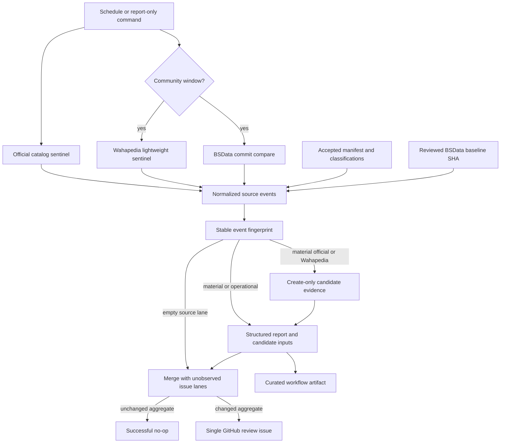
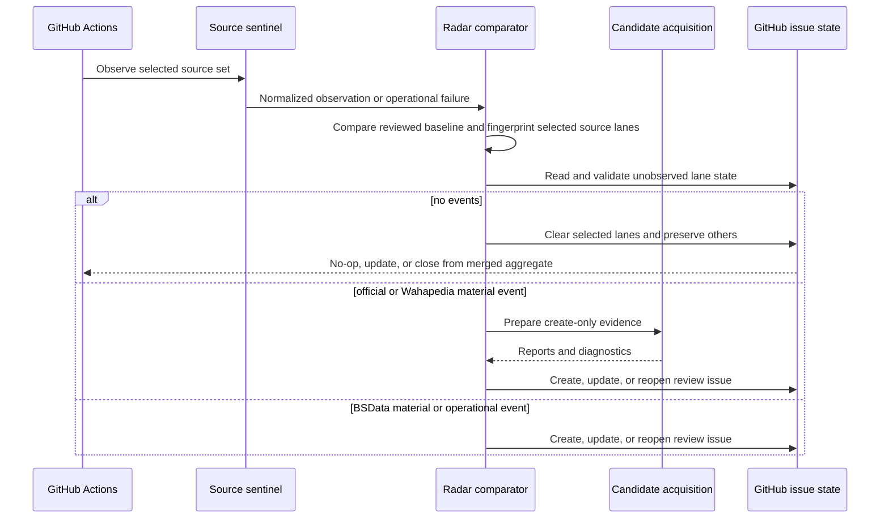
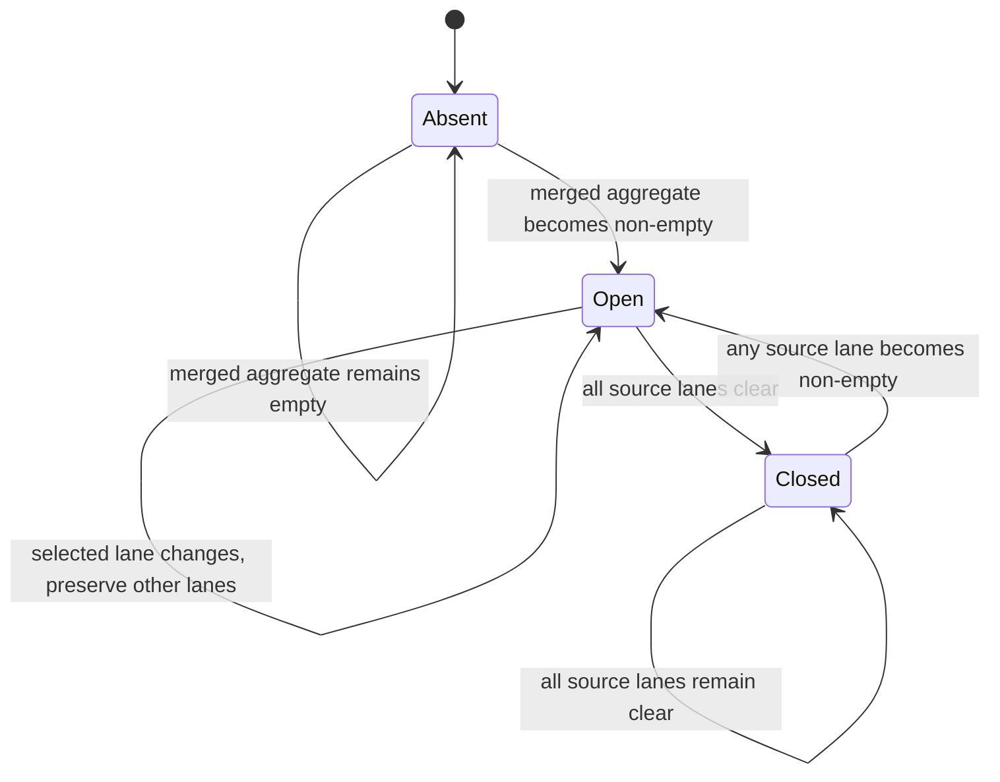

# Quiet Official-First Rules Radar - Plan

## Goal Capsule

- **Objective:** Detect material AoS rules-source changes without requiring the maintainer to poll Games Workshop, Wahapedia, or BSData manually.
- **Product authority:** Games Workshop remains authoritative, Wahapedia remains the coherent secondary source, and BSData supplies community-level discovery signal only.
- **Accepted-data authority:** The checked-in accepted manifest, reviews, identities, catalog, generated runtime, and beta certification remain unchanged until the normal candidate-review-accept-generate workflow approves a replacement.
- **Execution profile:** Add offline-testable source sentinels, deterministic event classification, event-only candidate evidence, and one GitHub issue lifecycle.
- **Stop conditions:** Stop if the design would accept source data automatically, publish raw source bodies, write generated runtime files, require a production deployment, or require a push to `master`.
- **Tail ownership:** Implement on a migration sub-branch targeting `aos4-migration`. The scheduled workflow becomes active only after it reaches the repository's default branch through an explicitly authorized launch path.

---

## Product Contract

### Summary

Add a quiet Rules Radar that checks official sources first, checks community sources less often, and says nothing when the accepted corpus still matches upstream discovery.
When a material change appears, the radar gathers review-safe candidate evidence and creates or refreshes one maintainer-owned GitHub issue without changing accepted game data.

### Problem Frame

AoS rules arrive through battletomes, battle profiles, errata, downloadable supplements, faction pages, export files, and community catalog updates.
Manually finding and reconciling those releases was a recurring maintenance burden and a reason the original site became difficult to keep current.

The repository now has safe acquisition, official catalog discovery, bounded Wahapedia observation, source inventory reconciliation, create-only candidate acquisition, and fail-closed certification.
It does not yet connect those pieces into a recurring, low-noise discovery loop.

A live official discovery on 2026-07-29 returned 164 current downloads.
Fourteen URLs were outside the accepted manifest and six accepted URLs were no longer listed.
The raw difference mixed material updates such as Battle Profiles, Rules Updates, Armies of Renown, Legends, seasonal material, and faction supplements with old non-rules downloads.
That result proves the radar must classify semantic events instead of notifying on every URL difference.

### Actors

- A1. **Rules curator:** Owns the review issue, decides whether an event is material, and controls every accepted-data change.
- A2. **Rules Radar runner:** Performs bounded observation, deterministic comparison, candidate evidence preparation, and GitHub issue synchronization.
- A3. **Games Workshop:** Supplies the authoritative AoS download catalog and versioned official documents.
- A4. **Wahapedia:** Supplies the secondary navigation surface, export specification, update marker, and bounded rule pages.
- A5. **BSData:** Supplies lower-authority repository drift for community catalog files without contributing runtime content.

### Key Decisions

- **Quiet, official-first review loop** (session-settled: user-directed — chosen over broader multi-channel discovery automation: the selected idea reduces maintenance with the smallest durable notification surface). Games Workshop is checked first and most often; community signals are slower and subordinate. Governs R1-R7.
- **Automation stops before acceptance** (session-settled: user-directed — chosen over automatic ingestion: the repository's reviewed candidate boundary is required to keep player-facing rules trustworthy). The radar may prepare candidate evidence but cannot change accepted or generated products. Governs R8-R10.
- **GitHub is the first notification surface.** One issue uses the repository's existing `rule updates` and `maintenance` labels and GitHub's native web, mobile, and email notification settings. Governs R6-R7 and R12.

### Requirements

**Discovery cadence and authority**

- R1. The radar must observe the current Games Workshop AoS download catalog daily through the existing private-API-with-page-fallback adapter.
- R2. The official comparison must use the accepted manifest and reviewed non-material classifications so a new authoritative document is never hidden by a broad title filter.
- R3. The radar must observe Wahapedia weekly through a lightweight sentinel that checks `robots.txt`, navigation, the export specification, and `Last_update.csv` before any full bounded acquisition.
- R4. The radar must observe BSData weekly by comparing the reviewed `main` baseline SHA with the current `BSData/age-of-sigmar-4th` head and must classify only catalog-data path changes as material.
- R5. Source events must retain publisher authority, locator, observed and baseline fingerprints, change kind, observation time, and the source-specific evidence needed to start review.

**Noise control and review handoff**

- R6. A successful run with no current or previously active event for the sources it checked must not create, reopen, comment on, or edit an issue.
- R7. Material events must be ordered official first, then Wahapedia, then BSData, and must identify likely new publications, factions, rules pages, exports, removals, replacements, or community catalog changes. The issue must retain the compact locator and checksum evidence needed to start review after a workflow artifact expires.
- R8. A material official or Wahapedia event must trigger source-scoped, create-only candidate acquisition and produce a review-safe evidence bundle without accepting its contents or contacting unrelated providers.
- R9. Repeated runs over the same normalized per-source event sets must produce the same source and aggregate fingerprints and must not generate repeated issue activity.
- R10. One Rules Radar issue must merge independently observed source lanes, preserve unobserved lanes, and be created, updated, reopened, or closed to reflect the aggregate event set.

**Safety and operations**

- R11. The radar must never modify accepted manifests, review policies, identity registries, audit catalogs, generated runtime files, or certification evidence.
- R12. GitHub issue automation must use only the repository-scoped `GITHUB_TOKEN` with `contents: read` and `issues: write`; it must not require a PAT, GitHub App, pull-request permission, or content-write permission, and it must never send that token to Games Workshop, Wahapedia, or the BSData repository.
- R13. Workflow artifacts must contain structured reports, checksums, locators, and candidate URL lists only; raw PDFs, exports, page bodies, and cache bytes must remain excluded.
- R14. Acquisition, source-contract, GitHub API, comparison-range, or candidate-preparation failures must produce a failing operational result and must never be presented as new rules. The radar must synchronize that result to the issue when the GitHub notification channel is available; a GitHub API failure must remain visible through the failed workflow and job summary.
- R15. Scheduled runs must remain dormant until the workflow exists on the default branch, while local and fixture-backed report-only commands remain usable on migration branches.
- R16. All automated tests must run offline from compact fixtures and must not depend on live Games Workshop, Wahapedia, BSData, or GitHub availability.

### Key Flows

- F1. **Quiet official check**
  - **Trigger:** The daily official schedule starts.
  - **Actors:** A2, A3
  - **Steps:** Observe the official catalog, reconcile it against the accepted official inventory, classify semantic events, and compute the normalized official-lane fingerprint.
  - **Outcome:** No GitHub mutation occurs when the event set is empty.
  - **Covers:** R1-R2, R5-R7, R9

- F2. **Material source change**
  - **Trigger:** The official or Wahapedia sentinel differs materially from the reviewed baseline.
  - **Actors:** A1-A4
  - **Steps:** Expand the bounded observation, prepare create-only candidate evidence, upload the structured report, and synchronize the Rules Radar issue.
  - **Outcome:** The curator receives one evidence-rich review item while accepted products remain unchanged.
  - **Covers:** R5, R7-R13

- F3. **Community drift**
  - **Trigger:** BSData `main` advances from the reviewed community baseline.
  - **Actors:** A1, A2, A5
  - **Steps:** Compare commits, filter changed paths, classify community catalog drift, and add only material path changes to the report.
  - **Outcome:** Community changes can identify blind spots but cannot change source precedence or runtime content.
  - **Covers:** R4-R5, R7, R9-R13

- F4. **Review resolution**
  - **Trigger:** A reviewed data or classification PR makes the active source event set empty.
  - **Actors:** A1, A2
  - **Steps:** The next applicable source runs clear their lanes against the reviewed baselines; the final cleared lane comments with the resolution evidence and closes the Rules Radar issue.
  - **Outcome:** The issue history remains the durable inbox and the radar returns to silence.
  - **Covers:** R6, R9-R11

- F5. **Observer, candidate, or notifier failure**
  - **Trigger:** A source contract, acquisition, compare, evidence-preparation, or GitHub notification step fails.
  - **Actors:** A1, A2
  - **Steps:** Record an operational event without a rules-change claim, preserve safe diagnostics, synchronize the same review issue when GitHub remains available, write the job summary, and fail the workflow.
  - **Outcome:** Broken discovery cannot silently look healthy and cannot alter accepted data.
  - **Covers:** R10-R14

### Acceptance Examples

- AE1. **Covers F1 / R6.** Given an official catalog whose normalized material inventory matches the accepted manifest, when the daily run completes, then the workflow succeeds and makes no GitHub issue mutation.
- AE2. **Covers F2 / R2.** Given a new Games Workshop PDF not covered by an explicit non-material disposition, when the official sentinel runs, then the report contains an official material event even if the title classifier is uncertain.
- AE3. **Covers F2 / R3.** Given unchanged Wahapedia navigation but a changed `Last_update.csv` fingerprint, when the weekly sentinel runs, then the full bounded Wahapedia observation starts; candidate evidence starts only if that comparison emits a material event.
- AE4. **Covers F3 / R4.** Given a BSData compare containing only README, image, or workflow changes, when the community run completes, then no material community event is emitted.
- AE5. **Covers F3 / R4.** Given a BSData compare containing a changed `.cat` or `.gst` path, when the community run completes, then the issue identifies the changed paths as community evidence and no BSData fact enters candidate or runtime data.
- AE6. **Covers R9-R10.** Given an open Rules Radar issue with the same per-source and aggregate fingerprints, when the next run observes the same events, then the issue is not edited or commented on.
- AE7. **Covers F4 / R10.** Given an open issue with official and Wahapedia events, when an official-only run clears the official lane, then the issue keeps the Wahapedia lane and remains open until an applicable community run clears it.
- AE8. **Covers F5 / R14.** Given a provider contract failure, when observation stops, then the workflow fails and the issue describes an operational failure without claiming a new publication or rules change.
- AE9. **Covers R13.** Given successful candidate preparation, when the workflow artifact is inspected, then it contains reports, manifests, checksums, and URL lists but no downloaded source body.
- AE10. **Covers R15.** Given the workflow exists only on `aos4-migration`, when its cron time arrives, then GitHub does not schedule it; the documented local report-only command remains available.

### Success Criteria

- A no-change week produces no issue activity.
- A new official document becomes a review issue on the next daily official run.
- A Wahapedia or BSData material change becomes a review issue on the next weekly community run.
- The same unresolved upstream state produces one stable issue history rather than repeated issues or comments.
- Every event report states why the signal is authoritative, secondary, community-only, or operational.
- The accepted beta corpus verifies byte-for-byte after the feature is implemented.

### Scope Boundaries

#### Included

- Games Workshop catalog discovery and official inventory differences.
- A lightweight Wahapedia update sentinel plus event-triggered bounded observation.
- BSData `main` SHA and changed-path discovery at community authority.
- Event-triggered create-only candidate evidence for Games Workshop and Wahapedia.
- One GitHub issue lifecycle and native GitHub notifications.
- Offline fixtures, command documentation, and a default-branch activation runbook.

#### Deferred to Follow-Up Work

- Discord delivery, custom SMTP email, Slack, or other channel projections.
- Automatic draft PRs after candidate acquisition.
- Periodic byte polling for accepted Games Workshop PDFs whose catalog URL and metadata do not change.
- Semantic comparison of BSData facts after alias reconciliation exists.
- Warhammer Community news-feed discovery outside the official downloads catalog.

#### Outside This Product's Identity

- Automatic acceptance, reconciliation, identity assignment, certification, or publication of changed rules.
- Shipping BSData-derived rules or characteristics in the browser runtime.
- A permanent Rules Radar dashboard or a second data-maintenance application.
- AoS 3 or dual-edition discovery.

### Dependencies and Assumptions

- The GitHub issue is the v1 notification surface. The maintainer enables the desired GitHub issue and Actions delivery methods in personal notification settings.
- The repository owner remains an assignable GitHub user. The notifier supports a configured assignee override if ownership later moves to an organization.
- `Last_update.csv` remains Wahapedia's lightweight content-change marker. Any contract break becomes an operational event instead of a false no-change result.
- The BSData compare endpoint remains within its documented response bounds. A diverged, force-pushed, or truncated comparison becomes an operational event and requires a reviewed baseline update.
- Initial official and Wahapedia comparison is against the accepted corpus rather than a newly seeded live snapshot. Existing unreviewed drift is expected to produce the first Rules Radar issue.
- The existing candidate command remains the fail-closed full-candidate entry point. Its acquisition seam can be refactored so radar evidence is source-scoped without weakening the full command's required Wahapedia export acquisition. The workflow gives every run a unique output directory.
- The plan does not modernize unrelated GitHub Actions or package versions.

---

## Planning Contract

**Product Contract preservation:** Product Contract unchanged during implementation planning.

### Key Technical Decisions

- KTD1. **Reuse acquisition and inventory seams.** The radar composes `src/aos4/data/gamesWorkshop/`, `src/aos4/review/gamesWorkshopObservation.ts`, `src/aos4/review/wahapediaObservation.ts`, `src/aos4/review/sourceInventory.ts`, and refactored create-only candidate acquisition functions instead of introducing a second scraper. The existing full-candidate command keeps its current required-source behavior. Governs R1-R3, R8, R11.
- KTD2. **Use a two-stage Wahapedia check.** The weekly sentinel fetches only robots policy, navigation, export specification, and `Last_update.csv`; a material change unlocks the existing full bounded observation and candidate acquisition. Governs R3, R8, R13.
- KTD3. **Use reviewed state as the baseline.** Official and Wahapedia events compare against the accepted manifest and classifications; BSData compares against an explicit reviewed community SHA in radar configuration. Governs R2, R4, R11.
- KTD4. **Fingerprint semantic events by source lane.** Each source lane hashes a stable, sorted projection of publisher, authority, locator, baseline, current fingerprint, and change kind; the aggregate hashes the lane fingerprints while excluding timestamps, workflow URLs, and presentation text. Governs R5-R7, R9-R10.
- KTD5. **Maintain one issue as the durable, mergeable inbox.** The issue carries validated machine-owned lane state plus bounded human-readable source sections with compact locators and checksums that survive artifact expiry. A run replaces only the lanes it observed, preserves unobserved lanes, no-ops on an unchanged aggregate, reopens unresolved events, and closes only when the merged aggregate is empty. Governs R5-R7, R9-R10, R14.
- KTD6. **Keep notification separate from discovery.** The core radar command produces deterministic files and supports report-only operation; a separate GitHub adapter performs issue mutations only when explicitly enabled by the workflow. Only that adapter receives `GITHUB_TOKEN`; source observers use unauthenticated public endpoints and never receive repository credentials. All source-controlled titles, locators, and diagnostics are escaped for Markdown and prevented from creating mentions. Governs R12, R15-R16.
- KTD7. **Treat operational health as a different event class.** Acquisition or contract failures share the one issue lifecycle but remain visibly separate from material rules events and force a non-zero workflow result. Governs R10, R14.
- KTD8. **Upload curated evidence only.** Candidate output is filtered to its manifest, reports, diagnostics, and generated URL lists before artifact upload; checksum cache directories are never upload inputs. Governs R8, R11, R13.
- KTD9. **Schedule off the top of the hour.** Use a daily official cron and a weekly community cron at distinct non-zero minutes, plus a source-selectable manual trigger. GitHub documents that schedules run only from the default branch and can be delayed under load near the top of the hour. Governs R1, R3-R4, R15.

### High-Level Technical Design

#### Component and data flow

#### Scheduled run protocol

#### Issue lifecycle

### System-Wide Impact

- **Data lifecycle:** Adds a pre-candidate discovery state without weakening candidate, review, acceptance, generation, or certification boundaries.
- **Security:** Introduces a repository-scoped GitHub write operation limited to issues. Source acquisition remains HTTPS-only, host-allowlisted, bounded, and cache-aware.
- **Operations:** Adds scheduled network work and one durable issue. The workflow must distinguish silent success from failure and avoid concurrent duplicate runs.
- **Repository workflow:** The feature can merge into `aos4-migration`, but cron execution cannot begin until the workflow reaches the default branch.
- **Browser runtime:** No React, state, generated catalog, bundle, or player-facing behavior changes.

### Risks and Mitigations

| Risk | Mitigation |
| --- | --- |
| Official catalog shape changes | Reuse API/page fallback diagnostics and emit an operational event instead of an empty inventory. |
| Raw URL churn creates noise | Compare normalized semantic events and require explicit non-material dispositions. |
| Wahapedia observation becomes too heavy | Use the lightweight sentinel and run full bounded acquisition only after a material marker or navigation change. |
| Robots policy changes | Fetch and evaluate `robots.txt` before Wahapedia requests; stop with an operational event when planned paths are disallowed. |
| BSData history diverges or exceeds compare limits | Fail the community observation clearly and require a reviewed baseline SHA update. |
| Repeated schedules spam GitHub | Use one issue marker plus a stable event fingerprint and no-op on unchanged state. |
| A partial official run erases a community event | Store validated per-source lane state in the issue and replace only lanes observed by the current run. |
| Upstream text creates mentions or malformed issue Markdown | Normalize length and control characters, escape Markdown, and neutralize mention syntax before rendering. |
| Candidate evidence leaks source bodies | Upload an explicit allowlist of reports and URL lists; never upload the cache root. |
| An official-only event causes unrelated Wahapedia traffic | Invoke source-scoped candidate acquisition functions and test the exact requested provider set. |
| GitHub token gains excess authority or reaches a source host | Declare job-level `contents: read` and `issues: write`, inject it only into the notifier, and test source request headers. |
| A schedule appears active on the migration branch but never runs | Document and test the default-branch activation boundary; make report-only commands the pre-launch verification path. |

### Sources and Research

- Existing official discovery: `src/aos4/data/gamesWorkshop/catalogCommand.ts`, `src/aos4/data/gamesWorkshop/downloadCatalog.ts`, and `src/aos4/data/gamesWorkshop/pageDiscovery.ts`.
- Existing independent observation and reconciliation: `src/aos4/review/gamesWorkshopObservation.ts`, `src/aos4/review/wahapediaObservation.ts`, and `src/aos4/review/sourceInventory.ts`.
- Existing safe candidate workflow: `src/aos4/data/candidateCommand.ts` and `docs/data/aos4-maintenance.md`.
- [Games Workshop AoS downloads](https://www.warhammer-community.com/en-gb/downloads/warhammer-age-of-sigmar/) is the authoritative discovery entry point.
- [Wahapedia AoS 4 data export](https://wahapedia.ru/aos4/the-rules/data-export/) states that exports are updated as site content changes, and [Wahapedia robots.txt](https://wahapedia.ru/robots.txt) publishes the current crawl boundary.
- [BSData/age-of-sigmar-4th](https://github.com/BSData/age-of-sigmar-4th) is an active community data repository on `main`; the GitHub compare API returns changed files for two commits.
- [GitHub scheduled workflows](https://docs.github.com/en/actions/reference/workflows-and-actions/events-that-trigger-workflows#schedule) run only when the workflow exists on the default branch and may be delayed during high-load periods.
- [GitHub workflow permissions](https://docs.github.com/en/actions/reference/workflows-and-actions/workflow-syntax#permissions) support least-privilege `contents` and `issues` scopes.
- [GitHub token behavior](https://docs.github.com/en/actions/concepts/security/github_token) favors issue notification over workflow-created PRs because token-generated events have special workflow-trigger limits.
- [GitHub notifications](https://docs.github.com/en/subscriptions-and-notifications/concepts/about-notifications) support web, mobile, and email delivery for subscribed or assigned issue conversations.

---

## Implementation Units

### U1. Define the radar configuration, event model, and deterministic comparison

- **Goal:** Create the pure, offline core that converts reviewed baselines and normalized observations into stable material and operational events.
- **Requirements:** R2, R4-R7, R9, R11, R16; A1-A2; AE1-A2, AE4-A6
- **Dependencies:** None
- **Files:**
  - Create `src/aos4/radar/model.ts`
  - Create `src/aos4/radar/config.ts`
  - Create `src/aos4/radar/compare.ts`
  - Create `src/aos4/radar/index.ts`
  - Create `data/aos4/radar/config.json`
  - Create `src/tests/aos4/rulesRadarCompare.test.ts`
  - Create compact fixtures under `src/tests/fixtures/aos4/radar/`
- **Approach:**
  1. Define source observations, event authority, material and operational change kinds, evidence references, and the aggregate report contract.
  2. Point official and Wahapedia comparison at the accepted manifest and reviewed classifications.
  3. Store the BSData repository, branch, and reviewed baseline SHA in the radar config.
  4. Normalize and sort events before hashing each source lane and the aggregate KTD4 projection.
  5. Reject malformed, duplicate, untrusted, or baseline-incompatible inputs rather than coercing them.
- **Patterns to follow:** Branded validation and explicit unknown handling in `src/aos4/domain/`; stable ordering and `stableJson` in `src/aos4/generate/serialization.ts`; inventory reconciliation in `src/aos4/review/sourceInventory.ts`.
- **Test scenarios:**
  - Identical official and Wahapedia inventories in different input orders produce no events and the same empty-result fingerprint.
  - A new unclassified official URL produces an official material event, while a URL with a reviewed non-material disposition does not.
  - An accepted official URL missing from the live catalog produces a distinct removal event instead of being treated as a new publication.
  - A BSData `.cat` or `.gst` path produces community material drift, while documentation, image, and workflow paths do not.
  - Observation timestamps and workflow URLs change without changing the event fingerprint.
  - Replacing the official lane leaves the stored Wahapedia and BSData lane fingerprints unchanged.
  - Duplicate locators, invalid checksums, stale config paths, and an unknown authority fail validation.
- **Verification:** Fixtures prove deterministic event order, authority order, validation, and fingerprints without network access.

### U2. Add cheap official and Wahapedia sentinels

- **Goal:** Observe high-value source surfaces at low cost while preserving the repository's acquisition and crawl-safety rules.
- **Requirements:** R1-R3, R5, R11, R13-R16; F1-F2; AE1-A3, AE8-A9
- **Dependencies:** U1
- **Files:**
  - Create `src/aos4/radar/observers/gamesWorkshop.ts`
  - Create `src/aos4/radar/observers/wahapedia.ts`
  - Create `src/aos4/radar/observers/robots.ts`
  - Create `src/aos4/radar/observeCommand.ts`
  - Modify `src/aos4/review/wahapediaObservation.ts`
  - Modify `src/aos4/review/wahapediaObservationCommand.ts`
  - Create `src/tests/aos4/rulesRadarObservation.test.ts`
  - Add provider fixtures under `src/tests/fixtures/aos4/radar/`
- **Approach:**
  1. Reuse the official catalog search and fallback adapter to produce a radar observation without downloading every official PDF.
  2. Fetch and evaluate Wahapedia robots policy before the sentinel requests.
  3. Reuse navigation and export-spec parsing, but fetch only the index, specification, and `Last_update.csv` during the cheap sentinel.
  4. Apply an explicit request budget and bounded pacing to expanded Wahapedia observation while reusing immutable cached artifacts.
  5. Preserve acquired checksums when a material Wahapedia signal unlocks the existing full observation command.
  6. Expose a source-selectable report-only command with injected time and transport seams for offline tests.
- **Execution note:** Characterize the existing observer outputs before extending them with optional fingerprint evidence.
- **Patterns to follow:** `createPinnedHttpsTransport`, `acquireArtifact`, `FileArtifactCache`, DNS/public-IP validation, bounded media types, and existing Games Workshop/Wahapedia observer tests.
- **Test scenarios:**
  - The official private API succeeds and produces a normalized observation.
  - The official API fails but page fallback succeeds without producing an operational event.
  - Both official discovery paths fail and produce an operational event rather than an empty success.
  - Wahapedia robots policy allows `/aos4/`, so the sentinel fetches the bounded index, specification, and update file only.
  - Wahapedia robots policy disallows a planned path, so the observer stops before fetching it and returns an operational event.
  - A changed `Last_update.csv` checksum triggers the full-observation decision even when navigation is unchanged.
  - Sentinel and expanded observations respect their request budgets, concurrency limit, and pacing under an injected clock.
  - A new faction, rules page, or export link produces a material navigation event.
  - Malformed HTML, missing English worksheet, multiple specification links, unsafe hosts, timeouts, and oversized responses fail closed.
- **Verification:** Provider contract fixtures cover both discovery paths, robots enforcement, the lightweight request set, and the full-observation gate.

### U3. Add the lower-authority BSData observer

- **Goal:** Detect community catalog drift without cloning the repository, ingesting catalog facts, or weakening official precedence.
- **Requirements:** R4-R5, R7, R9, R11, R13-R16; F3; AE4-A5, AE8
- **Dependencies:** U1
- **Files:**
  - Create `src/aos4/radar/observers/bsData.ts`
  - Create `src/aos4/radar/bsDataObservationCommand.ts`
  - Create `src/tests/aos4/rulesRadarBsData.test.ts`
  - Add GitHub API fixtures under `src/tests/fixtures/aos4/radar/bsdata/`
- **Approach:**
  1. Read the current `main` head and compare it with the reviewed config SHA through bounded, unauthenticated GitHub REST requests.
  2. Retain commit identifiers, compare URL, and changed paths without fetching `.cat` or `.gst` contents.
  3. Classify catalog-data extensions as community material signal and ignore non-data paths for event generation.
  4. Treat divergence, force-push, pagination overflow, compare truncation, rate limiting, or malformed responses as operational events.
- **Patterns to follow:** Existing HTTPS allowlist, timeout, size, and diagnostics conventions under `src/aos4/data/`; community authority boundary in `src/aos4/domain/source.ts`.
- **Test scenarios:**
  - An unchanged head SHA produces no BSData event.
  - A fast-forward compare with only documentation or workflow changes produces no material event.
  - A compare with `.cat` and `.gst` changes emits one stable community event with sorted paths.
  - A mixed compare excludes non-data paths from the material evidence.
  - A diverged, truncated, rate-limited, or malformed compare produces an operational event.
  - BSData requests contain no repository token or other authorization header.
  - No response body or report contains catalog file content.
- **Verification:** Offline API fixtures prove path filtering, authority, compare bounds, and failure handling.

### U4. Orchestrate reports and event-only candidate evidence

- **Goal:** Turn source observations into a curator-ready report and invoke the existing create-only candidate workflow only when useful.
- **Requirements:** R5-R9, R11, R13-R16; F1-F3, F5; AE1-A5, AE8-A9
- **Dependencies:** U1-U3
- **Files:**
  - Create `src/aos4/radar/report.ts`
  - Create `src/aos4/radar/rulesRadarCommand.ts`
  - Create `src/aos4/data/candidateAcquisition.ts`
  - Modify `src/aos4/data/candidateCommand.ts`
  - Modify `package.json`
  - Create `src/tests/aos4/rulesRadarCommand.test.ts`
  - Modify `src/tests/aos4/candidateCommand.test.ts`
  - Add command fixtures under `src/tests/fixtures/aos4/radar/`
- **Approach:**
  1. Accept source-specific observation files so daily and weekly jobs can share one deterministic comparator.
  2. Write the machine report, concise issue body, material-event count, fingerprint, and candidate URL lists to an explicit output directory.
  3. Produce no candidate inputs for a successful empty run.
  4. Extract source-scoped create-only acquisition functions from the existing candidate command while preserving its full-candidate defaults and safety checks.
  5. For official material events, acquire only new or replaced official asset URLs; do not request Wahapedia.
  6. For Wahapedia material events, run the full bounded observer and acquire its material page list plus the published exports; do not request official assets.
  7. Preserve candidate failures in the operational report so notification can still occur.
- **Patterns to follow:** Create-only output in `src/aos4/data/candidateCommand.ts`, source inventory reporting in `src/aos4/review/sourceInventoryCommand.ts`, and stable JSON serialization.
- **Test scenarios:**
  - An empty event set writes a deterministic no-change report and no candidate URL list.
  - A new official document writes a bounded official URL list and never includes already matched or explicitly non-material URLs.
  - An official-only event makes no Wahapedia requests, while a Wahapedia-only event makes no Games Workshop requests.
  - The existing full-candidate command still acquires every required Wahapedia export after the source-scoped functions are extracted.
  - A Wahapedia update writes the reviewed full material-page list without content bodies.
  - A BSData-only event writes no official or Wahapedia candidate inputs.
  - A create-only output collision fails instead of overwriting evidence.
  - Candidate preparation failure preserves the material event, adds an operational event, and returns a failing result.
  - Reordered observations produce byte-identical reports and issue bodies.
- **Verification:** The command runs entirely from fixtures, emits deterministic reports, and preserves the create-only acquisition boundary.

### U5. Synchronize one least-privilege GitHub review issue

- **Goal:** Deliver actionable change and health notifications without duplicate issues or custom notification infrastructure.
- **Requirements:** R6-R7, R9-R10, R12-R16; F1-F5; AE1, AE6-A8, AE10
- **Dependencies:** U4
- **Files:**
  - Create `src/aos4/radar/githubIssue.ts`
  - Create `src/aos4/radar/rulesRadarNotifyCommand.ts`
  - Create `src/tests/aos4/rulesRadarGitHubIssue.test.ts`
  - Modify `package.json`
- **Approach:**
  1. Hide REST operations behind a small injected client so lifecycle decisions remain offline-testable.
  2. Locate the marker-bearing Rules Radar issue across open and closed states.
  3. Validate the machine-owned state envelope and source-section boundaries before merging observed lanes.
  4. Implement the KTD5 state machine using per-source fingerprints and the merged aggregate fingerprint.
  5. Assign the configured maintainer and apply the existing `rule updates` and `maintenance` labels.
  6. Link the workflow run and curated artifact while keeping the structured report authoritative.
  7. Bound and escape untrusted source text before issue rendering, including mention and machine-marker syntax.
  8. Redact authorization headers and token values from all errors and serialized diagnostics.
  9. Ensure only the GitHub adapter can receive `GITHUB_TOKEN`; source clients expose no credential parameter.
  10. Reject credentialed redirects away from `api.github.com`.
  11. Default to report-only or dry-run behavior unless GitHub notification is explicitly enabled.
- **Execution note:** Implement lifecycle decisions against a fake client before connecting the REST adapter.
- **Patterns to follow:** Node 20 built-in HTTPS/fetch capabilities, explicit dependency injection used by acquisition tests, and GitHub's versioned REST API.
- **Test scenarios:**
  - No events and no existing issue cause zero API mutations.
  - A first material event creates one assigned, labeled issue with the event fingerprint.
  - The issue body retains compact source locators and checksums when the workflow-artifact link is absent or expired.
  - The same fingerprint on an open issue causes zero mutations.
  - A changed fingerprint updates the body and adds exactly one concise delta comment.
  - An official-only run clears its prior event while preserving an unresolved Wahapedia lane and keeping the issue open.
  - An official-only no-change run with an unchanged community lane produces no mutation.
  - Events on a closed issue reopen and update that issue instead of creating a duplicate.
  - Clearing the final active lane comments once and closes the open issue.
  - Multiple marker-bearing issues fail without mutating any of them.
  - Missing, duplicated, oversized, or malformed machine-owned lane state fails without overwriting the issue.
  - Source titles containing Markdown, control characters, mention syntax, or marker-shaped text render as inert bounded text.
  - The notifier sends its bearer token only to `api.github.com` calls for the current repository; discovery clients cannot receive it.
  - An operational event is rendered separately from rules changes and keeps the workflow result failing.
  - A 403, 404, 422, timeout, redirect to another host, or malformed API response fails clearly without leaking the token.
- **Verification:** The fake client proves every issue transition and mutation count; dry-run output matches the issue body from U4.

### U6. Add the scheduled workflow, regression gate, and activation runbook

- **Goal:** Operate the radar at the intended cadence with explicit permissions, concurrency, evidence retention, and migration-safe rollout.
- **Requirements:** R1, R3-R4, R6, R8, R10-R16; AE1, AE6-A10
- **Dependencies:** U2-U5
- **Files:**
  - Create `.github/workflows/aos4-rules-radar.yml`
  - Create `src/tests/aos4/rulesRadarWorkflow.test.ts`
  - Modify `docs/data/aos4-maintenance.md`
  - Modify `package.json`
- **Approach:**
  1. Add a daily official schedule at a non-zero minute and a weekly community schedule at a different non-zero minute.
  2. Add a manual source selector and report-only mode for controlled live verification after default-branch activation.
  3. Use concurrency to prevent overlapping radar runs.
  4. Grant only `contents: read` and `issues: write`.
  5. Run candidate acquisition only when the report exposes applicable material events.
  6. Upload only the curated output allowlist with bounded retention.
  7. Run notification even after candidate failure when a valid event report exists, then preserve the failing workflow result.
  8. Document baseline updates, issue resolution and state recovery, report-only use, native notification settings, and the default-branch activation boundary.
- **Patterns to follow:** `.github/workflows/nodejs.yml` for repository CI conventions and `docs/data/aos4-maintenance.md` for the candidate-review-accept-generate runbook.
- **Test scenarios:**
  - Workflow contract validation confirms both schedules avoid the top of the hour.
  - Workflow contract validation confirms the daily job excludes community observers and the weekly job includes them.
  - Workflow contract validation confirms only `contents: read` and `issues: write` are granted.
  - Workflow contract validation confirms candidate steps are gated by material official or Wahapedia events.
  - Workflow contract validation confirms the upload path cannot include `.cache/aos4/artifacts/` or another raw cache root.
  - Workflow contract validation confirms notification can run after candidate failure and the job still fails.
  - The runbook states that schedules do not run from `aos4-migration` and requires an observed first default-branch run before declaring the radar operational.
- **Verification:** Static workflow tests, offline command tests, and the runbook agree on cadence, permissions, artifact boundary, and activation.

---

## Verification Contract

| Gate | Applies to | Expected outcome |
| --- | --- | --- |
| Focused radar Vitest files | U1-U6 | All event, observer, report, issue-lifecycle, and workflow-contract scenarios pass offline. |
| Existing observer and acquisition tests | U2-U4 | Games Workshop, Wahapedia, source inventory, candidate command, and acquisition behavior remain compatible. |
| Accepted-manifest offline replay | U2-U4 | The accepted artifacts replay from checksum cache without network and produce the expected candidate reports. |
| `yarn lint` | U1-U6 | New TypeScript, tests, and workflow-adjacent code satisfy repository lint rules. |
| `yarn tsc --noEmit` | U1-U6 | Node-only radar code remains type-safe and does not leak into the browser dependency graph. |
| `yarn test --run` | U1-U6 | The complete test suite remains green with no live-source dependency. |
| `yarn build` | U1-U6 | The production browser build remains unchanged in behavior and excludes radar-only modules. |
| `yarn data:aos4:verify:beta` | U1-U6 | The accepted AoS 4 corpus and certification remain valid. |
| Deliberate live report-only smoke | U2-U4 | Each provider returns a bounded report without GitHub mutation; this is an implementation check, not a routine test dependency. |
| First default-branch workflow run | U6 rollout | After explicit launch authorization places the workflow on `master`, one manual report-only run and the first scheduled run are inspected before operational sign-off. |

---

## Definition of Done

- U1-U6 satisfy their listed test scenarios and verification outcomes.
- A no-change fixture produces no candidate inputs and no GitHub mutations.
- Material official and Wahapedia fixtures produce create-only candidate evidence and one issue transition.
- Material BSData fixtures produce community-only path evidence and no candidate data.
- Operational failures are visible, non-zero, token-safe, and never worded as rules discoveries.
- Workflow permissions are limited to `contents: read` and `issues: write`.
- Workflow artifacts exclude raw source bytes and cache roots.
- Accepted manifests, reviews, identities, catalogs, generated corpus files, and certification evidence have no diff.
- `yarn data:aos4:verify:beta`, lint, type checking, full tests, and build pass.
- Maintenance documentation explains review, baseline advancement, issue resolution, notification settings, and default-branch activation.
- The implementation PR targets `aos4-migration`; it does not push `master`, merge the migration PR, deploy, or activate production schedules.
- Abandoned experiments, temporary reports, cache bytes, and dead-end code are absent from the final diff.
