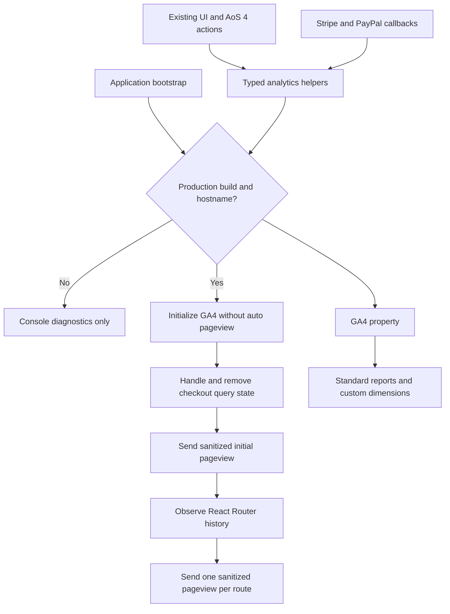
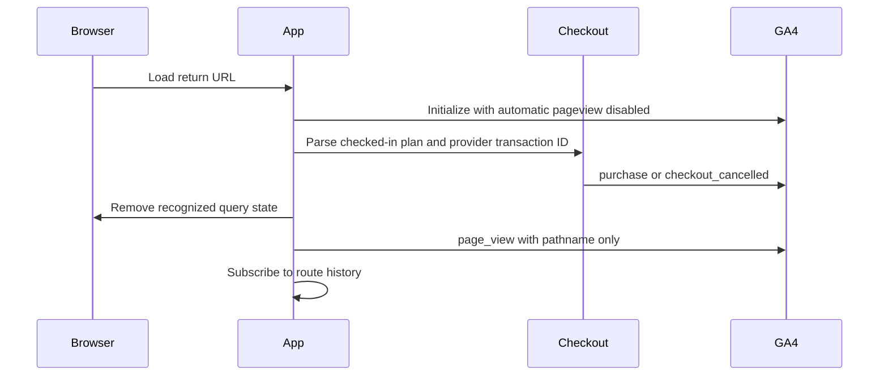

# Google Analytics Reporting Reliability - Plan

## Goal Capsule

- **Objective:** Make the GA4 property trustworthy enough to answer basic acquisition, product-usage, and subscription questions without development traffic, duplicate pageviews, event-name fragmentation, or sensitive query data.
- **Authority order:** Repository constraints and issue #1773; current production behavior and GA4 property state; official Google Analytics and Stripe contracts; implementation details in this plan.
- **Execution profile:** Preserve the current interface while changing the analytics adapter, existing call sites, tests, documentation, and additive GA4 property configuration.
- **Stop conditions:** Do not deploy, merge, push `master`, delete historical GA4 data, alter account authorization, or make analytics the source of truth for payment fulfillment.
- **Tail ownership:** Land the work in a migration sub-PR targeting `aos4-migration`, with the accepted AoS 4 beta gate and normal repository verification green.

---

## Product Contract

### Summary

Replace the legacy React GA adapter with a production-gated GA4 collection boundary, one explicit pageview stream, a small stable event taxonomy, privacy-safe parameters, and valid ecommerce events. Configure only the additive GA4 definitions needed to report those parameters.

### Problem Frame

The live GA4 property is not a reliable description of product use. On July 29, 2026, `localhost` generated the overwhelming majority of pageviews in the hostname report, which explains the reported spike. `src/utils/analytics.ts` initializes GA in every non-test build, including the Vite development server and locally served production builds.

Pageviews also have two owners. GA4 Enhanced Measurement sends the initial page load while individual React routes call `logPageView`; Home has no manual call, and client-side transitions are not tracked centrally. Non-Home initial loads can be duplicated while some SPA transitions are missed.

The event adapter still sends the Universal Analytics object shape. `react-ga4` maps the legacy `action` field to the GA4 event name, producing 345 distinct names in the last 28 days, including names that encode banner, faction, and mode values. Subscription completions no longer emit GA4 `purchase`, so the property reports zero revenue even though `purchase` is already configured as a key event.

### Actors

- A1. A visitor or subscriber uses the AoS 4 builder, reminders, printing, import, account, or checkout flows.
- A2. A product maintainer uses GA4 reports to distinguish real production behavior from development activity and to analyze events by bounded dimensions.

### Requirements

**Collection integrity**

- R1. Analytics must initialize and transmit only from a production build running on `aosreminders.com` or `www.aosreminders.com`.
- R2. The app must emit exactly one explicit `page_view` for the initial sanitized URL and each subsequent SPA route transition.
- R3. Pageviews must exclude query strings, fragments, share tokens, and checkout-session identifiers; other events must exclude emails, Auth0 identifiers, user-entered army names, roster contents, and cloud-army identifiers, with the provider transaction ID allowed only as the standard `purchase.transaction_id`.

**Product reporting**

- R4. Events must use a bounded GA4 taxonomy whose categorical differences are parameters rather than dynamically generated event names.
- R5. Reporting must cover faction selection, edit/play mode changes, PDF generation, roster-import outcomes, account interactions, banners, theme changes, login attempts, and existing navigation interactions without changing their UI behavior.
- R6. Subscription and gift checkout must emit GA4-recommended `begin_checkout` and `purchase` events with numeric value, USD currency, items, provider, and a provider transaction identifier; cancellation must remain a bounded custom event.

**Operability**

- R7. The GA4 property must expose the custom parameters needed for useful reports without deleting legacy definitions or changing historical data.
- R8. Automated tests and documentation must make production gating, pageview ownership, taxonomy, privacy exclusions, ecommerce mapping, and the limits of client-side purchase telemetry explicit.
- R9. The change must preserve the established interface, route behavior, account flows, and AoS 4 domain boundary.

### Key Flows

- F1. **Production pageview collection**
  - **Trigger:** A1 loads the app or changes a React Router route.
  - **Actors:** A1, A2
  - **Steps:** The app initializes GA without an automatic pageview, removes recognized checkout state, sends a sanitized initial pageview, then observes route changes.
  - **Outcome:** A2 sees one pageview per route and no development-host traffic after rollout.
  - **Covered by:** R1, R2, R3
- F2. **Product action collection**
  - **Trigger:** A1 completes a tracked UI or AoS 4 action.
  - **Actors:** A1, A2
  - **Steps:** A typed analytics helper accepts only bounded, non-sensitive context and sends one stable event name.
  - **Outcome:** A2 can analyze the action by registered parameters without event-name cardinality growth.
  - **Covered by:** R3, R4, R5, R7
- F3. **Checkout telemetry**
  - **Trigger:** A1 starts, cancels, or returns from a Stripe or PayPal checkout.
  - **Actors:** A1, A2
  - **Steps:** The app maps the checked-in plan catalog to GA4 item/value fields, uses the provider identifier for deduplication, removes return parameters, and records the bounded event.
  - **Outcome:** A2 gets directional checkout and revenue telemetry while the payment backend remains authoritative.
  - **Covered by:** R3, R4, R6, R8

### Acceptance Examples

- AE1. **Development isolation**
  - **Covers:** R1, R3
  - **Given:** The Vite development server or a production bundle served from `localhost` or `127.0.0.1`.
  - **When:** The app loads and tracked actions occur.
  - **Then:** The Google tag is not initialized and no analytics request is sent.
- AE2. **SPA pageview ownership**
  - **Covers:** R2, R3
  - **Given:** A production-host load at `/faq?army=<token>` followed by navigation to `/subscribe`.
  - **When:** bootstrap and route navigation complete.
  - **Then:** GA4 receives one pageview for `/faq` and one for `/subscribe`, with neither query string nor token.
- AE3. **Stable action taxonomy**
  - **Covers:** R4, R5
  - **Given:** A1 selects two different factions and switches to play mode.
  - **When:** the actions are tracked.
  - **Then:** GA4 receives repeated stable event names with faction and mode values in parameters.
- AE4. **Subscription purchase**
  - **Covers:** R3, R6
  - **Given:** A1 returns from a completed checkout for a checked-in plan with a provider transaction identifier.
  - **When:** checkout query handling runs.
  - **Then:** GA4 receives one `purchase` with the matching item, numeric USD value, quantity, provider, and transaction ID before the URL is sanitized.
- AE5. **Untrusted checkout query**
  - **Covers:** R3, R6, R8
  - **Given:** A return URL names an unknown plan or lacks a usable provider transaction identifier.
  - **When:** checkout query handling runs.
  - **Then:** no revenue event is created, recognized query state is still removed, and the app continues normally.

### Success Criteria

- New GA4 traffic has no `localhost` or `127.0.0.1` pageviews attributable to this app.
- A production navigation produces one sanitized pageview per route.
- New custom product events use the bounded taxonomy in this plan; categorical values do not create new event names.
- Valid Stripe and PayPal completions populate the existing `purchase` key event and monetization metrics.
- Focused analytics tests and the full repository verification suite pass.

### Scope Boundaries

**In scope**

- The web analytics adapter and existing analytics call sites.
- Current AoS 4 builder, print, and import telemetry.
- Current subscription and gift-checkout telemetry.
- Additive GA4 custom dimensions and reporting documentation.

#### Deferred to Follow-Up Work

- Server-side GA4 Measurement Protocol events tied to verified Stripe/PayPal webhooks; this belongs with the subscription authorization and Stripe modernization work.
- Replacing the deprecated client-only Stripe Checkout integration.
- Consent-management or regional collection policy changes.
- A historical-data annotation or BigQuery cleanup workflow.

**Outside this product's identity**

- Using analytics to authorize access, fulfill purchases, or store canonical army/rules data.
- Sending user-authored rule, army, roster, account, or share content to GA4.

---

## Planning Contract

### Key Technical Decisions

- KTD1. **Analytics initialization is explicit and inert at module import.** `src/components/App.tsx` owns initialization so merely importing a helper cannot load Google code. Runtime enablement requires both Vite production mode and the production hostname. This implements R1 and makes locally served production bundles safe.
- KTD2. **The app owns every pageview.** GA initializes with `send_page_view: false`; App sanitizes recognized checkout state, emits the initial pageview, and subscribes once to `src/utils/history.ts`. Route components lose their mount-time pageview effects. The GA4 stream keeps history-based Enhanced Measurement off, preventing a second SPA pageview owner. This implements R2 and R3.
- KTD3. **Typed domain helpers own a bounded event vocabulary.** Recommended events are used where their semantics fit (`select_content`, `file_download`, `begin_checkout`, `purchase`); custom events use stable snake_case names. Existing generic click sites map to one `ui_interaction` event. Helpers accept allowlisted parameters rather than arbitrary payloads. This implements R3-R5.
- KTD4. **The checked-in plan catalog supplies ecommerce facts.** Subscription and gift plans provide the item name, provider product/plan identifier, unit price, and quantity. Stripe includes its Checkout Session ID in the return URL and PayPal uses its subscription ID, both as GA4 `transaction_id`. Unknown or incomplete returns do not emit revenue. This implements R6 while treating client-side purchase telemetry as directional, not payment proof.
- KTD5. **GA4 property changes are additive.** Keep the existing `purchase` key event and legacy custom definitions; add only event-scoped custom dimensions used by the new taxonomy. Avoid custom metrics because value, quantity, and item fields are standard ecommerce fields. This implements R7 and limits irreversible external-state changes.

### High-Level Technical Design

### Assumptions

- The user-authorized GA4 session permits additive changes to property 386405185; no destructive property changes are needed.
- The property keeps Enhanced Measurement page-load tracking on and browser-history tracking off; application initialization disables the automatic page-load event for this tag.
- `purchase` remains configured as a key event.
- The production hostnames are `aosreminders.com` and `www.aosreminders.com`; other deployment or preview hosts are intentionally excluded.
- Stripe Checkout substitutes its documented `{CHECKOUT_SESSION_ID}` return-URL template. Existing in-flight checkouts without that identifier may finish without a GA4 purchase event.

### System-Wide Impact

- **Bootstrap and routing:** Analytics sequencing moves into `App` so checkout parameters are removed before the initial pageview and route components no longer compete for ownership.
- **Privacy:** The adapter sends only fixed categorical metadata and sanitized pathnames. It never accepts free-form roster, army, account, share, or query data.
- **Payments:** GA4 receives client-side telemetry only. Stripe/PayPal and the subscription API continue to determine payment and entitlement state.
- **AoS 4 boundary:** Home and the import UI report accepted canonical IDs or source enums outward; `src/aos4/` remains independent of application analytics.
- **Operations:** Custom dimensions begin collecting only after creation and are not retroactive. The live hostname report is the rollout sentinel for renewed contamination.

### Risks and Dependencies

- **Client-side purchase spoofing or drop-off:** Return URLs can be forged and a successful customer may never return. Treat GA4 revenue as directional and defer authoritative server-side events to webhook modernization.
- **Duplicate pageviews:** A future stream setting or second route listener could reintroduce duplication. Keep the single-owner decision documented and cover App startup/history behavior.
- **High-cardinality or private parameters:** Generic payload APIs make accidental leaks easy. Typed wrappers, pathname-only pageviews, and focused payload tests mitigate this.
- **Provider contract drift:** Stripe has deprecated the client-only `redirectToCheckout` surface in newer Stripe.js. Do not upgrade it in this issue; preserve the current pinned integration and track replacement separately.
- **Non-retroactive definitions:** Custom dimensions cannot repair the existing 345-event history. Validate new traffic after rollout instead of rewriting history.

### Sequencing

U1 establishes the safe adapter and pageview owner. U2 and U3 migrate product and ecommerce call sites onto that contract. U4 makes the parameters reportable and records the operating model. U5 validates the complete change and prepares the migration PR.

---

## Implementation Units

### U1. Establish the production-only analytics boundary

- **Goal:** Replace import-time initialization and route-local pageviews with one testable collection boundary.
- **Requirements:** R1-R4, R8, R9; F1; AE1, AE2
- **Dependencies:** None
- **Files:** `src/utils/analytics.ts`, `src/components/App.tsx`, `src/components/routes/Faq.tsx`, `src/components/routes/Join.tsx`, `src/components/routes/Profile.tsx`, `src/components/routes/Redeem.tsx`, `src/components/routes/Subscribe.tsx`, `src/tests/analytics.test.ts`
- **Approach:**
  1. Make module import inert and gate initialization on build mode plus an exact production-host allowlist.
  2. Disable GA4's automatic pageview and expose sanitized pathname-only page tracking.
  3. Initialize, process checkout returns, send the initial pageview, and install one history listener from App.
  4. Remove route-local pageview effects.
- **Execution note:** Start with adapter characterization tests for import side effects, host gating, and sanitized pageview payloads.
- **Patterns to follow:** `src/utils/history.ts`; query sanitization in `src/utils/shareLink.ts`; focused jsdom utility tests under `src/tests/aos4/`.
- **Test scenarios:**
  1. Covers AE1. Importing the module and initializing on a test, development, localhost, or loopback context does not call `ReactGA.initialize`.
  2. A production build on either accepted hostname initializes once with automatic pageviews disabled.
  3. Covers AE2. Initial load and a subsequent history transition each emit one pageview.
  4. A URL containing query and fragment data emits only origin plus pathname fields.
  5. Repeated initialization does not register duplicate listeners or initialize GA twice.
- **Verification:** Focused tests prove gating, initialization options, pageview payloads, and listener cleanup; route components contain no pageview side effects.

### U2. Restore bounded product-usage events

- **Goal:** Replace dynamic UA-shaped events and restore AoS 4 action coverage with stable GA4 names and safe parameters.
- **Requirements:** R3-R5, R8, R9; F2; AE3
- **Dependencies:** U1
- **Files:** `src/utils/analytics.ts`, `src/components/routes/Home.tsx`, `src/components/input/importArmy/importArmyModal.tsx`, `src/context/useAppStatus.tsx`, `src/context/useTheme.tsx`, `src/components/info/banners/notification_banner.tsx`, `src/components/routes/Join.tsx`, `src/components/routes/Redeem.tsx`, `src/utils/hooks/useLogin.tsx`, `src/tests/analytics.test.ts`, `src/tests/aos4/importUi.test.tsx`
- **Approach:**
  1. Define typed helpers for the bounded taxonomy and keep generic interaction tracking on one event name.
  2. Track faction choice, game-mode changes, successful PDF generation, and import success/failure using canonical IDs, source enums, and aggregate counts only; move game-mode ownership to Home and remove the stale context-side analytics call.
  3. Migrate theme, banner, account, and login call sites away from arbitrary event-name construction.
  4. Remove obsolete generic event and subscription helpers after every caller is migrated.
- **Patterns to follow:** Canonical faction IDs in `src/components/routes/Home.tsx`; `Aos4ImportSource` in `src/aos4/import/types.ts`; existing UI tests in `src/tests/aos4/importUi.test.tsx`.
- **Test scenarios:**
  1. Covers AE3. Different faction values emit the same event name and differ only by `item_id` and bounded faction display metadata.
  2. Edit and play transitions emit one stable event with the resulting mode.
  3. Successful PDF generation emits a `file_download` with a synthetic file name, extension, layout, and page-size metadata but not the user's army/file name.
  4. Successful imports emit source, success outcome, selection count, and diagnostic count without roster text or proposed army name.
  5. Failed preview attempts emit source when known, error outcome, and diagnostic count without file name or input body.
  6. Theme, banner, account, login, and interaction helpers never use their categorical value as the GA4 event name.
- **Verification:** Repository search finds no legacy `logEvent`, `logSubscription`, or `logGiftedSubscription` call sites; focused tests assert stable names and allowlisted payloads.

### U3. Emit valid subscription ecommerce telemetry

- **Goal:** Restore checkout funnel and revenue reporting without making browser telemetry authoritative.
- **Requirements:** R3, R4, R6, R8, R9; F3; AE4, AE5
- **Dependencies:** U1
- **Files:** `src/utils/analytics.ts`, `src/utils/handleQueryParams.ts`, `src/utils/plans.ts`, `src/components/payment/pricingPlans.tsx`, `src/components/payment/giftSubscriptions.tsx`, `src/components/payment/paypal/paypalButton.tsx`, `src/tests/handleQueryParams.test.ts`, `src/tests/analytics.test.ts`
- **Approach:**
  1. Map checked-in subscription and gift plans to standard ecommerce items and numeric USD values.
  2. Emit `begin_checkout` before Stripe/PayPal handoff, extending the PayPal button callback boundary to expose the authenticated click, and emit a bounded cancellation event on callback.
  3. Add the Stripe Checkout Session template to success URLs and use the PayPal subscription ID for purchase deduplication.
  4. Validate return-query plan, quantity, and transaction identifier before emitting `purchase`, then sanitize the URL regardless of validity.
- **Execution note:** Write return-query and ecommerce-payload tests before modifying checkout callbacks because these paths touch payment reporting.
- **Patterns to follow:** Plan ownership in `src/utils/plans.ts`; query parsing and cleanup in `src/utils/handleQueryParams.ts`; provider callbacks in the current payment components.
- **Test scenarios:**
  1. A subscription checkout emits `begin_checkout` with one plan item and the plan's billed interval value.
  2. A gift checkout multiplies unit value by a bounded positive quantity and preserves that quantity on the item.
  3. Covers AE4. A recognized Stripe subscription return with a session ID emits one purchase whose transaction ID is that session ID.
  4. A PayPal success uses the subscription ID as the purchase transaction ID and identifies PayPal as provider.
  5. Covers AE5. Unknown plan, missing transaction ID, invalid quantity, or non-string query values do not emit purchase.
  6. Subscription, gift, and cancellation return parameters are removed before the initial pageview.
- **Verification:** Focused tests assert recommended event shapes, numeric totals, transaction IDs, invalid-return suppression, and URL cleanup.

### U4. Configure and document reportable GA4 parameters

- **Goal:** Make the new event parameters usable in GA4 and leave a durable reporting contract for future changes.
- **Requirements:** R7, R8
- **Dependencies:** U2, U3
- **Files:** `docs/analytics.md`
- **Approach:**
  1. Add event-scoped custom dimensions only for non-standard parameters used by the taxonomy, including interaction, faction, mode, import, banner, theme, login-origin, account-action, and payment-provider context.
  2. Preserve the existing `purchase` key event and legacy definitions; do not delete or rewrite historical data.
  3. Document event names, parameters, privacy exclusions, pageview ownership, environment gating, GA4 property settings, validation reports, and client-side purchase limitations.
- **Patterns to follow:** Operational documentation in `docs/printing.md`; official GA4 recommended-event and custom-definition contracts.
- **Test scenarios:** Test expectation: none -- this unit is additive external configuration and documentation; U1-U3 test every emitted parameter contract.
- **Verification:** The GA4 Admin custom-definitions table shows the new event-scoped dimensions, `purchase` remains a key event, browser-history Enhanced Measurement remains off, and `docs/analytics.md` matches the implemented taxonomy.

### U5. Validate and ship the reporting fix

- **Goal:** Prove the change preserves application behavior and prepare a reviewable migration sub-PR.
- **Requirements:** R1-R9
- **Dependencies:** U1-U4
- **Files:** All files changed by U1-U4 and the PR description
- **Approach:**
  1. Run focused analytics/import/payment tests and the repository's full lint, type, unit, build, and AoS 4 beta gates.
  2. Review the diff for correctness, privacy, payment-reporting risk, project standards, and unnecessary complexity.
  3. Commit and push the feature branch, then open a PR targeting `aos4-migration` that links issue #1773 and includes post-deploy GA4 validation steps.
- **Patterns to follow:** Migration branch and verification policy in the repository instructions; existing migration sub-PR conventions.
- **Test scenarios:** Test expectation: none -- this unit verifies and packages behavior implemented and tested in U1-U3.
- **Verification:** All required gates pass, review findings are resolved or documented, and the PR targets `aos4-migration` without deployment or merge.

---

## Verification Contract

| Gate | Applies to | Done signal |
|---|---|---|
| Focused analytics and checkout tests | U1-U3 | Host, payload, taxonomy, pageview, import, and ecommerce scenarios pass |
| `yarn lint` | U1-U5 | Zero lint warnings or errors |
| `yarn tsc --noEmit` | U1-U5 | Strict TypeScript check passes |
| `yarn test --run` | U1-U5 | Full Vitest suite passes |
| `yarn build` | U1-U5 | Production bundle builds within the entry-chunk budget |
| `yarn data:aos4:verify:beta` | U1-U5 | Accepted corpus certification remains valid |
| GA4 Admin inspection | U4 | New custom dimensions exist, `purchase` remains a key event, and history-based pageview tracking remains off |
| Diff and PR review | U5 | No P0/P1 correctness, privacy, reliability, testing, or project-standard finding remains |

Post-deploy validation is operational, not part of this branch's authorization: Realtime/DebugView should show one sanitized pageview and stable event names from the production host, then the hostname report should stop accumulating development traffic.

---

## Definition of Done

- R1-R9 are implemented without visible UI changes or AoS 4 domain dependencies.
- U1-U3 test scenarios pass and no legacy UA-shaped analytics helper remains.
- The GA4 property has the additive definitions needed by the implemented parameter contract.
- `docs/analytics.md` documents collection ownership, taxonomy, privacy rules, ecommerce caveats, and validation.
- Every Verification Contract gate available before deployment passes.
- Abandoned experiments, unused helpers, duplicate pageview effects, and dead analytics code are removed from the diff.
- The branch is committed, pushed, and represented by a migration sub-PR targeting `aos4-migration`; production remains untouched.

---

## Appendix

### Sources and Research

- Issue #1773: `https://github.com/daviseford/aos-reminders/issues/1773`
- Current collection boundary: `src/utils/analytics.ts`
- Current routing boundary: `src/components/App.tsx` and `src/utils/history.ts`
- Current plan catalog and callbacks: `src/utils/plans.ts`, `src/components/payment/pricingPlans.tsx`, `src/components/payment/giftSubscriptions.tsx`
- GA4 pageview measurement: `https://developers.google.com/analytics/devguides/collection/ga4/views`
- GA4 recommended events: `https://developers.google.com/analytics/devguides/collection/ga4/reference/events`
- GA4 event parameter guidance: `https://support.google.com/analytics/answer/13675006`
- GA4 event collection limits: `https://support.google.com/analytics/answer/9267744`
- GA4 custom-dimension limits: `https://support.google.com/analytics/answer/12229528`
- Stripe Checkout success-page session identifier: `https://docs.stripe.com/payments/checkout/custom-success-page`

### Live GA4 Evidence

- Property `AoS Reminders - GA4`, stream ID `5494190629`, measurement ID `G-EM4GX294XG`.
- In the last 28 days, the property showed 345 distinct event names, 3,610 events, and 392 users; top custom names included banner, mode, and selection values.
- The July 29 hostname breakdown was dominated by `localhost`, with small amounts from `aosreminders.com`, another host, and `127.0.0.1`.
- Enhanced Measurement had page loads enabled and browser-history changes disabled.
- `purchase` was already marked as a key event, but monetization revenue was zero.
