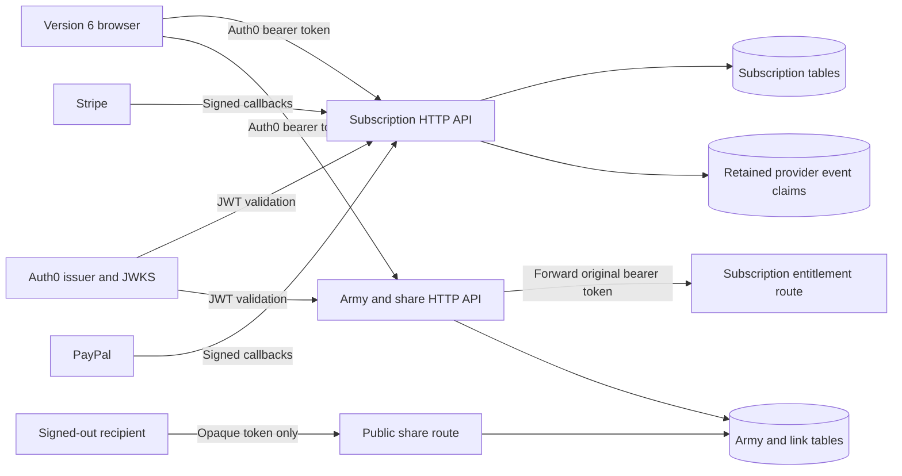
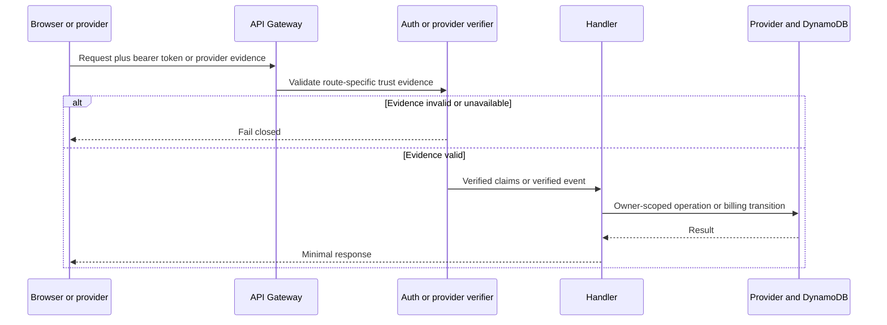
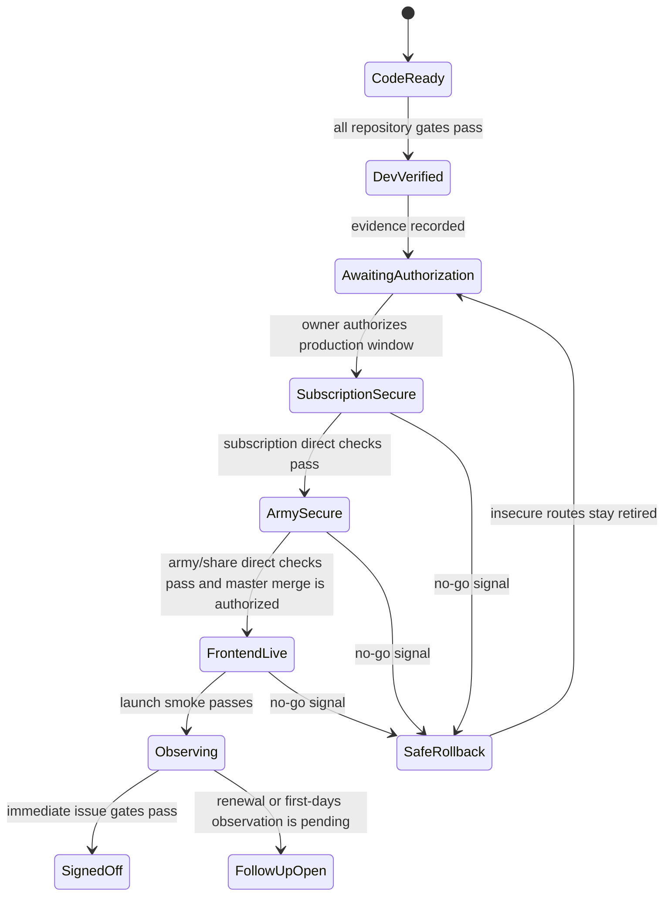

# Version 6 Production Security and Cloud Rollout - Plan

This plan spans three repositories. Unprefixed paths belong to `daviseford/aos-reminders`.
`sub-api:` paths belong to `daviseford/aos-reminders-subscription-api`, and `rest-api:` paths
belong to `daviseford/aos-reminders-rest-api`.

## Goal Capsule

- **Objective:** Close the remaining Version 6 production blockers by authorizing subscription
  operations, verifying payment-provider callbacks, deploying the AoS 4 army/share service with
  fail-closed configuration, completing the production evidence in #1731 and #1805, and retiring
  migration-branch guidance after a verified live cutover through #1806.
- **Authority order:** Repository `AGENTS.md` and issues #1720, #1804, #1731, #1805, and #1806; the
  confirmed scope of this plan; current code and deployed-service evidence; the earlier account and
  capability-restoration plans; official Auth0, AWS, Stripe, and PayPal contracts.
- **Execution profile:** Make security and deployment changes in the two companion APIs first, wire
  the frontend to their verified contracts, prove both services in dev, and enter one explicitly
  authorized production cutover window.
- **Stop conditions:** Stop before any production deploy, provider-console mutation, secret rotation,
  `master` merge, or frontend production release unless the project owner authorizes that operation.
  Also stop if a CloudFormation change set replaces a retained table or if a verified Auth0 token
  lacks the claim needed to locate the caller's subscription record.
- **Tail ownership:** Code lands through reviewed PRs in the owning repository. Production evidence
  remains attached to #1720, #1804, #1731, #1805, and #1806 until each issue's own completion
  condition is met; a delayed natural renewal and the post-cutover branch-policy update do not
  disappear into undocumented launch follow-ups.

---

## Product Contract

### Summary

Create a security-first launch path across the frontend and both companion APIs. Subscription and
private cloud-account operations use the caller's verified Auth0 identity, payment callbacks use
provider signatures, and the production build cannot advertise cloud features without compatible
configured services.

### Problem Frame

Version 6 has the AoS 4 cloud collection, sharing, subscription UI, and account shell in the
integration branch, but the production trust boundaries are incomplete. The subscription browser
client still reads another account by a caller-supplied email and sends a shared key for
cancellation, PayPal grants, redemption, and theme updates. The subscription API still exposes
those operations through unauthenticated REST API routes, and its Stripe and PayPal handlers parse
callback bodies without first proving the provider sent them.

The army/share service is further along. Its merged code uses an API Gateway JWT authorizer on
writes, derives ownership from the Auth0 subject, checks active entitlement, validates AoS 4
documents, and creates owner-free opaque shares. Production still runs the legacy surface, however,
and the checked-in frontend deployment does not provide `VITE_ARMY_API_URL`. The current service also
leaves collection reads public and accepts a caller-supplied owner query, which does not satisfy
issue #1804's production acceptance contract for private cloud armies.

The frontend deployment runs automatically after a push to `master`, independently from the normal
CI workflow. A launch therefore needs more than green branch checks: both API contracts must exist
in production, the frontend build must prove it received their endpoints, and rollback must never
restore the insecure subscription routes merely to recover availability.

### Actors

| Actor | Role in this plan |
|---|---|
| Authenticated account holder | Reads and mutates only their subscription, preferences, and cloud armies |
| Active subscriber | Uses cloud mutations, share creation, import, and subscriber themes |
| Second authenticated account | Supplies the cross-account negative cases for both services |
| Signed-out share recipient | Reads an opaque shared snapshot without receiving owner identity |
| Stripe or PayPal | Delivers independently verified payment lifecycle callbacks |
| Release operator | Supplies production configuration, authorizes deploys, observes signals, and executes rollback |
| Repository contributor | Targets the live primary branch without mistaking that policy for deploy authorization |

### Requirements

#### Subscription identity and ownership

R1. Every browser-initiated subscription or preference request carries an Auth0 access token for
the `https://api.aosreminders.com` audience.

R2. API Gateway validates the token signature, issuer, audience, and time claims before an
account-scoped subscription handler runs.

R3. The subscription API requires a verified-email claim, derives the normalized account email from
verified token claims, and never uses a request email, user ID, row ID, or subscription ID to
establish ownership.

R4. A valid account can read and mutate only its own subscription record and theme. Redemption may
also consume only the valid one-time gift or coupon named by the request, atomically with the grant;
foreign account identifiers cause no provider call or unrelated DynamoDB mutation.

R5. The current-account response exposes only fields consumed by the Version 6 account UI and never
returns an unrelated account or provider-only metadata.

R6. `SUBSCRIPTION_AUTH_KEY`, `UI_AUTH_KEY`, browser-reachable administrative keys, and the retired
migration key are removed from active code and deployed routes.

#### Payment boundary

R7. Every Stripe callback verifies the `Stripe-Signature` header against the unchanged raw request
body and the correct stage-and-endpoint secret before parsing or mutating data.

R8. Every PayPal callback verifies the transmission headers, webhook ID, and full event through
PayPal's verification contract before mutating data.

R9. Payment-provider callbacks remain separate from Auth0 account routes and fail closed when
signature verification or its dependency is unavailable.

R10. The browser PayPal grant, cancellation, coupon redemption, and gift redemption flows preserve
their current behavior while deriving the receiving account from the verified token.

R22. Each verified provider event is claimed once through a retained idempotency record; provider
retries cannot repeat a grant, gift, renewal, or cancellation transition.

R23. A browser PayPal grant verifies the approved subscription with PayPal and matches its verified
account email, plan, and eligible status before issuing temporary access.

R24. Coupon and gift redemption consume their one-time entitlement atomically, so concurrent or
replayed requests cannot grant it twice.

#### Cloud armies and sharing

R11. Production cloud collection reads and writes require a valid token and derive the collection
owner from its `sub` claim; request owner fields are ignored.

R12. Army mutations also require an active entitlement, and an unavailable or inactive entitlement
check causes no DynamoDB mutation.

R13. Public access exists only through an opaque share token; a public share response and browser
state contain no owner subject, email, or private collection metadata.

R14. Loading a cloud army or share validates the AoS 4 document and selection graph and cannot
replace local work until the user confirms.

#### Configuration, rollout, and evidence

R15. Dev and production service packaging fail when required issuer, audience, entitlement, share,
CORS, or provider-verification configuration is absent; production configuration has no localhost
or placeholder fallback.

R16. The frontend deployment workflow supplies explicit subscription and army API endpoints and
fails before upload when either production endpoint is missing, non-HTTPS, or inconsistent with the
expected service contract.

R17. The established account, payment, cloud-army, sharing, navigation, responsive, and theme UI is
preserved without a redesign.

R18. Automated route inventories, handler tests, and dev-stage black-box checks cover missing,
malformed, expired, wrong-issuer, wrong-audience, and valid-but-foreign authorization cases.

R19. The production cutover records deployed revisions, endpoint/configuration evidence, monitoring
signals, and a rollback decision before #1720 or #1804 is closed.

R20. Launch-day validation completes the applicable #1731 and #1805 checks, while delayed payment
renewal observations remain explicitly owned until their real events occur.

R21. `docs/release.md`, the Version 6 integration PR, and the tracked launch issues state the actual
production result and any remaining observation tail.

R25. After a verified `FrontendLive` cutover, live contributor instructions name `master` as the
primary branch and normal PR target while preserving its explicit merge/deploy authorization rule.
A rollback leaves the migration-branch guidance intact until the next authorized cutover.

### Key Flows

#### F1. Current-account request

1. The signed-in browser obtains an audience-scoped Auth0 access token through the existing token
   accessor.
2. The browser calls the subscription or army HTTP API with the bearer token and action data only.
3. API Gateway validates the token and passes verified claims to the Lambda handler.
4. The handler derives email or subject from those claims and loads the caller-owned record. A
   redemption may also conditionally consume only the named one-time gift or coupon as part of its
   atomic grant.
5. A failure returns a recoverable account/cloud error without discarding the local AoS 4 document.

#### F2. Provider callback

1. Stripe or PayPal sends a callback to its provider-specific endpoint.
2. The handler preserves the raw body and collects the provider signature or transmission headers.
3. A shared verifier validates the callback with stage-specific secret material or PayPal's
   verification API.
4. The service conditionally claims the verified provider event ID in a retained event table.
5. Only the winning claim reaches the existing billing transition logic; completed duplicates
   return success and incomplete claims follow the bounded retry contract.
6. Invalid, unverifiable, unavailable, or already-running claims produce no Stripe, PayPal, or
   subscription-table mutation and emit a bounded operational signal.

#### F3. Production cutover

1. The operator confirms backups, required configuration, dev evidence, rollback artifacts, and
   explicit authorization.
2. The secured subscription API deploys and its direct production checks pass.
3. The private AoS 4 army/share API deploys against the verified subscription entitlement endpoint
   and its direct checks pass.
4. The frontend endpoint variables are confirmed, and the explicitly authorized merge triggers a
   build that repeats release gates before uploading.
5. The operator completes the Version 6 smoke matrix and records go/no-go evidence.

#### F4. Security-safe rollback

1. A no-go signal stops further rollout and identifies whether the failing boundary is subscription,
   army/share, or frontend.
2. Retained DynamoDB data is left in place and the last known-good artifact for the affected layer is
   selected.
3. The subscription service never rolls back to browser-key authorization or unsigned callbacks.
4. If no secure frontend/API combination is available, account/cloud actions remain unavailable
   while local army functionality is restored.
5. The rollback revision, data checks, and remaining outage are recorded in #1805.

#### F5. Post-cutover branch-policy cleanup

1. The operator confirms U7 reached `FrontendLive` and #1805 records a successful production smoke,
   not `SafeRollback`.
2. Current contributor and operator docs replace live `aos4-migration` targeting instructions with
   `master` as the primary branch and normal PR target.
3. The `master` merge/deploy authorization warning remains explicit, and historical plan artifacts
   remain unchanged.
4. Issue #1806 records the search evidence and closes; a rollback skips this flow.

### Acceptance Examples

#### Foreign subscription mutation

```gherkin
Given account A and account B each have a valid Auth0 access token
And account A has an active subscription row
When account B submits account A's email, row id, or subscription id to any account operation
Then the API resolves account B from the verified token
And account A's row is neither returned nor mutated
And no payment-provider call is made for account A
```

#### Forged callback

```gherkin
Given a syntactically valid Stripe or PayPal event body
When it arrives without a valid provider signature or transmission verification
Then the callback fails before billing transition logic runs
And no subscription, gift, coupon, or temporary-grant row changes
```

#### Private army and public share

```gherkin
Given account A saved an AoS 4 army and created an opaque share
When account B calls the private collection or army endpoint
Then account A's army is not returned or mutated
When a signed-out browser calls the share endpoint with the opaque token
Then the shared document is returned without owner identity
And local work is unchanged until the recipient confirms
```

#### Missing deployment configuration

```gherkin
Given a production frontend build has no subscription or army API endpoint
When the deployment workflow reaches its configuration gate
Then the build stops before the S3 synchronization step
And the existing production site is unchanged
```

#### Security-safe rollback

```gherkin
Given the Version 6 frontend fails after the secured APIs are deployed
When the operator rolls back the frontend
Then the vulnerable subscription routes remain absent
And local army use remains available even if account features are temporarily unavailable
```

#### Post-cutover branch policy

```gherkin
Given the Version 6 production result is recorded as FrontendLive
When current repository instructions are updated
Then master is the primary branch and normal pull-request target
And master merges and production changes still require explicit authorization
And historical migration plans remain unchanged
```

### Success Criteria

- The subscription API's complete browser route inventory is JWT-protected and ownership-negative
  tests prove foreign-account inputs cannot redirect an operation.
- Stripe and PayPal callback tests prove invalid provider evidence is rejected before any downstream
  billing call or write beyond the verification boundary.
- The production army/share service uses the intended subscription entitlement endpoint, Auth0
  issuer/audience, production share base URL, and production-only browser origin.
- A production build artifact contains the intended subscription and army API endpoints and contains
  no shared subscription authorization key.
- Two-account production checks pass for subscription reads/mutations and cloud collection
  reads/mutations; anonymous share loading remains owner-free.
- #1805 records a successful product smoke test or a specific rollback, and #1731 retains ownership
  of payment observations that cannot occur on launch day.
- A verified live cutover leaves current branch guidance pointed at `master`; a rollback leaves the
  migration guidance untouched for the next authorized attempt.

### Scope Boundaries

**In scope.** Closing #1720 and #1804; the code, configuration, secret rotation, dev evidence, and
production operations needed to close them; launch-day #1731 payment checks; the technical product
smoke and operational evidence in #1805; release documentation updates caused by those results; and
the post-cutover branch-policy cleanup in #1806.

**Non-goals.**

- Broad Vite, TypeScript, Sass, PWA, Stripe UI, PayPal UI, or other package modernization.
- Changes to pricing, plan definitions, subscription duration, redemption policy, or payment-provider
  business rules.
- A redesign of account, Subscribe, Profile, cloud-army, import, share, or payment surfaces.
- AoS 4 rules-data acquisition, reconciliation, generation, or accepted-corpus changes.
- AoS 3 compatibility, translation, or restoration of retired code paths.
- Full offline cloud synchronization, multi-device conflict resolution, or background sync.

#### Deferred to Follow-Up Work

- Subscriber release communication in #1762 is coordinated after technical sign-off but is not a
  completion criterion for this security and deployment plan.
- Migrating legacy subscription rows from email ownership to Auth0 `sub` remains a separate data
  migration; this launch keeps the existing key and derives its email from the verified token.
- A natural Stripe renewal and the first-days provider dashboard watch remain open in #1731 when the
  required real event has not occurred by the end of launch day.

---

## Planning Contract

### Key Technical Decisions

KTD1. **Use two independent trust boundaries: Auth0 for browser account operations and provider
signatures for payment callbacks.** An Auth0 token proves the signed-in user, not that Stripe or
PayPal sent an event. Conversely, a valid webhook proves the provider sent the event but grants no
browser account authority. This division satisfies R1-R10 and R22-R24 and keeps provider routes out
of the user authorizer.

KTD2. **Use the subscription service's existing HTTP API JWT authorizer for every browser account
route.** The service already proves this pattern on `/entitlement`, and the army service uses the
same issuer and audience. Extending that native authorizer avoids custom JWT verification code and
lets API Gateway reject signature, issuer, audience, and time-claim failures before Lambda.

KTD3. **Expose current-account routes that do not contain account identity.** The account lookup,
theme, cancellation, PayPal grant, coupon redemption, and gift redemption routes accept only their
action inputs. Handlers require a verified email, derive the normalized legacy subscription key from
that claim, query the row, and use stored provider/row identifiers. This replaces the old email path
and `{ id, userName, subscriptionId, authKey }` request contracts while preserving the UI behavior
in R10 and R17.

KTD4. **Retire public privileged and unused account routes instead of teaching them end-user
authorization.** Remove the HTTP events for administrative subscription/gift/coupon creation,
delete the retired migration endpoint, and remove the unused favorite-faction routes. If operator
administration remains necessary, invoke a no-HTTP Lambda through AWS IAM and remove its hardcoded
key. An end-user token must never mint an administrative entitlement.

KTD5. **Private cloud collections replace the earlier open-read collection posture; opaque shares
remain public.** The current #1804 acceptance contract requires a second account to be unable to
read another user's private army. Protect collection listing and item reads, derive `ownerId` from
the verified `sub`, and remove the caller-supplied owner query. `/links/{token}` remains the sole
anonymous document-read path and strips ownership.

KTD6. **Preserve provider endpoint URLs and add verification adapters ahead of existing transition
logic.** Repointing every Stripe and PayPal dashboard endpoint during the security fix creates an
avoidable cutover variable. Each existing callback route gets its stage-specific verification
material; shared adapters verify the untouched request before handing the parsed event to the
characterized billing handler.

KTD7. **Make public stage configuration checked-in and secret material externally resolved.** Auth0
issuer/audience, production origin, share base URL, and service-to-service URLs are non-secret
deployment inputs with no permissive production defaults. Stripe API keys, Stripe endpoint secrets,
PayPal client credentials, and PayPal webhook IDs resolve from encrypted AWS configuration and are
rotated when their existing copies are exposed or committed. Rotation prepares replacement
credentials alongside the current values, deploys and verifies the replacement, and revokes the old
value only after direct checks pass so the security fix does not create an avoidable provider gap.

KTD8. **Treat endpoint variables as required release inputs, not optional feature flags.** The
frontend reads `VITE_SUBSCRIPTION_API_URL` and `VITE_ARMY_API_URL` from GitHub Actions configuration,
validates both before building, and records them in deployment evidence. A missing endpoint stops
the workflow before any S3 synchronization rather than shipping a disabled paid capability.

KTD9. **Use an expand-secure-cutover-observe rollout with a no-insecure-rollback rule.** All code is
merged and dev-proven before production changes. In the authorized window, secured APIs deploy
before the frontend, which may briefly make current account actions unavailable. Rollback may trade
account availability for safety but may not restore browser-key routes or unsigned callbacks.

KTD10. **Deduplicate verified callbacks before billing transitions.** A valid provider signature
does not make a replay safe. Claim each stage/provider/event-ID tuple through a conditional write in
a small retained event table before running transition logic. Commit the subscription-row mutation
and claim completion in one DynamoDB transaction so a crash cannot leave an applied transition with
a retryable claim. An already-completed event returns success without reapplying the transition; a
failure before that transaction remains retryable. The claim records `processing`, `complete`, and
retryable `failed` states, uses a bounded lease to recover abandoned work, and expires only after the
provider's documented retry horizon. Callback-side provider operations remain read-only; if
characterization finds an unavoidable external mutation, it needs its own durable step marker and
provider idempotency key before this KTD is satisfied.

KTD11. **Treat browser payment proof as a locator, not authority.** A PayPal approval's subscription
ID and plan ID help locate the purchase, but the service independently retrieves it from PayPal and
matches the verified account email, expected plan, and eligible status before issuing a provisional
grant. Coupon and gift redemptions similarly use conditional writes so bearer authentication cannot
turn a race or replay into duplicate value.

### High-Level Technical Design

#### Service and trust topology



#### Verification sequence



#### Rollout state machine



### Sequencing and Dependencies

1. Complete subscription security and payment callback verification before depending on the
   subscription service as the army service's production entitlement authority.
2. Complete the matching frontend subscription contract and army privacy changes before the
   integrated dev matrix.
3. Make production configuration and frontend workflow changes reviewable before requesting a
   production window.
4. Land frontend work through migration sub-PRs targeting `aos4-migration`; land each companion API
   change through a reviewed PR in its owning repository. Do not push a launch fix directly to
   `master`.
5. Deploy secured production backends before allowing the Version 6 frontend deployment to begin.
6. Run immediate production smoke checks before starting delayed provider observation.

### Operator Prerequisites

- Confirm the Auth0 API identifier, issuer, signing algorithm, and the access-token claim that holds
  the normalized account email in both dev and production.
- Create or rotate Stripe API and webhook secrets and PayPal verification credentials in encrypted
  AWS configuration without copying their values into issues, PRs, logs, or repository files.
- Record the PayPal webhook ID associated with each deployed callback URL and stage.
- Create GitHub Actions configuration variables for the production subscription and army HTTP API
  endpoints after those endpoints are known.
- Prepare two production Auth0 accounts, including one active subscriber, for owner/foreign-account
  checks without modifying unrelated customer data.
- Capture restorable DynamoDB backups and inspect CloudFormation change sets for retained tables
  before each authorized production deployment.
- Obtain explicit project-owner authorization for each production API deployment and for the
  `master` merge that triggers the frontend deployment.

### Alternatives Considered

| Alternative | Decision |
|---|---|
| Keep REST API v1 account routes and add a custom Lambda JWT authorizer | Rejected because the existing HTTP API already has the native JWT authorizer and custom token validation adds security-critical code. |
| Treat the browser-visible key as a second factor | Rejected because every visitor can extract it from the bundle and replay it. |
| Put provider callbacks behind Auth0 | Rejected because Stripe and PayPal do not authenticate as site users; their signatures are the correct authority. |
| Keep cloud army reads public and rely on hard-to-guess owner IDs | Rejected for launch because #1804 defines cloud armies as private and opaque shares already provide intentional public access. |
| Merge the frontend first and configure APIs afterward | Rejected because the deployed UI would advertise paid capabilities that are unavailable or incompatible. |
| Roll back the subscription service to its current routes if Version 6 fails | Rejected because recovery cannot reopen a known authorization bypass. |

---

## Implementation Units

### Phase A: Close the code and configuration gaps

### U1. Authorize the subscription current-account API

**Goal.** Replace browser-key and caller-identity account operations with one JWT-authorized,
current-account contract.

**Requirements.** R1-R6, R10, R17-R18, R24.

**Dependencies.** Auth0 claim confirmation from Operator Prerequisites.

**Files.**

- Modify `sub-api: serverless.yml`.
- Modify `sub-api: util/auth.js`, `util/env.js`, and `util/response.js`.
- Modify `sub-api: user/get.js` and `user/theme.js`.
- Modify `sub-api: subscription/cancel.js`, `subscription/coupon.js`, and
  `subscription/gift.js`.
- Modify `sub-api: paypal/grant.js`.
- Remove or detach the HTTP events and dead code owned by `sub-api: user/favorite.js`,
  `subscription/adminCreate.js`, administrative exports in `subscription/gift.js` and
  `subscription/coupon.js`, and `migrations/migrate_v4.js` as specified by KTD4.
- Add `sub-api: tests/authorization.test.js` and extend `tests/user.test.js`,
  `tests/subscription.test.js`, and `tests/gift-coupon.test.js`.
- Update `sub-api: README.md`.

**Approach.** Extend the `/entitlement` HTTP API authorizer pattern to a current-account API. Use
the verified email claim to query the legacy row, and use the row's stored composite key and provider
IDs for all subsequent actions. Accept only action data such as a theme, coupon code, gift locator,
or PayPal approval proof. Return the existing UI flags through an allowlisted response. Remove the
shared browser key and ensure every function in the deployed route inventory is classified as an
Auth0 route, a provider callback, a public non-account route, or a non-HTTP operator function. For
gift and coupon redemption, conditionally consume the one-time value and grant the verified
recipient in one DynamoDB transaction; retain enough redemption ownership/result metadata for a
same-account retry after a lost response to converge without consuming or granting twice.

**Test scenarios.**

- A current-account read with verified mixed-case email claims queries the normalized email and
  returns only the allowlisted account fields.
- A missing or unverified email claim fails before DynamoDB access even when the request supplies an
  email.
- Theme, cancellation, PayPal grant, coupon redemption, and gift redemption ignore supplied account,
  row, or subscription identifiers and operate on the verified caller's row.
- A valid token for account B plus account A's identifiers cannot read or mutate account A and makes
  no Stripe call.
- Two concurrent coupon or gift redemption requests can consume the entitlement once, and the loser
  receives the existing already-used/invalid outcome without a second subscription grant.
- A response failure after a committed redemption lets the same account retry to its recorded result
  without a second grant; a different account receives no value.
- An old `authKey` payload without verified claims fails and causes no provider or database call.
- A signed-in user with no row retains the current not-subscribed behavior, while transport and
  authorization failures remain recoverable errors.
- The route-inventory test fails when a browser account route lacks the JWT authorizer or an unknown
  HTTP route appears.
- No administrative, migration, or favorite-faction HTTP route remains deployed.

**Verification.** The subscription test suite passes, a packaged route table contains only the
intended account/provider/public classifications, and repository/bundle scans find no browser shared
key or deployed hardcoded administrative key.

### U2. Verify Stripe and PayPal callbacks and externalize secrets

**Goal.** Prove a payment provider sent every callback before existing billing logic can run.

**Requirements.** R6-R10, R15, R18, R22-R23.

**Dependencies.** U1's authenticated PayPal grant contract; provider endpoint inventories and
encrypted configuration from Operator Prerequisites.

**Files.**

- Add shared verification adapters under `sub-api: util/`.
- Modify `sub-api: subscription/create.js`, `subscription/renew.js`, and the Stripe callback in
  `subscription/gift.js`.
- Modify `sub-api: paypal/create.js`, `paypal/renew.js`, and `paypal/cancel.js`.
- Modify `sub-api: serverless.yml`, `util/env.js`, `util/clients.js`, `config.dev.json`,
  `config.prod.json`, and `.gitignore`.
- Add the retained provider-event claim resource and a small idempotency adapter under
  `sub-api: util/`.
- Modify `sub-api: paypal/grant.js` to verify browser approval locators with PayPal before granting
  access.
- Extend `sub-api: tests/subscription.test.js`, `tests/paypal.test.js`, and
  `tests/gift-coupon.test.js`; add focused verifier tests when clearer.
- Update `sub-api: README.md` with secret names, provider endpoint ownership, and verification
  failure signals without recording values.

**Approach.** Put one verifier in front of each provider handler and pass only a verified parsed
event into the characterized transition logic. Stripe verification reconstructs the exact request
bytes from `event.body` and `isBase64Encoded` without parsing or re-serializing them, then uses the
signature header and secret for that exact endpoint/stage. PayPal verification sends the required
transmission headers, configured webhook ID, and complete event to its official verification API.
Malformed or invalid evidence fails before database or provider-client calls; a verifier timeout or
dependency outage returns a retryable non-success response, while a completed duplicate returns 2xx.
Claim the verified stage/provider/event-ID tuple before its transition. Finish by atomically writing
the characterized subscription change and completed claim, so a duplicate delivery cannot repeat
value and a crash cannot make an applied change look retryable. Model pre-transition claims as
`processing` or retryable `failed`, recover an abandoned `processing` claim only after a bounded
lease, and set TTL beyond the longest documented provider retry horizon. Define the event table as
an additive retained resource so stack rollback cannot delete the replay ledger. Treat a browser
PayPal approval as a locator and retrieve authoritative subscription details before a temporary
grant. Move Stripe and PayPal credentials out of tracked JSON and hardcoded environment modules;
rotate any exposed production credential before it is considered safe.

**Test scenarios.**

- A valid Stripe fixture with a generated test signature reaches each existing transition path.
- The same Stripe body with changed whitespace, changed data, missing signature, or the wrong
  endpoint secret is rejected before DynamoDB and Stripe clients are called.
- Text and base64-encoded API Gateway events reconstruct the same signed bytes; JSON parse/stringify
  output is never substituted for the signed body.
- A PayPal callback with all required headers and a successful verification response reaches the
  matching CREATED, ACTIVATED, renewal, or cancellation path.
- A missing PayPal transmission header, failed verification, malformed response, timeout, or wrong
  webhook ID causes no mutation.
- A valid Auth0 access token without provider evidence cannot invoke a provider transition.
- Two deliveries of the same verified provider event produce one transition, while a retry after a
  pre-transition failure can complete safely.
- A worker interruption before the final transaction leaves a lease-bounded claim that a later
  provider retry can recover; interruption after the transaction observes a completed claim and
  cannot repeat the subscription mutation.
- A PayPal grant locator with an unknown subscription, wrong account email, wrong plan, or
  ineligible status cannot create or refresh a temporary grant.
- Dev and production packaging fail when the stage's required API key, callback secret, client
  credential, or webhook ID is missing.
- Existing Stripe legacy-payload and PayPal order-independence characterization tests still pass
  after verification succeeds.

**Verification.** The payment test suites pass with explicit no-write and single-transition
assertions, the retained event table is present in the dev and production service packages,
packaged functions resolve encrypted configuration, the packaged change set contains no table
replacement or deletion, and no live credential remains in the working tree.

### U3. Send bearer tokens through the frontend subscription client

**Goal.** Move every browser subscription action onto U1's current-account API without changing the
visible account experience.

**Requirements.** R1, R3-R6, R10, R16-R18.

**Dependencies.** U1's request and response contract.

**Files.**

- Modify `src/api/subscriptionApi.ts`, `src/utils/authToken.ts`, and `src/utils/env.ts`.
- Modify `src/context/useSubscription.tsx` and `src/context/useTheme.tsx`.
- Modify `src/components/payment/pricingPlans.tsx`, `src/components/routes/Join.tsx`, and
  `src/components/routes/Redeem.tsx` only where token/action wiring requires it.
- Modify `src/tests/subscriptionApi.test.ts`, `src/tests/aos4/subscriptionApi.test.ts`,
  `src/tests/aos4/subscriptionContext.test.tsx`, `src/tests/aos4/subscriberTheme.test.tsx`, and
  `src/tests/aos4/pricingPlans.test.tsx`.
- Update `.env.example`.

**Approach.** Give the subscription client an injected endpoint and the same audience-token source
already used by the army client. The subscription provider owns token acquisition for status and
cancellation; the theme and redemption/payment call sites use the shared token accessor without
copying account identity into API payloads. Remove the shared-key constant and the email-path
encoding workaround with the retired contract. Preserve existing context methods, loading/error
states, route behavior, and account copy.

**Test scenarios.**

- Subscription lookup, cancellation, theme, PayPal grant, coupon redemption, and gift redemption
  send the audience bearer token and only their action inputs.
- Signed-out calls do not reach the network and surface the established authentication recovery.
- A rejected silent token refresh leaves local army state and the account shell intact.
- An inactive subscriber, unknown account, transport error, and authorization error remain distinct
  in the current UI states.
- No request contains `authKey`, caller email, row ID, or provider subscription ID for ownership.
- Account navigation, Profile, Subscribe, Join, Redeem, payment modal, and subscriber theme tests
  preserve their existing landmarks and text.

**Verification.** Focused frontend tests pass, the full frontend verification contract is green,
and a production bundle scan contains neither the retired browser key nor an unconfigured
subscription endpoint.

### U4. Make the army/share service production-private and fail-closed

**Goal.** Satisfy #1804's private collection, public share, entitlement, CORS, and production
configuration contract before deploying the service.

**Requirements.** R11-R19.

**Dependencies.** U1's production-compatible `/entitlement` contract; production configuration from
Operator Prerequisites.

**Files.**

- Modify `rest-api: serverless.yml` and add sanitized stage configuration files.
- Modify `rest-api: items/list.js` and `items/get.js`.
- Modify `rest-api: util/auth.js`, `util/entitlement.js`, `util/env.js`, and response helpers as
  required by the private-read contract.
- Remove the legacy public user-list route in `rest-api: user/get.js` if it has no non-retired
  consumer.
- Modify `rest-api: tests/auth.test.js`, `tests/items.test.js`, `tests/links.test.js`, and
  `tests/clients.test.js`; add a route/configuration contract test.
- Update `rest-api: README.md`.
- Modify `src/api/armyApi.ts`, `src/context/useArmyCollection.tsx`,
  `src/tests/aos4/armyApi.test.ts`, and `src/tests/aos4/armyCollection.test.tsx` to remove the
  caller-supplied collection owner.

**Approach.** Attach the existing JWT authorizer to collection listing and individual army reads.
Derive `ownerId` from verified claims for every collection operation and query the existing GSI with
that value. Keep only the opaque share read public, and continue stripping owner fields. Replace
packaging defaults with required stage inputs for entitlement URL, Auth0 issuer/audience, share base
URL, and allowed browser origin. Production allows `https://aosreminders.com`; localhost origins
remain dev-only. Preserve table retention and reject any planned resource replacement.

**Test scenarios.**

- Account A lists and reads its own structurally valid AoS 4 armies with a valid token.
- Account B cannot list, read, update, or delete account A's army when it supplies account A's
  subject, item ID, or legacy username.
- Missing verified claims and inactive or unavailable entitlement checks cause no mutation.
- A signed-out browser can load a valid share but cannot call collection or item routes.
- Share responses exclude `ownerId`, `userName`, and other private collection metadata.
- Production CORS emits allow headers for the production origin and no allow header for localhost or
  an unapproved origin; tests do not confuse CORS with API authorization.
- Production packaging fails on a placeholder entitlement URL, localhost share base, missing issuer,
  missing audience, or missing allowed origin.
- The proposed CloudFormation change set retains both existing DynamoDB tables and adds no delete or
  replacement action.

**Verification.** REST API tests and both stage packages pass, the prod package contains the exact
required public configuration, and the frontend army client no longer sends an owner query or path
identity.

### U5. Gate the production frontend build on compatible APIs

**Goal.** Ensure the `master` deployment cannot upload Version 6 without its two compatible account
API endpoints and the normal release checks.

**Requirements.** R15-R17, R19, R21.

**Dependencies.** U3 and U4; known dev and production HTTP API endpoints.

**Files.**

- Modify `.github/workflows/deploy.yml`.
- Add a focused deployment-configuration validator under `scripts/` or `src/tests/support/`.
- Modify `.env.example`, `package.json`, and `vite.config.mts` only as required to expose and validate
  the two endpoint variables.
- Add focused validator tests.
- Modify `docs/release.md`.

**Approach.** Read the two non-secret endpoint values from GitHub Actions configuration and validate
their scheme, presence, and expected environment before the build. Repeat lint, tests, beta
verification, type/build checks, and endpoint validation inside the credentialed deployment job
before its first mutating AWS step; the separate CI workflow remains useful but is not the deploy
job's dependency. Inspect the built artifact for the intended endpoints and absence of retired
authorization material before S3 sync. Keep the `master`-only trigger and established S3/CloudFront
mechanics.

**Test scenarios.**

- Missing or blank subscription or army endpoints fail before build/upload.
- An HTTP, localhost, placeholder, or unexpected-stage endpoint fails the production validator.
- Valid production endpoints reach the build and appear in the intended client configuration.
- A bundle containing the retired shared key fails the artifact inspection.
- A failed lint, test, beta, type, build, or configuration gate prevents S3 synchronization and
  CloudFront invalidation.
- The workflow remains incapable of deploying `aos4-migration` or a migration sub-branch.

**Verification.** Workflow validation tests pass, a non-mutating production build produces an
artifact with both intended endpoints, and every route/account presentation test remains green.

### Phase B: Prove, deploy, and close the launch tail

### U6. Run the integrated dev authorization and callback matrix

**Goal.** Produce repeatable evidence that the code/configuration combination is safe before any
production change is requested.

**Requirements.** R2-R20, R22-R24.

**Dependencies.** U1-U5 deployed or configured against dev-stage services.

**Files.**

- Add or update black-box verification scripts under `sub-api: scripts/` and `rest-api: scripts/`.
- Add sanitized evidence templates to both API `README.md` files or a small `docs/` runbook.
- Update the companion API PR descriptions and issues #1720 and #1804 with results.

**Approach.** Exercise API Gateway rather than only calling handlers. The script accepts short-lived
tokens and provider test evidence through process environment, never stores them, and records only
case/result metadata. Use two accounts to prove owner isolation. Run the full token matrix against
each authenticated route, the provider-signature matrix against each callback, and CORS preflights
against approved and unapproved origins. Then use a frontend preview configured to the dev endpoints
to exercise the established UI flows and local-state safeguards.

**Test scenarios.**

- Missing, malformed, expired, wrong-issuer, and wrong-audience tokens are rejected by API Gateway
  before the account handler runs.
- Valid account A and account B tokens prove cross-account subscription and army reads/mutations
  fail without writes or provider calls.
- Active and inactive entitlements prove army mutations succeed or fail at the intended boundary.
- Valid Stripe test callbacks and PayPal sandbox verification reach their characterized transitions;
  invalid evidence reaches none.
- Production-like CORS configuration accepts only the expected browser origin.
- The preview completes status, cancellation, redemption, theme, cloud collection, and share flows
  without changing recognizable desktop or mobile presentation.
- Every temporary dev row, share, army, gift/coupon use, and entitlement change is inventoried and
  removed or restored after the run.

**Verification.** Both service test/package gates, the black-box matrix, frontend preview, cleanup
audit, and written PR evidence pass before U7 can request authorization.

### U7. Execute the explicitly authorized production cutover

**Goal.** Deploy the secured backends and compatible frontend in a controlled window with observable
go/no-go points and a security-safe rollback.

**Requirements.** R15-R24.

**Dependencies.** U6; all Operator Prerequisites; explicit authorization for each production
operation.

**Files and systems.**

- Production stacks for `aos-reminders-subscription-api` and `aos-reminders-rest-api`.
- Auth0, Stripe, PayPal, AWS encrypted configuration, DynamoDB backups, and CloudWatch.
- GitHub Actions configuration for `daviseford/aos-reminders`.
- PR #1717, issues #1720 and #1804, and `docs/release.md`.

**Approach.** Capture deployed revisions, table backups, CloudFormation change sets, provider
endpoint mappings, configuration fingerprints, and rollback artifacts before mutation. After the
owner authorizes the window, stage replacement provider credentials, deploy the secured subscription
service, and prove current-account and signed-callback behavior directly before revoking the old
credentials. Deploy the army/share service against its production entitlement endpoint and prove
private collection, entitlement, share, and CORS behavior directly. Set and double-check the
frontend endpoint variables. Only then may the owner authorize the #1717 merge and resulting
frontend deployment. Stop at the first no-go signal. Roll back the affected safe layer or leave
account/cloud operations unavailable; never restore the insecure subscription surface.

**Test scenarios.**

- The subscription stack reports the intended revision and exposes protected account routes,
  independently verified callbacks, and no retired browser/admin/migration route.
- Same-account production status/theme/cancel behavior works and a second account cannot redirect an
  operation.
- The army stack reports the intended revision and passes active, inactive, anonymous, foreign-owner,
  public-share, and production-CORS checks.
- The frontend deployment logs the two intended endpoints and completes every gate before S3 sync.
- An injected or naturally observed no-go signal stops the next stage and follows F4 without table
  deletion or insecure route restoration.

**Verification.** If the rollout reaches `FrontendLive`, the recorded production evidence satisfies
issues #1720 and #1804 and the deployed frontend commit matches the intended `master` revision. If it
reaches `SafeRollback`, #1720 and/or #1804 remain open, and #1805 records the restored revision, data
invariants, unavailable account capabilities, and next authorization boundary.

### U8. Complete the Version 6 production smoke and observation handoff

**Goal.** Validate the deployed product rather than only its build and assign every delayed
observation to a tracked owner.

**Requirements.** R17, R19-R21, R25.

**Dependencies.** U7 reached `FrontendLive` or executed and documented `SafeRollback`.

**Files and systems.**

- `docs/release.md`, `AGENTS.md`, and PR #1717.
- Issues #1720, #1804, #1731, #1805, and #1806.
- Production site, GitHub Actions, CloudWatch, Stripe/PayPal dashboards, GA4, service worker, and the
  Rules Radar workflow.

**Approach.** When U7 reaches `FrontendLive`, run #1805 against the deployed commit at desktop and
mobile widths: local army editing/persistence, all roster inputs, PDF variants, subscription states,
cloud collection, public sharing, GA4, service-worker update, and Rules Radar operational checks. Use
two production accounts for isolation. Run the launch-day Stripe purchase/cancel and PayPal
activation/grant/cancel checks in issue #1731, verify provider delivery and database convergence, and
refund/cancel test purchases. Keep natural renewal and first-days dashboard observation open with an
explicit owner and expected event; do not claim they occurred. If U7 reaches `SafeRollback`, run only
the rollback-safe local/edit/reload and restoration checks, record the skipped live-account/payment
cases, and leave their owning issues open for the next authorized attempt. In either branch, update
docs and issue/PR bodies with the actual result, and remove the subscription launch warning from
`AGENTS.md` only after production authorization evidence passes. After the live smoke passes, only
the `FrontendLive` branch may resolve #1806 by making `master` the primary branch/normal PR target
and removing live `aos4-migration` instructions; retain the explicit authorization boundary for
merges and deploys, and leave historical plans unchanged.

**Test scenarios.**

- In the live branch, the deployed footer, GitHub workflow revisions, API endpoints, and production
  asset revision agree; in the rollback branch, the restored revision and intentionally unavailable
  account capabilities match #1805.
- Desktop and mobile local edit/play, notes, hide/show, ordering, faction switching, and reload
  persistence remain recognizable and correct.
- Official-app, Listbot, New Recruit `.ros`/`.rosz`/`.json`, malformed-input safety, and Standard and
  Compact A4/Letter PDFs pass.
- Two accounts complete cloud create/list/load/update/rename/delete with foreign-account failures;
  a signed-out share remains owner-free and preserves local work until confirmation.
- Subscription status, theme, coupon/gift redemption, Stripe checkout/cancel, and PayPal
  activation/grant/cancel pass without an authorization or callback-verification regression.
- GA4, service-worker update, production console/network, and the first manual Rules Radar run show
  no release-blocking regression.
- Any delayed Stripe renewal, PayPal delivery, or first-days dashboard watch remains open in #1731
  with a named observation and no false completion claim.
- After a live cutover, current contributor/operator docs contain no instruction to target
  `aos4-migration` and still warn that `master` mutations deploy production; after a rollback, the
  branch instructions remain unchanged.

**Verification.** #1805 contains a complete go/no-go record, #1720 and #1804 close only after their
production criteria pass, #1731 closes only after its real-event tail finishes, and all launch docs
match the observed state. Issue #1806 closes only after a verified live cutover and the branch-policy
search passes.

---

## Verification Contract

### Repository gates

Run the normal clean-install gate in `aos-reminders` with Node `v22.23.2` and Yarn Classic:

```powershell
yarn install --frozen-lockfile
yarn lint
yarn tsc --noEmit
yarn test --run
yarn build
yarn data:aos4:verify:beta
```

Run focused frontend coverage for subscription auth, account state, themes, cloud clients,
collection state, public sharing, account presentation, and legacy isolation. The production-config
validator must also prove the built artifact received both intended endpoints and no retired shared
key.

In each companion API repository, run:

```powershell
yarn install --frozen-lockfile
yarn test
npx serverless@4 package --stage dev
npx serverless@4 package --stage prod
```

Packaging uses non-secret public stage configuration plus encrypted provider inputs and must not
deploy. Both API CI workflows remain required to run tests and packaging when credentials are
available.

### Authorization matrix

| Boundary | Positive proof | Required negative proof |
|---|---|---|
| Subscription account routes | Same-account audience token | Missing, malformed, expired, wrong issuer, wrong audience, missing email claim, foreign identifiers |
| Army collection routes | Same-owner audience token and active entitlement for writes | Missing/malformed token, wrong token claims, foreign owner/item, inactive entitlement, entitlement outage |
| Public share read | Valid opaque token without authentication | Unknown token, invalid document, owner fields in response |
| Stripe callbacks | Valid signature over unchanged raw body | Missing/wrong signature, changed bytes, wrong endpoint secret |
| PayPal callbacks | Successful transmission verification for configured webhook | Missing headers, wrong webhook ID, failed/malformed/timeout verification |

Handler tests prove owner derivation and no-write behavior. Dev black-box checks prove the API
Gateway token matrix. Production smoke repeats the same-account/foreign-account cases without
recording tokens or private row contents.

### Production gates

- Both companion API PRs are merged, their CI is green, and dev evidence is attached.
- Frontend units U3-U5 are merged into `aos4-migration`, and PR #1717 points at those exact reviewed
  revisions without unrelated launch work.
- The subscription deployment resolves verified Auth0 email claims and every provider-verification
  secret before its change set is approved.
- The army deployment change set retains existing tables and has exact production entitlement,
  Auth0, share, and origin configuration.
- GitHub Actions has non-empty production API variables, and the credentialed frontend deployment
  repeats all release checks before uploading.
- The project owner authorizes each production deploy and the #1717 merge separately.
- Any authorization bypass, forged callback acceptance, cross-account read/mutation, owner leak,
  unconfigured endpoint, table replacement, subscription regression, or recognizable UI regression
  is a no-go.

### Production data invariants

Capture these checks immediately before the first production change, after each backend deploy, and
after smoke cleanup. Store counts and hashes or redacted aggregates in #1805; never export customer
rows into the issue.

| Data surface | Invariant |
|---|---|
| Subscription table | Counts by status and `createdBy` remain unchanged except for labeled smoke/payment rows and characterized provider transitions |
| Active entitlements | The active-subscriber aggregate does not drop unexpectedly; every planned test transition has a matching provider event and final row |
| Gifts and coupons | Only named smoke inputs change state, and each one-time record is consumed at most once under concurrent/replayed requests |
| Army and share tables | Existing row counts and schema remain unchanged until named smoke records are created; cleanup restores the baseline delta |
| Provider event claims | Only verified provider event IDs appear; duplicates leave one completed transition, and no claim remains `processing` past its lease |
| CloudFormation resources | Change sets contain no replacement or deletion of retained subscriber, army, share, or event-claim tables |
| Recovery assets | Backup identifiers, deployed artifacts, configuration fingerprints, and rollback revisions are recorded before mutation |

### Monitoring and no-go signals

| Signal | Expected launch behavior | No-go or escalation condition |
|---|---|---|
| JWT authorizer denials | Expected only for deliberate negative tests | A valid same-account token is denied, or a wrong-audience/foreign request reaches a handler mutation |
| Subscription/army handler errors | No unexplained 5xx during direct checks or smoke | Sustained or repeated 5xx, cross-account result, or a write after dependency failure |
| Provider verification | Test events verify once; forged events fail before transition | Valid production events repeatedly fail, unverifiable events mutate state, or verification dependency errors are hidden |
| Event-claim conditional writes | Duplicate deliveries produce bounded conditional conflicts and one transition | A duplicate transition occurs or a `processing` claim exceeds its lease without an operational signal |
| Entitlement checks | Active and inactive accounts follow their expected paths | Entitlement outage permits a write or prevents local army use |
| Billing convergence | Provider event, subscription row, and UI entitlement agree after the documented delay | Mismatch persists beyond the runbook threshold or requires an unsafe manual data edit |
| Deployment workflow | Exact revisions/endpoints pass gates before upload | Upload begins with missing/stale endpoints, failed release checks, or an unexpected artifact revision |

---

## System-Wide Impact

### Trust boundaries and API contracts

The browser subscription contract changes from identity-bearing requests on the REST API URL to
action-only requests on the subscription HTTP API URL. The army collection contract changes from a
public owner query to a JWT-derived private collection. Public shares remain stable. Provider
callbacks keep their deployed URLs but gain an authenticity gate before existing transition logic.

### State and data lifecycle

Subscription rows remain keyed by legacy normalized email, while army rows remain keyed by Auth0
subject. No production backfill is required. Deployments may update indexes and routes around
retained tables, so change-set inspection and backups precede mutation. Tests and smoke runs create
only inventoried temporary data and clean it up after evidence is captured.

### Failure propagation

Auth0 failure blocks account operations before Lambda. Entitlement failure blocks army writes but
does not block local armies or public shares. Provider-verification failure blocks a billing event
and alerts operators, so provider retry behavior can recover it. Missing frontend configuration
blocks deployment, and an API/frontend mismatch degrades account/cloud availability without
discarding local army state.

### Observability and privacy

Logs may record route names, event IDs, verification outcomes, owner-safe correlation IDs, deployed
revisions, and bounded status classes. They must not record bearer tokens, signature secrets,
provider credentials, full callback bodies, full subscription rows, email-address lists, or army
documents. API Gateway and CloudWatch metrics plus structured-log dashboard checks distinguish JWT
denial, entitlement denial, provider-verification failure, handler error, and DynamoDB conditional
failure. The release runbook queries for claims older than their processing lease during launch and
the first-days observation window.

### Human-only boundaries

Auth0 tenant changes, provider secret rotation, PayPal webhook configuration, DynamoDB backups,
production deploys, the `master` merge, refunds, and rollback are operator actions. Scripts and
runbooks prepare or verify them but do not expand the authorization granted by this plan.

---

## Risks and Dependencies

| Risk | Consequence | Mitigation |
|---|---|---|
| Production Auth0 token lacks the expected email claim | Subscription ownership cannot be derived | Verify the actual token before implementation/deploy; stop and configure a namespaced claim rather than trusting request email |
| Auth0 account email changes after launch | A legacy subscription row becomes orphaned | Keep normalization deterministic, surface a support path, and track a future `sub` backfill separately |
| API Gateway changes the body used for Stripe verification | Valid callbacks fail or altered bodies bypass the intended check | Preserve/test raw bytes through the deployed integration and replay provider test events before prod |
| PayPal verification API is slow or unavailable | Valid callbacks are delayed | Use a bounded timeout, fail closed, monitor failures, and rely on provider retry rather than accepting unverifiable events |
| A callback worker dies after claiming an event | The provider retries but the transition stays blocked, or an unsafe takeover repeats value | Use explicit claim states, a bounded processing lease, conditional takeover, retained records, and launch/first-days checks for claims older than the lease |
| Existing tracked provider credentials remain valid | Repository access can become provider access | Rotate before sign-off, store replacements encrypted, and confirm old credentials fail |
| CloudFormation proposes table replacement | Subscriber or army data can be lost | Stop, retain backups, and revise the template; never approve a replacement in the launch window |
| Production endpoint variables are missing or stale | Paid features deploy disabled or against the wrong stage | Required pre-upload validator plus artifact inspection and direct API checks |
| Secured APIs deploy before the frontend | Current account actions can be temporarily unavailable | Use a bounded maintenance window and communicate it; prefer safe unavailability to vulnerable compatibility |
| Frontend rollback points to retired routes | Account features fail after rollback | Keep secured APIs in place and accept temporary account/cloud unavailability; never restore insecure routes |
| CORS is mistaken for API authorization | Non-browser callers can still reach a route | Treat CORS only as browser-origin policy and require JWT/provider verification independently |
| A natural renewal does not occur during launch | #1731 cannot close immediately | Keep the issue open with explicit monitoring ownership and close only after the real event |

---

## Documentation and Operational Notes

- Update both API READMEs with route classification, required public configuration, secret locations
  by name only, package/test gates, dev verification, monitoring, and rollback boundaries.
- Update `.env.example` and `docs/release.md` with both frontend API variables and their fail-closed
  deployment behavior.
- Update PR #1717 and issues #1720/#1804 with exact merged/deployed revisions and evidence links.
- Use #1805 as the production go/no-go ledger and #1731 as the real-payment observation ledger.
- Use #1806 for the post-cutover switch from migration-branch guidance to `master`; do not rewrite
  historical plan artifacts or close it after a rollback.
- Remove the subscription security warning from `AGENTS.md` only after the production negative
  matrix passes; replace it with the resulting stable authorization contract when useful.
- Never paste tokens, webhook secrets, provider credentials, raw customer callbacks, or customer
  records into documentation, PRs, issues, or test artifacts.

---

## Sources and Research

### Repository sources

- Issues [#1720](https://github.com/daviseford/aos-reminders/issues/1720),
  [#1804](https://github.com/daviseford/aos-reminders/issues/1804),
  [#1731](https://github.com/daviseford/aos-reminders/issues/1731), and
  [#1805](https://github.com/daviseford/aos-reminders/issues/1805), plus post-cutover branch-policy
  issue [#1806](https://github.com/daviseford/aos-reminders/issues/1806).
- `docs/plans/2026-07-28-002-feat-aos4-user-accounts-plan.md` for the service split, Auth0 audience,
  legacy subscription-key constraint, and prior authorization design.
- `docs/plans/2026-07-29-001-feat-phase2-capability-restoration-plan.md` for entitlement, cloud,
  sharing, import, UI-continuity, and release-gate contracts.
- `src/api/subscriptionApi.ts`, `src/context/useSubscription.tsx`, `src/context/useTheme.tsx`, and
  `src/utils/authToken.ts` for the current frontend boundary.
- `sub-api: serverless.yml`, `util/auth.js`, account handlers, provider handlers, and tests for the
  current mixed REST/HTTP API and shared-key/provider-callback behavior.
- `rest-api: serverless.yml`, `util/auth.js`, `util/entitlement.js`, item/link handlers, and tests for
  the current dev-proven army/share model.
- `.github/workflows/deploy.yml` and `docs/release.md` for the current production trigger, missing
  endpoint injection, validation order, and runbook.

### External authorities

- [Auth0 React SPA quickstart](https://auth0.com/docs/quickstart/spa/react) for requesting an API
  audience and sending the access token as a bearer credential.
- [AWS API Gateway JWT authorizers](https://docs.aws.amazon.com/apigateway/latest/developerguide/http-api-jwt-authorizer.html)
  for signature, issuer, audience, expiry, optional scope validation, and verified claim delivery to
  Lambda.
- [AWS HTTP API CORS](https://docs.aws.amazon.com/apigateway/latest/developerguide/http-api-cors.html)
  for browser-origin response behavior and its separation from authorization.
- [Stripe webhook signature verification](https://docs.stripe.com/webhooks/signature?lang=node) for
  verifying the signature against unchanged request bytes and the endpoint secret.
- [PayPal webhook signature verification](https://developer.paypal.com/api/webhooks/v1/verify-webhook-signature-post/)
  for transmission-header, webhook-ID, and full-event verification.
- [AWS Systems Manager Parameter Store](https://docs.aws.amazon.com/systems-manager/latest/userguide/systems-manager-parameter-store.html)
  for encrypted configuration references and IAM-controlled retrieval.
- [GitHub Actions variables](https://docs.github.com/en/actions/concepts/workflows-and-actions/variables)
  for non-secret production endpoint configuration.

---

## Definition of Done

### Global

- Every requirement R1-R25 is satisfied, with evidence linked from its owning issue.
- Every browser account route is JWT-protected and derives ownership only from verified claims.
- Every payment callback verifies provider authenticity before parsing into billing transition
  logic.
- Cloud collections are private to the verified subject; public shares remain owner-free.
- No browser shared key, browser-reachable administrative key, retired migration key, or live
  provider credential remains active in tracked code.
- Dev and production packages, the frontend verification suite, the beta gate, and the dev
  black-box matrix pass against the exact revisions proposed for production.
- The explicitly authorized production deployment either passes #1805 or performs and records a
  security-safe rollback without deleting retained data.
- #1720 and #1804 are closed only after production evidence passes; #1731 remains open until its
  delayed real-event criteria pass.
- #1806 closes only after the live cutover is verified and current instructions make `master` the
  primary branch without weakening production authorization.
- Release docs and `AGENTS.md` describe the resulting production truth without premature security or
  availability claims.
- Abandoned handlers, routes, configuration paths, fixtures, and experiments from superseded
  approaches are removed from the final changes.

### Per unit

- The unit's listed files and contracts are complete in the owning repository.
- Its positive, foreign-owner, malformed-input, dependency-failure, and no-mutation scenarios are
  implemented where applicable.
- Its verification result is attached to the relevant PR or issue without secrets or customer data.
- No unit deploys production or merges `master` unless U7's explicit authorization boundary is met.
