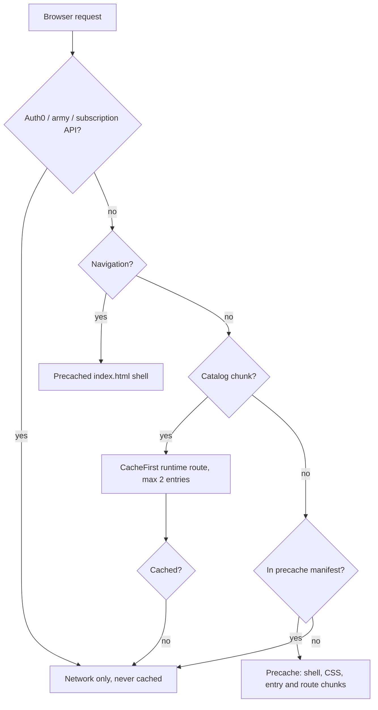
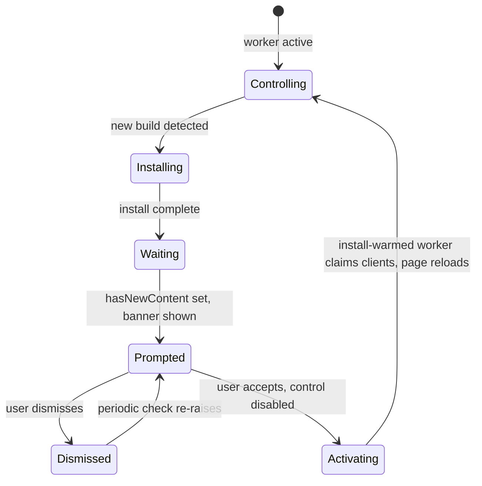
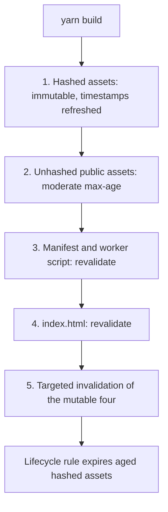

# PWA Install and Offline Support - Plan

---

## Goal Capsule

- **Objective.** Make AoS Reminders installable and genuinely usable offline. Addresses the first half of issue #1801; the admin console is out of scope, so the issue does not close on this work alone.
- **Authority hierarchy.** `AGENTS.md` and `DESIGN.md` outrank this plan. Within this plan, an R wins on product behavior and a KTD wins on implementation mechanism. Where this plan conflicts with `docs/plans/2026-07-28-003-refactor-phase2-frontend-modernization-plan.md`, this plan supersedes it and U11 amends that document.
- **Execution profile.** Sequential. Base on the latest `origin/master` and target the PR there, per the branch strategy in `AGENTS.md`.
- **Stop conditions.** Stop and surface if: the CloudFront distribution's cache policy cannot be read or changed (U3); or the precache manifest picks up the catalog chunk despite the glob exclusion (U4).
- **Tail ownership.** The implementer owns commits, the PR, and CI to green. Production deployment requires explicit user authorization and is not part of this work.

---

## Product Contract

### Summary

Rebuild AoS Reminders as an installable, offline-capable PWA on the maintained Vite PWA plugin, wired into the update and offline plumbing the app already has. Fix the production cache headers the service worker depends on to behave correctly.

### Problem Frame

The app is not a PWA today, and the remnants of the last attempt are actively broken. `src/service-worker.ts` and `src/serviceWorkerRegistration.ts` survived the CRA-to-Vite migration (PR #1711) as orphans: nothing compiles the worker into a build artifact, and the registration reads `import.meta.env.PUBLIC_URL`, which does not exist under Vite. The registration still ships — `dist/assets/index--BiSlC1U.js` contains `navigator.serviceWorker.register`, so every production visitor attempts a registration against a path that resolves to `index.html` and fails on the MIME type.

The app is also not installable. `public/site.webmanifest` has no `start_url`, which is a hard requirement in Chromium's installability criteria, and its `theme_color` is `#ffffff` — contradicting the `#063647` masthead colour that `index.html` sets with an explanatory comment.

Offline matters here for a specific reason. The app's job is to surface phase-ordered reminders while a game is in progress, on a phone, in a venue — a hall or a game store where connectivity is often congested or absent. A player who loses the network mid-game loses the reference they are playing from. The app already assumes this: `useAppStatus` tracks offline state, the navbar swaps in an offline header, and an offline explainer card exists. What is missing is the layer that would let any of it work.

That user-facing half is built and unreachable. `src/context/useAppStatus.tsx` exposes `hasNewContent` and `isOffline`; `navbar.tsx` swaps in an `OfflineHeader` when offline; `src/components/info/offline.tsx` renders the explainer. Nothing anywhere reads `hasNewContent` — the "new version available" path terminates at the context, and the comment in `src/main.tsx` promising the user an update option is false.

Underneath all of it, production serves no `Cache-Control` header on anything. `/`, `/site.webmanifest`, and hashed assets all return bare, and CloudFront caches them regardless. A service worker shipped onto that configuration is a liability rather than a feature: a stale worker or a stale `index.html` pinned at the edge strands installed clients on an old build, and CloudFront ignores viewer `Cache-Control` request headers, so the browser cannot recover on its own.

### Requirements

**Installability and offline**

- R1. The app satisfies Chromium's installability criteria and launches standalone from an iOS Home Screen add.
- R2. The manifest declares a stable application identity, so a future `start_url` change updates existing installs instead of orphaning them.
- R3. The app shell, its CSS, and its entry and route chunks load with no network after one successful online visit.
- R4. The generated army catalog is available offline once the user has loaded it online at least once on the build they are running.
- R5. When a new build is available, an installed or open client shows a visible prompt and reloads only when the user accepts.
- R6. The new worker is served at the path the pre-Vite CRA registration polls, so those registrations update in place rather than being orphaned.
- R7. No change in this plan alters the app's existing visual design, navigation, or interaction labels. The one new surface is the update banner R5 requires, which reuses the established informational-strip pattern.
- R14. The worker caches only build output and the catalog chunk. It never caches a response from the Auth0, army, or subscription APIs.

**Delivery integrity**

- R8. Each file class carries its own `Cache-Control`: mutable entry points revalidate on every request, content-hashed assets are immutable, and unhashed public assets sit between the two.
- R9. A deploy never leaves an already-loaded client requesting a hashed asset that no longer exists at the origin, within the asset-retention window.

**Documentation**

- R13. The repository states one PWA direction, with no surviving instruction to delete the service worker.

### Acceptance Examples

- AE1. Offline app shell.
  - **Covers:** R3
  - **Given** a user has loaded the app online once and installed it,
  - **When** they open the installed app with the network disabled,
  - **Then** the shell renders, the offline header appears, the home route and its reminder surface are reachable, and no request fails visibly.
- AE2. Offline catalog on the current build.
  - **Covers:** R4
  - **Given** a user has generated reminders for an army online since their last update,
  - **When** they reopen the app offline,
  - **Then** faction selection and reminder generation work against the cached catalog.
- AE3. Update prompt.
  - **Covers:** R5
  - **Given** a client has the app open and a new build is deployed,
  - **When** the worker finishes installing in the background,
  - **Then** a dismissible prompt appears, and the page reloads onto the new build only after the user accepts it.
- AE4. Nothing authenticated is cached.
  - **Covers:** R14
  - **Given** a signed-in subscriber has loaded their profile and cloud armies,
  - **When** the worker's caches are inspected,
  - **Then** they hold build output and the catalog chunk only, with no API response.

### Scope Boundaries

- **The admin console (`aos-reminders-admin`).** Removed from this plan at the user's direction. Issue #1801's second sentence is not addressed here, and the unit IDs U8–U10 are retired rather than reused. KTD2 is likewise retired.
- Push notifications.
- Background sync, periodic sync, and offline write queues.
- Offline cloud-army synchronisation and conflict resolution. Excluded by `docs/plans/2026-07-29-001-feat-phase2-capability-restoration-plan.md` and unchanged here.
- Any redesign of the existing offline UI. `OfflineHeader` and the offline explainer card are used as they are — see OQ4 for the consequence.
- Marketing or store-listing assets — screenshots, shortcuts, and richer install UI.

#### Deferred to Follow-Up Work

- PWA lifecycle analytics — install-prompt, install, update-shown, and update-accepted events, plus a standalone-mode dimension. Retired from this plan as U7: no requirement asks for it, and its payoff depends on a production rollout this work does not perform.
- The Vite 6/7/8 upgrade and the Vitest 4 upgrade that depends on it. Tracked as pending Phase 2 package work in `AGENTS.md`.
- The `jspdf` 1.5.3 upgrade and the remaining Phase 2 package modernisation.
- Replacing `OfflineHeader`'s full navbar takeover with a less destructive offline treatment.

---

## Planning Contract

### Key Technical Decisions

- KTD1. **Rebuild the PWA rather than delete it.** (session-settled: user-directed — chosen over shipping install-only or deleting the worker outright: issue #1801 asks for a PWA, and the app's offline-aware UI already assumes offline use.) This reverses KTD2 of `docs/plans/2026-07-28-003-refactor-phase2-frontend-modernization-plan.md`, which was itself recorded as user-directed. U11 amends that plan so the two do not contradict each other. Governs R1, R3, R4, R5.

- KTD3. **Adopt `vite-plugin-pwa` 1.3.0 on the current Vite 5.** Its peer range includes `^5.0.0` and its own development dependency is `vite@^5.0.12`, so no Vite major upgrade is forced. Removes the need to maintain a hand-written worker.

- KTD4. **Name the generated worker `service-worker.js`, overriding the plugin's `sw.js` default.** Clients still holding the pre-Vite CRA registration poll that exact path for updates. Serving a real, changed script there takes the registration over in place. Any other filename leaves those clients orphaned, because a registration is keyed by scope and the old worker keeps serving its stale precache. Recovery is not instant: the new worker installs and then waits, and the legacy worker keeps controlling until the client's last tab closes. Those clients are served a stale shell and cannot see the update prompt, so tab closure is the only path — which is why the filename must match rather than the prompt being relied on. Governs R6.

- KTD5. **Use the `generateSW` strategy, not `injectManifest`.** Everything this app needs — SPA navigation fallback, outdated-cache cleanup, and the catalog runtime route — is expressible as configuration. A hand-written worker source would reintroduce the maintenance burden that motivated the original decision to delete it.

- KTD6. **Runtime-cache the catalog chunk with `CacheFirst`; do not precache it and do not raise the precache ceiling.** `src/aos4/generated/corpus/runtime.json` builds to an 11.58 MiB chunk, against a 2 MiB default precache limit that the plugin throws on rather than warns about. Precaching it through Workbox would cross that ceiling and fail the build. The chunk is content-hashed, so a new build is a new URL and therefore a cache miss; U4 warms that URL during installation and aborts the update if the warm fails, so an accepted update is offline-complete before it activates. Governs R4.

- KTD7. **Use `registerType: 'prompt'` and drive the existing app-status plumbing rather than the plugin's own UI.** `autoUpdate` reloads under the user mid-session, which is wrong for an app people read during a game turn. The repo already has the update channel built — `hasNewContent`, the `app-update` broadcast channel, and the skip-waiting message contract — and only lacks the UI that consumes it. Governs R5.

- KTD8. **Set `Cache-Control` on the S3 objects, not through a CloudFront response-headers policy.** A response-headers policy alters only the viewer response and leaves edge TTL untouched, so it would fix the browser and not the stale copy at the edge. Governs R8.

- KTD9. **Stop deleting superseded assets on deploy, and retire only assets that a successful release proves are no longer current.** The current `aws s3 sync --delete` removes the previous build's hashed chunks the moment a new build lands, so any already-loaded client that then requests a lazy route chunk gets a 404 that cannot be retried. Each successful deploy tags its current immutable assets `retire=false`, then self-copies only older manifest entries once with `retire=true`. An S3 lifecycle rule scoped to the immutable prefix and `retire=true` expires those assets after the retention window. This avoids both immediate deletion and an age-only rule expiring a still-current unchanged chunk. Governs R9.

- KTD10. **Verify worker behaviour in a browser and in build output, not in vitest.** (session-settled: user-approved — chosen over upgrading Vite as part of this work: Vitest's stable browser mode requires Vite 6 or newer, and that upgrade is a separate Phase 2 track.) jsdom cannot run a service worker. Lighthouse removed its PWA category in 12.0.0 and current releases carry no installability audit, so there is no first-party CI answer to "is this installable"; the checks in U6 are assembled from build-output assertions plus a documented manual checklist.

### High-Level Technical Design

**Request handling once the worker is active.** The catalog sits on a different path from everything else, and the API origins are never cached.

**Update lifecycle.** The prompt is the only path to a reload; nothing reloads on its own.

**Deploy ordering.** Header class drives upload order, and the mutable entry points land last so a cached shell never references a chunk that has not arrived.

### Assumptions

- The 27 icon and image assets in `public/` date from 2020 and are treated as the source material for a maskable variant rather than a reason to redesign the mark.
- The CloudFront distribution `E3OO9Y9QRVZ2L1` is assumed to be on a managed cache policy whose default TTL is non-zero, because production currently returns cached responses with no origin `Cache-Control`. U3 reads the policy rather than assuming it.
- No measurement exists for how many clients still hold the CRA registration, and none can be built: those clients are served a stale shell and never execute current code. KTD4 makes the number irrelevant rather than knowable.
- KTD4 depends on the legacy registration having polled exactly `/service-worker.js`. That follows from the CRA build: `package.json` carried `"homepage": "./"`, CRA's `PUBLIC_URL` resolved to an empty string, and `serviceWorkerRegistration.ts` built `${PUBLIC_URL}/service-worker.js`. U1 deletes the `homepage` field that determines this, so the derivation is recorded here before it becomes unrecoverable.

### Risks & Dependencies

- **The CloudFront cache policy is not in the repository.** No Terraform, CloudFormation, or bucket policy is checked in; the distribution ID is a hardcoded literal in three shell scripts. Object-level headers are necessary but not sufficient — if the distribution's minimum TTL is above zero, CloudFront overrides origin `no-cache` directives. Resolving this needs console or CLI access outside the repo.
- **A stale-header deploy fails silently.** `aws s3 sync` compares size and modification time, not metadata. Changing the header strategy without changing file bytes leaves the old `Cache-Control` in place indefinitely; U3 handles this with an explicit metadata rewrite.
- **A bad worker is the highest-reversal-cost artifact in this deploy.** It persists on clients until explicitly replaced or unregistered, and every verification is manual and post-hoc. U3 records a rollback recipe and U4 commits the worker it needs.
- **Superseded builds stay publicly retrievable.** Once `--delete` is gone, withdrawing a build that shipped a bad value needs explicit object deletion plus a targeted invalidation, not a redeploy.
- **iOS storage eviction is unverified.** Whether Home Screen web apps still face a script-writable-storage cap that could evict caches between infrequent sessions could not be confirmed against a current Apple or WebKit source. The mitigation is design-level: a cold cache must degrade to "needs one online load", never to a broken app.
- **`vite-plugin-pwa` is not tested against React 19 upstream.** Its own development dependencies pin React 18. The vanilla registration entry point avoids the React hook entirely, which sidesteps both this and an open double-registration bug in the hook under StrictMode.
- **Workbox is feature-frozen.** Releases since 7.0.0 have been dependency maintenance only. It remains widely used and safe, but no new capability should be planned around it.

### Open Questions

- OQ1 (settle during U3). Which managed cache policy is attached to the CloudFront distribution, and does its minimum TTL permit origin `no-cache` to take effect? Read it with `aws cloudfront get-cache-policy` rather than inferring from a post-deploy probe, so U3 can close without a production deploy.
- OQ2 (deferred). Does current iOS evict cache storage for infrequently opened Home Screen web apps? Verify on a real device after U4. Affects offline reliability, not correctness.
- OQ3 (settle during U3). What retention window should the S3 lifecycle rule use for superseded hashed assets? Use 30 days unless the bucket's growth rate argues otherwise. The rule must be specified and documented before U3 is done.
- OQ4 (deferred). `OfflineHeader` replaces the entire navbar while offline, so an installed user offline for a whole game has no navigation beyond Home. This plan treats offline as a designed mode rather than an error state, which makes that takeover more consequential than it is today. Changing it is new UI and out of scope here; it bounds how complete the offline experience is.

### Sources & Research

- Issue #1801, "[FEATURE] PWA".
- `docs/plans/2026-07-28-003-refactor-phase2-frontend-modernization-plan.md` — KTD2, R13, and U7 record the superseded decision to delete the worker; amended by U11.
- Production probes, 2026-07-31: `/service-worker.js` returns `index.html` with `content-type: text/html`; `/` and hashed assets return no `Cache-Control`; `/site.webmanifest` already returns `application/manifest+json`.
- `dist/assets/index--BiSlC1U.js` — confirms the CRA registration and `PUBLIC_URL` reference ship in the current production bundle.
- `vite-plugin-pwa` 1.3.0 (published 2026-05-05): peer `vite` range includes `^5.0.0`; precache limit throws rather than warns since 0.20.2; `generateSW` defaults include `navigateFallback: 'index.html'` and `cleanupOutdatedCaches: true`; `workbox.globIgnores` excludes a file without overriding `globPatterns`.
- Chromium installability criteria: `name` or `short_name`, 192px and 512px icons, `start_url`, `display`, served over HTTPS. A service worker has not been required since Chrome 108 (mobile) and 112 (desktop).
- Safari 26 treats every Home Screen add as a web app by default, removing iOS-specific installability prerequisites.
- CloudFront: viewer `Cache-Control` request headers are ignored; response-headers policies affect the viewer response only, not edge caching; a non-zero minimum TTL overrides origin `no-cache`.
- Lighthouse removed the PWA category in 12.0.0; no installability audit exists in current releases.
- `cleanupOutdatedCaches` deletes precaches matching Workbox's own naming pattern only. The CRA worker's `StaleWhileRevalidate` route wrote a custom cache named `images`, which it does not touch.

---

## Implementation Units

### U1. Retire the dead CRA service-worker layer

**Goal.** Remove the orphaned worker, its registration, and its dependencies, so the plugin has a clean seam to attach to.

**Requirements.** Prepares R1, R3, R6.

**Dependencies.** None.

**Files.**
- Delete `src/service-worker.ts`, `src/serviceWorkerRegistration.ts`, `src/utils/installNewWorker.ts`.
- Modify `src/main.tsx` — remove the registration call and the two imports.
- Modify `package.json` — remove `workbox-core`, `workbox-expiration`, `workbox-precaching`, `workbox-routing`, `workbox-strategies` at 6.5.4, and the dead CRA `homepage` field.
- Test: `src/tests/aos4/bundleBoundaries.test.ts` (existing, must stay green).

**Approach.**
1. Remove the `serviceWorkerRegistration.register({ onUpdate })` block at the bottom of `src/main.tsx`, along with the `installNewWorker` and `serviceWorkerRegistration` imports.
2. Leave the three `// organize-imports-ignore` side-effect imports at the top of `src/main.tsx` in their current order. `bundleBoundaries.test.ts` asserts that `captureShareLink` is imported before `components/App`.
3. Delete the three source files and drop the five Workbox 6.5.4 packages. They are unused once the files are gone, and the plugin bundles its own Workbox 7.
4. Remove the `homepage` field from `package.json`. It is a CRA remnant that Vite never reads. Record the `/service-worker.js` derivation it supports in the plan's Assumptions before deleting it — KTD4 depends on that path.
5. Leave `src/context/useAppStatus.tsx` untouched. `hasNewContent` becomes temporarily unreachable and is reconnected in U4.

Removing `src/service-worker.ts` also removes its `/// <reference lib="webworker" />` directive, which currently injects the `webworker` lib into the whole program alongside `dom`. Expect type-checking to get stricter, not looser; resolve any newly surfaced error rather than restoring the directive.

**Patterns to follow.** `src/main.tsx` keeps side-effect imports at the top with explicit ignore markers — preserve that shape.

**Test scenarios.**
- The existing suite passes unchanged, including `bundleBoundaries.test.ts` import-order assertions.
- `yarn tsc --noEmit` succeeds with no `webworker` lib in the program.
- A production build contains no `navigator.serviceWorker.register` call and no `PUBLIC_URL` reference.

**Verification.** `yarn lint`, `yarn tsc --noEmit`, `yarn test --run`, and `yarn build` all pass. Grepping the built entry chunk for `serviceWorker` returns nothing.

### U2. Complete the web app manifest and icon set

**Goal.** Make the app satisfy installability criteria and stop the manifest from contradicting the masthead colour.

**Requirements.** R1, R2, R7.

**Dependencies.** None. Ships independently of the worker.

**Files.**
- Modify `public/site.webmanifest`.
- Create a maskable icon in `public/` at 512x512.
- Modify `index.html` only if the manifest link or Apple metadata needs adjusting.

**Approach.**
1. Add `start_url`. Its absence is the current installability blocker.
2. Add `id` with a stable value. Without it, application identity defaults to `start_url`, so any later `start_url` change would orphan every existing install rather than update it. This is cheap now and impossible to retrofit once users have installed.
3. Add `scope` and a `description`.
4. Change `theme_color` from `#ffffff` to the `#063647` masthead colour that `index.html` already sets for light mode. In standalone mode the manifest value wins, so the current value would put white browser chrome above a dark header — the exact outcome the comment in `index.html` says to avoid. A manifest carries one value, so dark-theme installs take the light one; that is accepted, because the mismatch is dark-on-dark rather than the white-over-dark case this fixes.
5. Set `background_color` deliberately rather than leaving the inherited `#ffffff`. It paints the splash before first paint, so it should match the app's initial background.
6. Add a third icon entry with `purpose: "maskable"`, alongside the existing 192 and 512 entries. Keep it separate: a maskable icon is over-padded and looks wrong when used as a general-purpose icon. Without one, Android renders the existing icon shrunken inside a white circle.
7. Keep the existing `apple-touch-icon` link and Apple metadata in `index.html`. They are inert where unneeded and remain the most reliably honoured iOS icon source.

The maskable variant needs its significant content inside a centre circle of radius 40% of the icon width, and must be full-bleed on an opaque ground taken from `background_color` — a transparent ground shows through the platform mask as black or white depending on the launcher. Derive it from the existing 512px icon rather than commissioning new artwork; R7 forbids visual change.

`public/site.webmanifest` sits outside the `yarn format` and pre-commit hook globs, which are both scoped to js/jsx/ts/tsx. Keep its existing 4-space indentation rather than reformatting it, so the diff stays limited to the fields this unit changes.

**Patterns to follow.** Icon `src` values carry a `?v=vMQB3wPOMa` cache-buster; match it on the new entry for consistency with the existing set.

**Test scenarios.**
- The manifest parses as JSON and contains `name`, `start_url`, `id`, `scope`, `display`, `theme_color`, and `background_color`.
- The icons array contains a 192x192 entry, a 512x512 entry, and one entry with `purpose: "maskable"`.
- Every icon `src` in the manifest resolves to a file that exists in `public/`.
- The manifest `theme_color` equals the light-mode `theme-color` meta value in `index.html`.
- The maskable icon has no transparent pixels.
- Chrome DevTools Application panel reports no installability errors against a local production preview.

**Verification.** Build, serve `dist/` over HTTPS or localhost, and confirm the DevTools Application panel shows the app as installable with the maskable icon previewing correctly in the masked shape.

### U3. Set per-file cache headers on the deploy path

**Goal.** Make mutable entry points revalidate and hashed assets immutable, so a worker cannot be pinned at the edge, and stop deleting assets that loaded clients still need.

**Requirements.** R8, R9.

**Dependencies.** None. Must land before U4 reaches production.

**Files.**
- Modify `upload.sh`, `CI-build.sh`, and `.github/workflows/deploy.yml`. All three carry the same two commands and must stay in step.
- Create `docs/deployment.md` recording the header contract, the CloudFront prerequisite, the retention rule, and the rollback recipe.

**Approach.**
1. Replace the single `aws s3 sync --delete` with an ordered sequence over three header classes:
   - Content-hashed assets under `assets/`: long max-age, `immutable`.
   - Unhashed public assets — icons, `favicon.ico`, `robots.txt`, `browserconfig.xml`, `safari-pinned-tab.svg`, `img/`: a moderate max-age with no `immutable`, since they carry a `?v=` query buster rather than a content hash.
   - Mutable entry points — the manifest, the worker script, `index.html`: `max-age=0, must-revalidate`, uploaded last so a freshly cached shell never references a chunk that has not landed.
2. Guard the worker-script upload with a file-existence check in all three scripts. U3 lands before U4, so `dist/service-worker.js` does not exist yet on the first deploys carrying this change, and an unguarded per-file upload would fail the deploy outright.
3. Drop `--delete` per KTD9. Upload current immutable assets with `retire=false`, keep the release manifest, and self-copy only superseded entries once with `retire=true` after the new mutable entry points publish successfully.
4. Specify the retention rule in `docs/deployment.md` as an expiration scoped to the immutable prefix and `retire=true`, using the window OQ3 settles. Creating it is a bucket-configuration step performed alongside the header rollout, not a repo change.
5. Replace the `/*` invalidation with targeted paths covering the root, `index.html`, the worker script, and the manifest. `/*` is a single billable path but evicts every hashed asset from the edge, forcing a full re-fetch from S3 on every deploy.
6. Perform a one-time metadata rewrite over the existing bucket contents. `aws s3 sync` compares size and modification time, not metadata, so objects whose bytes have not changed would keep their current header-free state indefinitely.
7. Read the distribution's cache policy with `aws cloudfront get-cache-policy` and record the result. Object-level headers are necessary but not sufficient: a policy with a non-zero minimum TTL overrides origin `no-cache`, and response-headers policies do not affect edge caching at all.
8. Record two operational notes in `docs/deployment.md`: the rollback recipe (deploy a committed no-op worker that unregisters itself and deletes every cache to `/service-worker.js`, then invalidate that path, `/`, and `index.html`), and the fact that superseded hashed assets stay publicly retrievable until the lifecycle rule expires them, so withdrawing a bad build now needs explicit object deletion rather than a redeploy.

**Execution note.** Verify with header probes rather than by reasoning about the scripts. The failure mode here is silent.

**Test scenarios.**
- The three scripts carry the same ordered sequence and the same header values.
- The worker-script upload is skipped without error when `dist/service-worker.js` is absent.
- After deploy, `index.html` and the manifest return `Cache-Control` with `max-age=0` and a revalidation directive.
- A hashed asset under `/assets/` returns a long max-age with `immutable`.
- An unhashed public asset returns the moderate max-age without `immutable`.
- A second request for `index.html` after a deploy returns the new build, not a cached response with a non-zero `Age`.
- A hashed asset from the previous build still resolves after a subsequent deploy.
- The manifest still returns `application/manifest+json`.

**Verification.** Two halves. In scope now: the three scripts carry the ordered per-file headers and the existence guard, `docs/deployment.md` records the header contract, the retention rule, and the rollback recipe, and the distribution's cache policy has been read and recorded. At deployment time: the header probes above, and the prior-build-asset check after a second deploy. If the cache policy does not honour origin headers, stop and surface before U4 deploys.

### U4. Build the service worker with vite-plugin-pwa

**Goal.** Ship a real worker that precaches the shell, runtime-caches the catalog, caches nothing authenticated, and takes over the legacy registration.

**Requirements.** R3, R4, R6, R14.

**Dependencies.** U1, U3.

**Files.**
- Modify `vite.config.mts` — add the plugin alongside `react()` and `enforceInitialEntryChunkBudget()`.
- Modify `src/main.tsx` — add the registration entry point.
- Modify `src/vite-env.d.ts` — add the plugin's client type reference.
- Modify `package.json` — add `vite-plugin-pwa` at 1.3.0.
- Create the committed rollback worker U3's recipe deploys.
- Modify `.gitignore` — add the plugin's dev output directory.

**Approach.**
1. Configure the plugin with the `generateSW` strategy (KTD5), `registerType: 'prompt'` (KTD7), and `filename: 'service-worker.js'` (KTD4).
2. Point the plugin away from generating its own manifest; U2 owns `public/site.webmanifest` and `index.html` already links it. Two manifest sources would drift.
3. Exclude the catalog chunk with `workbox.globIgnores`, leaving `globPatterns` at its default. Overriding `globPatterns` would mean hand-maintaining a list that must keep matching content-hashed route chunks, and drift there produces a runtime error rather than a build failure. The glob exclusion — not the runtime route — is what keeps the chunk out of the precache manifest and out of the size check.
4. Add a `CacheFirst` runtime route for the catalog, bounded by a small entry cap so the cache holds the current build and one predecessor.
5. Warm the catalog URL once during installation and fail the install if the response is not a successful JavaScript payload. Without it R4 degrades to "one online fetch per build": every update produces a new hashed URL, which is a `CacheFirst` miss, so a user who takes an update and then loses network cannot generate reminders — the exact scenario KTD6 exists to serve.
6. Constrain runtime caching to build output and the catalog, per R14. The Auth0, army, and subscription APIs are cross-origin, so the defaults do not capture them, but the route list is the guardrail and U6 asserts on it.
7. Leave `cleanupOutdatedCaches` at its default for precaches, and add a one-time deletion of the CRA worker's custom `images` cache on activation. `cleanupOutdatedCaches` matches Workbox's own precache naming only and will not touch it.
8. Register through the plugin's vanilla entry point, not its React hook. The hook has an open double-registration bug under StrictMode and is untested against React 19; the vanilla path avoids both and keeps registration out of the component tree.
9. In the registration callbacks, set the app's existing update signal rather than the plugin's own UI: post to the `app-update` broadcast channel and dispatch the `hasNewContent` window event that `useAppStatus` already listens for. Take ownership of the reload so the plugin does not perform it — U5 owns when the page reloads.
10. Add a periodic update check on the registration. A standalone PWA left open at a game table never performs a full navigation, so it would otherwise never notice a new build within a session. U5's dismissal behaviour depends on this check re-raising the signal.
11. Expect legacy takeover to lag. A client still controlled by the CRA worker is served a stale shell, so it runs no current code and cannot show the prompt; it recovers when its last tab closes and the new worker activates. Do not add `skipWaiting` to force it — that would reload every ordinary user mid-session, which KTD7 exists to prevent.

The build will fail rather than warn if anything above the precache size ceiling reaches the manifest. Treat that failure as the glob exclusion being misconfigured, not as a reason to raise the ceiling.

**Patterns to follow.** `vite.config.mts` composes plugins as an array with a local plugin factory above the config — add the PWA plugin in that array without disturbing the entry-chunk budget plugin, which must keep running on build. `src/vite-env.d.ts` already carries `/// <reference types="vite/client" />`; add the plugin's reference alongside it rather than introducing a `types` field in `tsconfig.json`, which would disable automatic `@types/*` inclusion and break the test suite's ambient globals.

**Test scenarios.**
- A production build emits `service-worker.js` at the output root, not under `assets/`. Scope is a path-prefix test, so a worker under `assets/` could not control the site root.
- The generated precache manifest contains the entry chunk, the CSS bundle, the lazy route chunks, and `index.html`.
- The generated precache manifest does not contain the catalog chunk.
- The build succeeds with the catalog chunk present, proving the glob exclusion keeps it out of the size check.
- The generated worker's runtime route list contains the catalog route and nothing else.
- Loading the built output, then going offline and reloading, renders the shell rather than a browser error.
- After loading an army online, going offline and reopening the app still resolves faction and warscroll data.
- After taking an update, going offline immediately still resolves catalog data, proving the install warm-up ran before activation.
- A cache named `images` left by the CRA worker is gone after the new worker activates.
- With a worker registered, deploying a new build causes the app-status update signal to fire without the page reloading on its own.
- Starting from a client controlled by a worker registered at `/service-worker.js`, serving the new build installs the new worker rather than leaving the old registration in place, and the new worker takes control once the last tab closes.

**Verification.** `yarn build` succeeds within the existing 850 kB entry-chunk budget. Serve `dist/` and confirm in DevTools that the worker activates, the precache lists the shell, the catalog appears in the runtime cache, and no API response is cached. The rollback worker is committed and dry-run against a local build.

### U5. Surface the update prompt in the UI

**Goal.** Give `hasNewContent` a consumer, so users can act on a waiting update.

**Requirements.** R5, R7.

**Dependencies.** U4.

**Files.**
- Create `src/components/info/updateAvailable.tsx`.
- Modify `src/components/App.tsx` — mount the banner.
- Modify `src/tests/aos4/legacyIsolation.test.ts` — add the new component to the presentation-shell allowlist.
- Test: `src/tests/aos4/updateAvailable.test.tsx`.

**Approach.**
1. Build a dismissible banner that renders only when `hasNewContent` is true, with an accept action that triggers the worker update and the reload.
2. Mount it in `src/components/App.tsx`, inside `<Router>` and above `<main>`, so it appears on every route. Do not mount it inside `navbar.tsx`: `Navbar` early-returns `<OfflineHeader />` when offline, which would make the banner vanish exactly when a client has a waiting worker and loses network. `offline.tsx` is mounted in the footer and `NotificationBanner` only on Home, so neither placement suits an app-wide prompt.
3. Reuse the established visual primitives rather than introducing a new one — `src/components/info/banners/notification_banner.tsx` is the closest pattern. R7 forbids a new visual language.
4. Keep dismissal in component-local state. If `NotificationBanner` is reused, pass `persistClose={false}`: it defaults to persisting a per-name key in localStorage, which would suppress every future build's prompt after one dismissal.
5. Bound the dismissal rather than hiding the banner forever. A standalone PWA on mobile is suspended rather than closed, so "the next natural load" may not arrive for weeks; U4's periodic update check re-raises the signal and the banner returns.
6. Give the accept action a pending state. The control disables and reads as in-progress from the moment it is activated until the new worker takes control and the page reloads, so a user who sees nothing happen cannot fire it twice.
7. Add the component's path to the `allowedPresentationShell` set in `legacyIsolation.test.ts`. That test walks nine presentation roots including `components/info` and asserts no unexpected files, so a new component there fails the suite until it is allowlisted.
8. Carry `d-print-none`, matching `notification_banner.tsx`. `DESIGN.md`'s print-parity rule treats a new surface with no print decision as unfinished, and the reminder sheet is a first-class output.

**Execution note.** Write the component test first. The visible states are few and well defined, and the test pins the interaction contract before styling decisions start.

**Patterns to follow.** `src/components/info/banners/notification_banner.tsx` — a conditional informational strip that already carries `d-print-none`, `role="alert"`, and the `flex-shrink-0` guard that keeps its close control above the touch-target floor.

**Test scenarios.**
- With `hasNewContent` false, the component renders nothing.
- With `hasNewContent` true, the banner renders with an accept control and a dismiss control.
- Activating accept calls the update function exactly once, and repeated activation still calls it exactly once.
- Accept puts the control into a disabled, in-progress state.
- Activating dismiss removes the banner and does not call the update function.
- Dismissing writes nothing to localStorage, and the banner reappears when the signal is re-raised.
- The banner carries `role="alert"` so it is announced when it appears without user action.
- Both controls meet the 44x44px touch-target floor and show a visible focus ring.
- The banner is reachable by keyboard and its controls have accessible names.
- The banner carries `d-print-none` and does not appear in printed output.
- `legacyIsolation.test.ts` passes with the new file allowlisted.

**Verification.** `yarn test --run` passes. Manually: build, serve, register the worker, deploy a changed build, and confirm the banner appears and reloads onto the new build only on accept.

### U6. Assert manifest and precache shape in the build, and document the manual checks

**Goal.** Catch manifest, precache, and runtime-route regressions in build output, and record in `docs/pwa.md` the installability and header checks that only a human can run.

**Requirements.** R1, R3, R4, R14.

**Dependencies.** U2, U4.

**Files.**
- Create `src/tests/pwaBuild.test.ts`.
- Create `docs/pwa.md`.
- Modify `.github/workflows/nodejs.yml` — move the build step before the test step.

**Approach.**
1. Assert against build output, which is the established pattern here — `src/tests/aos4/bundleBoundaries.test.ts` already reads source and config from disk rather than mocking.
2. Reorder `.github/workflows/nodejs.yml` so `yarn build` runs before `yarn test --run`. The workflow currently tests first and `dist/` is gitignored, so these assertions would fail on every clean run. The `prepush` script has the same ordering and should follow.
3. Cover the manifest's required fields, the presence of a maskable icon, the existence of every icon file the manifest names, the worker's location at the output root, the precache manifest including the shell while excluding the catalog chunk, and the runtime route list containing only the catalog route.
4. Use `// @vitest-environment node` at the top of the file. Vitest defaults `.test.ts` to node here, and these assertions are filesystem reads.
5. Document in `docs/pwa.md` what cannot be automated: no maintained tool answers "is this installable" in CI, so the DevTools Application panel and a post-deploy header probe are the real verification. Record both as a checklist, and note that the build-level size ceiling is the first line of defence and the precache assertion the second.

**Test scenarios.**
- The manifest in build output has every field installability requires.
- Every icon path the manifest names exists in build output.
- The worker is emitted at the output root, not under `assets/`.
- The precache manifest contains `index.html`, the entry chunk, the CSS bundle, and every lazy route chunk.
- The precache manifest does not contain the catalog chunk.
- The runtime route list contains the catalog route and no API origin.
- The catalog-exclusion assertion fails when a synthetic catalog entry is injected into the precache manifest the test parses, proving it is load-bearing rather than tautological. The glob cannot serve as the mutation point: a catalog entry above the 2 MiB ceiling throws during the build (KTD6), so no build output would exist to assert against.

**Verification.** `yarn test --run` passes after `yarn build`, and CI runs in that order.

### U11. Reconcile the PWA direction across repo docs

**Goal.** Leave one stated direction, so the next contributor does not follow the superseded instruction to delete the worker.

**Requirements.** R13.

**Dependencies.** U4.

**Files.**
- Modify `AGENTS.md` — the Phase 2 package track and the CRA-to-Vite cleanup line.
- Modify `docs/plans/2026-07-28-003-refactor-phase2-frontend-modernization-plan.md` — KTD2, R13, and U7.

**Approach.**
1. Rewrite KTD2 of plan `2026-07-28-003` in place to record that it was superseded by issue #1801 and this plan, with the date and the reason. Do not leave the original standing as struck-through text; version control holds the history.
2. Update that plan's R13 and U7 so they no longer instruct deleting the worker layer, and point them at this plan for the rebuilt behaviour.
3. Update the `AGENTS.md` Phase 2 lines that list PWA tooling as pending and CRA-to-PWA cleanup as unfinished, so they reflect what shipped.
4. Reference issue #1801, and note that its admin-console half remains open.

**Test expectation: none** — documentation only, no behavioural change.

**Verification.** Searching the repository for instructions to delete or remove the service worker returns only the superseded-and-annotated entry. No document still describes the app as having no PWA support.

---

## Verification Contract

| Gate | Command | Applies to |
|---|---|---|
| Lint | `yarn lint` | all units |
| Types | `yarn tsc --noEmit` | U1–U6 |
| Unit and component tests | `yarn test --run` (after `yarn build` once U6 lands) | U1–U6 |
| Build, including the entry-chunk budget | `yarn build` | U1–U6 |
| Data certification | `yarn data:aos4:verify:beta` | all units (must stay green; untouched by this work) |

Manual gates that no command covers:

- **Installability.** Chrome DevTools Application panel against a production build. No maintained CI tool answers this; Lighthouse removed its PWA category and current releases have no installability audit.
- **Offline behaviour.** Load online, disable the network, reload, and exercise faction selection and reminder generation — including immediately after taking an update, which is the case the install warm-up protects.
- **Update prompt.** Register the worker, deploy a changed build, and confirm the banner appears and reloads only on accept.
- **Cache contents.** Confirm the worker's caches hold build output and the catalog only, with no API response (R14).

Deployment-time gates, to run when the work is authorized for production:

- **Production headers.** `curl -sI` against each of the three file classes, checking `Cache-Control` and a zero `Age` on the mutable entry points.
- **Asset retention.** After a second deploy, confirm a prior build's hashed asset still resolves.
- **iOS.** Add to Home Screen on a real device, confirm standalone launch and the icon, and re-check after several days for cache eviction (OQ2).

---

## Definition of Done

**Global**

- Every requirement is either implemented or explicitly deferred in this document.
- The repository passes its full gates and the PR is green in CI.
- No abandoned or experimental code from approaches that did not pan out remains in the diff.
- No visual or interaction change beyond the update banner R7 names.
- The app has not been deployed to production without explicit user authorization.

**Per unit**

| Unit | Done signal |
|---|---|
| U1 | No worker source, registration, or Workbox 6 dependency remains; the built bundle contains no registration call; the `/service-worker.js` derivation is recorded before `homepage` is deleted. |
| U2 | The manifest passes the DevTools installability check, its theme colour matches the masthead, and the maskable icon renders correctly under the platform mask. |
| U3 | The three scripts carry the ordered per-file headers and the worker-upload guard, `docs/deployment.md` records the header contract, retention rule, and rollback recipe, and the CloudFront cache policy has been read and recorded. |
| U4 | The worker emits at the output root, precaches the shell, excludes the catalog, warms it during installation, caches no API response, and the rollback worker is committed and dry-run. |
| U5 | The update banner appears on a waiting worker, reloads only on accept, returns after dismissal, and passes its accessibility scenarios; the isolation test passes with the new component allowlisted. |
| U6 | Build assertions cover manifest fields, worker location, precache shape, and the runtime route list; the catalog-exclusion assertion is proven load-bearing by injection; CI builds before it tests; and `docs/pwa.md` records the manual checks. |
| U11 | No document in the repository still instructs deleting the service worker, and #1801's open admin half is noted. |
