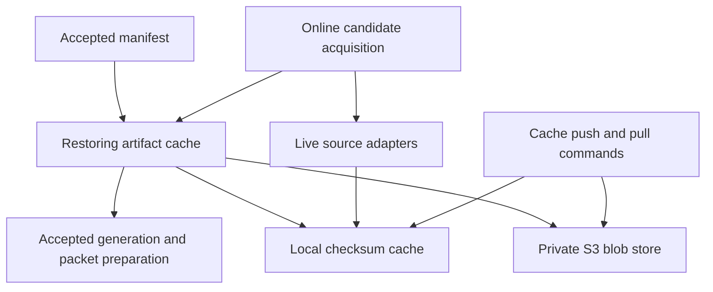
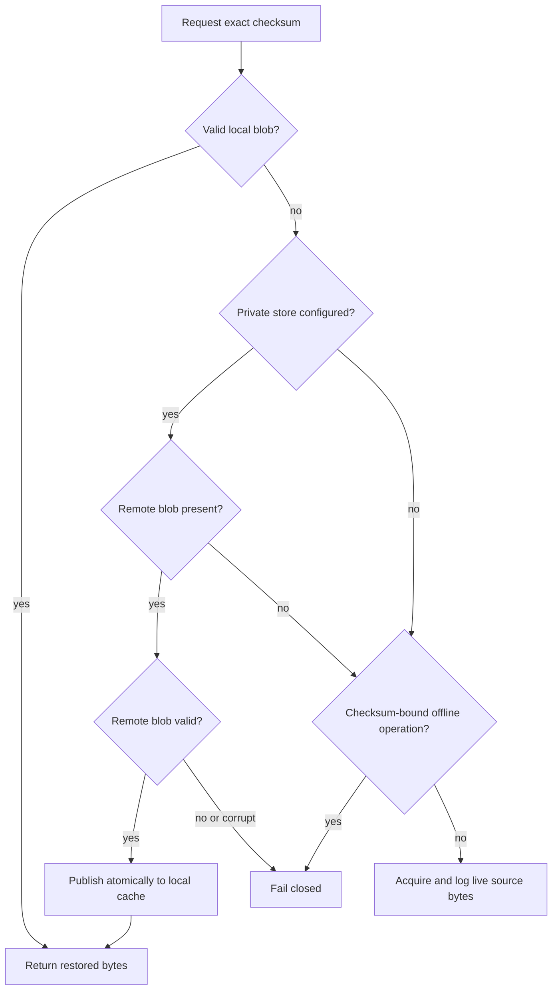
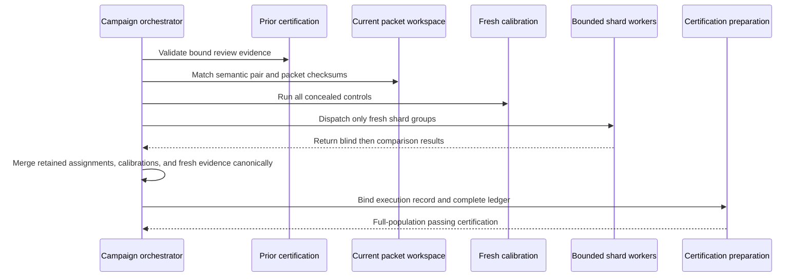

# Incremental Certification and Artifact Cache - Plan

## Goal Capsule

- **Objective:** Reduce the end-to-end time required to certify an AoS 4 corpus change by restoring pinned source artifacts from a durable private cache, reusing only byte-identical review verdicts, and parallelizing the remaining cold review work.
- **Authority:** `AGENTS.md`, GitHub issues #1869 and #1822, `docs/data/aos4-maintenance.md`, and `docs/data/aos4-accuracy-review.md`, in that order.
- **Execution profile:** Deep, code-bearing performance and trust-boundary work with offline tests and reproducible benchmarks.
- **Stop conditions:** Stop if reuse would weaken the blind-review, calibration, source-inventory, create-only, or beta-gate contracts. Stop before provisioning, seeding, or changing a production AWS resource without explicit authorization.
- **Tail ownership:** Target `master` with a draft PR. Do not merge, deploy, or change production services.

---

## Product Contract

### Summary

Add a private content-addressed artifact restore path and an incremental Accuracy Campaign that carries forward exact prior verdicts while re-verifying every changed or ambiguous pair. Keep the existing full campaign as the safe fallback and make reuse, fresh work, and performance visible to reviewers.

### Problem Frame

The accepted corpus depends on about 1.4 GB of ignored source artifacts that currently live on one workstation. A missing worktree cache therefore causes avoidable source acquisition or blocks deterministic generation even though the accepted manifest already identifies every required byte by SHA-256.

Certification then pays the full review cost for roughly 40,000 live pairs after any corpus checksum changes. The current deterministic adversarial driver processes packet shards serially and regenerates both blind and comparison results for every pair, even when the pair's source evidence, generated destinations, protocol, rubric, and reviewer configuration are unchanged. This turns small data fixes and routine rebases into full campaigns.

### Actors

- A1. **Corpus maintainer:** Acquires, restores, reviews, and certifies candidate snapshots.
- A2. **Code or data reviewer:** Verifies that reused evidence is exact, visible, and unable to bypass a changed input.
- A3. **Release operator:** Runs the beta gate from a clean checkout without access to raw source bytes.

### Requirements

**Private artifact restoration**

- R1. Store source artifacts only in a private content-addressed backend keyed by their lowercase SHA-256; raw source bytes remain absent from Git.
- R2. Add `data:aos4:cache:push` and `data:aos4:cache:pull` commands that default to the current accepted manifest, accept an explicit manifest, transfer only unique required blobs, verify every byte locally, publish local files atomically, and report transferred, reused, missing, and total counts.
- R3. Resolve checksum-bound artifacts through the local cache first and the configured private store second. An offline replay or accepted generation must never fall through to a live source. An online candidate restores the accepted pin for conditional revalidation, then preserves the normal live observation policy: a `304` consumes the restored bytes, while a successful response body is logged as acquisition and may create a different candidate pin.
- R4. Reject invalid checksums, unexpected object keys, corrupt local or remote bytes, incomplete transfers, and conflicting existing objects. A remote integrity failure is a blocker, not permission to silently reacquire different live bytes.

**Incremental certification**

- R5. Reuse a prior live verdict only when the current semantic pair key, blind packet ID and checksum, comparison packet ID and checksum, protocol, rubric, prompt/reviewer configuration, explicit deterministic review-engine version, and passing outcomes match exactly. Any semantic change to the reviewer implementation must bump that engine version.
- R6. Treat missing, partial, stale, finding, `cannot-verify`, malformed, unassigned, or configuration-mismatched prior evidence as fresh work. Retain reused results' original assignments and timestamps; never rewrite them to look newly reviewed.
- R7. Run the complete concealed calibration set freshly for every campaign and preserve full current-population, faction/context, high-risk cohort, source-inventory, chronology, and beta-gate validation.
- R8. Bind a campaign-execution record into every newly prepared certification. It must identify the reuse source, the exact reused and fresh pair-key set checksums, the contributing assignments and their calibration evidence, and reviewer-visible pair/result counts.
- R9. Preserve the create-only workspace and certification-directory contracts. A new campaign always writes new output even when every live pair is reused.

**Execution speed and compatibility**

- R10. Process fresh packet shards with bounded process-level parallelism while preserving per-pair blind-before-comparison ordering and deterministic final serialization. `--jobs 1` remains the reference serial behavior.
- R11. Keep the existing full campaign path available when no reuse source is supplied or no prior evidence qualifies. Existing schema-v1 certifications without an execution record must continue to pass unchanged.
- R12. On the same machine and workspace, an unchanged incremental campaign must reuse 100% of live pairs, perform zero fresh live comparisons, and reduce adversarial-review-plus-preparation wall-clock by at least 80% from the single-job cold baseline. A representative small delta affecting about 2% of live pairs must reduce that wall-clock by at least 70% from the same baseline. A cold campaign on a machine with at least four available processors should reduce adversarial review wall-clock by at least 25% from `--jobs 1` without changing evidence bytes apart from timestamps and execution provenance. Measurements must report stage timings, pair counts, job count, and peak child-process count so the paths are comparable.
- R13. Tests must remain offline and source-safe across Windows, macOS, and Linux under Node 22. Production bucket provisioning, credentials, and raw artifacts must not enter test fixtures or Git.
- R14. Update maintenance, accuracy-review, and release documentation with restore, incremental-campaign, benchmark, failure-recovery, and private-store setup contracts.

### Key Flows

- F1. **Restore a pinned snapshot**
  - **Trigger:** A1 starts generation or explicitly pulls the accepted manifest in a checkout with missing local blobs.
  - **Actors:** A1
  - **Steps:** The tool validates the manifest, keeps checksum-valid local blobs, restores missing blobs from the private store, verifies SHA-256 and byte length, and publishes them atomically.
  - **Outcome:** The accepted snapshot is reproducible without contacting Games Workshop or Wahapedia.
  - **Covered by:** R1-R4, R13
- F2. **Certify a small corpus delta**
  - **Trigger:** A1 supplies a prior passing certification while starting a new campaign.
  - **Actors:** A1, A2, A3
  - **Steps:** The tool validates reusable prior evidence, partitions current pairs into reused and fresh sets, freshly calibrates the current reviewer, reviews only fresh pairs, merges evidence deterministically, and prepares a fully bound certification.
  - **Outcome:** The beta gate covers the entire current corpus while the campaign recomputes only changed or ambiguous pairs.
  - **Covered by:** R5-R9, R11-R12
- F3. **Run a cold campaign**
  - **Trigger:** No prior evidence qualifies or A1 deliberately omits reuse.
  - **Actors:** A1, A2
  - **Steps:** The tool freshly calibrates, processes all live packet shards with bounded workers, merges by canonical shard order, and runs the unchanged certification gates.
  - **Outcome:** The trust model is unchanged and cold review uses available processors.
  - **Covered by:** R7, R9-R12

### Acceptance Examples

- AE1. **Remote restore without source access**
  - **Covers:** F1, R2-R4
  - **Given:** A manifest pins a blob that is missing locally and exists under its checksum key in the private store.
  - **When:** A1 runs cache pull or an offline accepted replay with the store configured.
  - **Then:** The exact blob is restored and verified without any live-source request.
- AE2. **Corrupt remote object fails closed**
  - **Covers:** F1, R4
  - **Given:** The remote checksum key returns bytes whose SHA-256 or byte length differs from the manifest.
  - **When:** A1 requests the blob.
  - **Then:** The operation fails, leaves no published local blob, and does not contact a live source.
- AE3. **No-op campaign reuses all live pairs**
  - **Covers:** F2, R5-R9, R12
  - **Given:** The current workspace is packet-identical to a prior passing certification.
  - **When:** A1 runs a new campaign with that certification as the reuse source.
  - **Then:** Every live pair is reused, only calibration is fresh, and the new certification reports zero fresh live pairs.
- AE4. **One changed pair is reviewed fresh**
  - **Covers:** F2, R5-R8
  - **Given:** One pair's generated destination changes while every other pair remains identical.
  - **When:** A1 runs an incremental campaign.
  - **Then:** That pair alone is reviewed fresh; every exact pair is reused; the execution record reports both sets.
- AE5. **Protocol drift disables reuse**
  - **Covers:** F2, R5-R7, R11
  - **Given:** The prior certification uses a different protocol, rubric, prompt, or reviewer configuration.
  - **When:** A1 supplies it as the reuse source.
  - **Then:** No incompatible result is reused and the affected population is reviewed fresh.
- AE6. **Parallel and serial cold campaigns agree**
  - **Covers:** F3, R10-R12
  - **Given:** The same immutable workspace and campaign instant.
  - **When:** A1 runs with `--jobs 1` and with the default parallel job count.
  - **Then:** Assignments, outcomes, findings, pair coverage, and deterministic shard content agree; only the execution record's job metadata differs.

### Scope Boundaries

In scope are the AoS 4 artifact cache abstraction and commands, accepted replay integration, adversarial review orchestration, reusable-evidence validation, certification provenance, offline tests, operator documentation, and performance evidence.

#### Deferred to Follow-Up Work

- Provisioning the private S3 bucket, its public-access block, encryption, IAM policy, expected-owner value, lifecycle policy, and initial 1.4 GB seed remains an explicit operator action under #1822.
- A scheduled CI restore drill may follow after credentials and cost controls are approved; this plan provides the command and deterministic test seams but does not add repository secrets.

The plan does not change accepted rules facts, generated runtime products, review rubric semantics, source observation policy, the browser application, the production site bucket, or any companion API.

---

## Planning Contract

### Assumptions

- The repository's existing AWS CLI operator dependency is the preferred private-store transport; adding the AWS JavaScript SDK would add install and dependency cost without improving the checksum contract.
- The store uses a general-purpose private S3 bucket and a configurable prefix. AWS profile, region, and credential resolution remain owned by the AWS CLI.
- Prior committed certification directories are durable reuse sources after their internal manifest and review-evidence bindings validate, even when their old corpus products are no longer the current checkout's files.
- Vite Node can launch long-lived child processes for shard groups on every supported development platform. If execution proves this false, keep the same worker protocol and use a small direct Node worker bundle rather than falling back to fake asynchronous parallelism.

### Key Technical Decisions

- KTD1. **Use the AWS CLI behind an injected artifact-store runner.** `s3api put-object` supports an `If-None-Match: *` conditional write, and S3 can validate a supplied base64 SHA-256. Downloads request stored checksums, then the application hashes bytes again before `FileArtifactCache.put`. This reuses the deploy environment's established AWS dependency and makes tests independent of AWS.
- KTD2. **Keep local cache and remote store as separate layers.** `FileArtifactCache` remains the atomic local authority. A restoring wrapper consults local bytes, restores a missing exact checksum from S3, verifies it, and populates the local cache. Live acquisition stays in `acquireArtifact` and is never presented as cache restoration.
- KTD3. **Reuse the existing semantic identities instead of adding a stratum allowlist.** `pairKey` already hashes candidate identity, source records and checksums, structured evidence, generated destinations, contexts, factions, and cohorts. Both packet checksums add protocol and rubric. Reuse additionally requires the exact current reviewer configuration, an explicit deterministic review-engine version carried by that configuration, and two passing result lanes. The engine version changes whenever reviewer evaluation logic changes, even if packet inputs do not.
- KTD4. **Carry prior assignment-scoped evidence; do not clone it.** Reused results keep their original assignment IDs and timestamps, together with the calibration and checksum-bound control results that preceded each assignment's live review. Every campaign adds an assignment and fresh calibration; that assignment may contain only concealed controls when no live pair is fresh. Calibration lookup becomes assignment-scoped through its existing evidence receipt, with configuration-and-rubric lookup retained for legacy single-assignment evidence. This avoids falsely applying a newly timestamped calibration to older carried results and permits multiple campaigns using the same reviewer configuration without duplicate-calibration ambiguity.
- KTD5. **Make execution provenance a backward-compatible certification extension.** New adversarial outputs emit a source-safe execution record, and every full or incremental certification prepared by the new command binds it as an additive schema-v1 input plus a compact manifest/summary projection. Pre-existing schema-v1 certifications without the record remain valid and can bootstrap reuse after their complete evidence validates; all newly generated paths emit and validate the record.
- KTD6. **Parallelize only fresh shard evaluation and merge canonically.** The parent balances fresh shard work by fresh-pair count across up to `min(8, max(1, availableParallelism() - 1))` long-lived child processes, always runs calibration in the parent, and serializes results in workspace shard order. Workers load only their assigned packet shards; the parent validates compact receipts before reading final staged results. `--jobs` can force a different positive bound for benchmarking or constrained machines.
- KTD7. **Treat remote conflicts and reuse uncertainty as misses with different safety behavior.** Uncertain review evidence falls back to fresh review. Corrupt checksum-addressed artifact storage fails immediately because fetching mutable live bytes cannot repair an immutable pin.

### High-Level Technical Design

**Artifact resolution topology**

**Fail-closed artifact branch**

**Incremental campaign sequence**

### Sequencing

Build and verify the private artifact store independently from review execution. Capture a stage-timed single-job cold baseline before changing review orchestration. Land reusable-evidence validation before changing orchestration, bind provenance with the serial incremental path, then add parallel execution after that path proves byte-identical. Update documentation only after the incremental and cold paths expose stable result contracts.

---

## Implementation Units

### U1. Private content-addressed artifact store and commands

- **Goal:** Add safe push and pull operations for the manifest-pinned blob set.
- **Requirements:** R1-R2, R4, R13; F1; AE1-AE2.
- **Dependencies:** None.
- **Files:** `src/aos4/data/cache.ts`, `src/aos4/data/artifactStore.ts`, `src/aos4/data/cacheCommand.ts`, `src/tests/aos4/artifactStore.test.ts`, `package.json`.
- **Approach:**
  1. Define a remote artifact-store interface and an AWS CLI implementation with validated bucket, prefix, expected-owner, checksum, and object-key inputs. Invoke the CLI with an argument array rather than a command shell, require the expected owner on every remote operation, and render bounded structured errors instead of forwarding raw CLI output.
  2. Implement manifest parsing, unique-checksum transfer planning, bounded transfers, atomic local publication, conditional upload, integrity validation, and structured summaries.
  3. Add the two Yarn commands without adding an AWS SDK dependency.
- **Execution note:** Start with fake-runner contract tests for command arguments, race outcomes, corruption, and atomic publication before wiring the CLI entry point.
- **Patterns to follow:** `FileArtifactCache` atomic writes in `src/aos4/data/cache.ts`, command parsing in `src/aos4/data/candidateCommand.ts`, and injected AWS command testing in `src/tests/deploymentContract.test.ts`.
- **Test scenarios:**
  1. Pull keeps a valid local blob and makes no AWS call.
  2. Pull restores one missing blob, verifies its SHA-256 and byte length, and publishes it under the lowercase checksum.
  3. Pull rejects invalid manifest checksums, path traversal, unexpected remote checksum metadata, truncated bytes, and a corrupt payload without publishing a destination.
  4. Push skips an existing object only when its stored full-object SHA-256 matches the key.
  5. Push uses a conditional write for a missing object and accepts a racing precondition failure only after the winner validates.
  6. Push fails when any required local blob is absent or corrupt and never uploads a partial manifest receipt.
  7. Repeated pull and push transfer zero blobs and report reused counts deterministically.
  8. Bucket, prefix, profile, owner, and object-key inputs containing control characters or argument-injection shapes are rejected, and the fake runner proves every remote call carries the expected owner as a distinct argument.
- **Verification:** Focused tests prove the AWS runner contract, atomic file behavior, fail-closed integrity checks, and deterministic summaries without network access.

### U2. Layered restore integration for accepted data workflows

- **Goal:** Make accepted generation and packet preparation restore missing pinned artifacts automatically when the private store is configured.
- **Requirements:** R3-R4, R11, R13; F1; AE1-AE2.
- **Dependencies:** U1.
- **Files:** `src/aos4/data/cache.ts`, `src/aos4/data/command.ts`, `src/aos4/data/candidateCommand.ts`, `src/aos4/generate/corpusCommand.ts`, `src/aos4/review/packetCommand.ts`, `src/tests/aos4/acquisition.test.ts`, `src/tests/aos4/candidateCommand.test.ts`, `src/tests/aos4/reviewPackets.test.ts`.
- **Approach:**
  1. Compose the local cache with the optional remote store at Node-only command boundaries.
  2. Preserve online conditional source revalidation while making the accepted pin restorable from private storage when a `304` requires its bytes.
  3. Preserve the current error contract when no store is configured and forbid live fallback for offline replay, generation, and review preparation.
- **Patterns to follow:** `AcquisitionDependencies`, `readCached`, `assertReviewCacheComplete`, and the accepted manifest/cache flags already shared by generation and packet preparation.
- **Test scenarios:**
  1. Accepted generation cache reads prefer valid local bytes over remote storage.
  2. A missing local accepted blob is restored once and subsequent reads are local.
  3. Offline replay with no local or remote blob fails with the pinned checksum and performs no transport request.
  4. Remote corruption blocks both offline and online accepted workflows instead of falling through to a live source.
  5. Online acquisition conditionally revalidates a restored accepted pin: a `304` returns those bytes without a source-body download, while a successful response body is logged as acquisition and may produce a changed candidate.
  6. No remote configuration preserves all current local-cache behavior.
- **Verification:** Existing acquisition and review-packet tests remain green, and new integration tests prove local/private/live ordering with fake transports and stores.

### U3. Reusable certification evidence loader and eligibility gate

- **Goal:** Identify exact prior verdict pairs that are safe to carry into a new campaign.
- **Requirements:** R5-R7, R11, R13; F2; AE3-AE5.
- **Dependencies:** None.
- **Files:** `src/aos4/review/reviewReuse.ts`, `src/aos4/review/records.ts`, `src/aos4/review/findings.ts`, `src/aos4/review/certification.ts`, `src/aos4/review/reviewWorkspace.ts`, `src/tests/aos4/certificationReuse.test.ts`, `src/tests/aos4/certification.test.ts`.
- **Approach:**
  1. Load a prior create-only certification's manifest, safe index, assignments, and sharded results through checksum-verified internal evidence bindings.
  2. Build reusable result pairs only from exact current pair and packet identities with two passing agent outcomes, the current reviewer configuration, and the current deterministic review-engine version.
  3. Return disjoint reused and fresh pair sets plus every assignment, calibration, and control result needed to validate the reused results; classify every eligibility ambiguity as fresh, but reject an internally corrupt claimed reuse source.
- **Execution note:** Write mutation tests first: independently change every field named by R5 and prove reuse drops to zero or to the unaffected subset.
- **Patterns to follow:** `matchingResults`, `packetOutcomeIssues`, sharded input loading in `certificationCommand.ts`, and create-only path validation in `reviewWorkspace.ts`.
- **Test scenarios:**
  1. An exact prior blind/comparison pair is reusable and retains its original assignment, timestamps, preceding calibration, and bound control results.
  2. A changed source record, generated destination, context, cohort, packet checksum, protocol, rubric, prompt, model, deterministic review-engine version, or reviewer configuration makes only affected pairs fresh.
  3. Partial results, stale checksums, findings, `cannot-verify`, unknown assignments, duplicate results, and malformed source manifests are never reused.
  4. Extra obsolete prior pairs are ignored and missing current pairs remain fresh.
  5. A prior certification whose internal review files no longer match its manifest fails as a reuse source rather than degrading the corruption into a cache miss.
  6. Existing certifications without execution metadata still load as full legacy evidence, remain valid beta inputs, and may bootstrap reuse after their internal bindings and exact current pairs validate.
  7. Two assignments with the same reviewer configuration retain distinct receipt-bound calibrations, while a legacy single-assignment ledger still resolves its calibration by configuration and rubric.
- **Verification:** Focused tests demonstrate field-complete invalidation and reuse only of exact passing evidence.

### U4. Incremental campaign orchestration and provenance

- **Goal:** Review only fresh live pairs, merge carried evidence safely, and expose an auditable execution record.
- **Requirements:** R5-R9, R11-R13; F2; AE3-AE5.
- **Dependencies:** U3.
- **Files:** `src/aos4/review/adversarialReviewCommand.ts`, `src/aos4/review/certificationPrepareCommand.ts`, `src/aos4/review/certificationCommand.ts`, `src/aos4/review/certification.ts`, `src/aos4/review/records.ts`, `src/tests/aos4/adversarialReviewCommand.test.ts`, `src/tests/aos4/certificationReuse.test.ts`, `src/tests/aos4/certification.test.ts`.
- **Approach:**
  1. Add an optional reuse-source argument and build a merged ledger containing retained prior assignments, calibrations, control results, and live results plus one fresh campaign assignment; that assignment is controls-only when no live pair is fresh.
  2. Run calibration controls freshly for the campaign, even when no live pair is fresh; bind that evidence to a calibration-only assignment when necessary without making it the calibration for older reused results.
  3. Emit and bind a source-safe campaign-execution record with pair-set checksums, source certification identity, assignment provenance, and reused/fresh counts.
  4. Extend preparation and clean-checkout verification backward-compatibly: every newly prepared full or incremental certification emits and validates the record; pre-existing full certifications remain accepted without it.
- **Execution note:** Before changing the driver, capture the current cold serial stage breakdown for calibration, live review, preparation, and the surrounding certification gates. Use it to explain the fixed-cost floor and final R12 measurements without weakening the target silently.
- **Patterns to follow:** `sourceSafeReviewLedger`, `createCalibrationEvidenceReceipt`, `assertAgentBlindDerivations`, `evaluateCertification`, and `writeCreateOnlyDirectory`.
- **Test scenarios:**
  1. Covers AE3: a no-op incremental campaign runs fresh controls, carries every live result, and records zero fresh pairs.
  2. Covers AE4: one changed pair produces exactly two fresh result lanes while exact pairs retain prior assignments.
  3. Covers AE5: configuration drift produces no incompatible reuse.
  4. The execution record's source checksum, reused/fresh counts, pair-set checksums, or assignment sets cannot be edited without failing preparation or the clean beta check.
  5. Reused and fresh result sets cannot overlap, omit a current pair, or introduce an obsolete pair.
  6. Two successive no-op incremental campaigns do not create duplicate assignment identities.
  7. Omitting the reuse argument produces a full fresh campaign and a `full` execution record.
  8. A newly calibrated reviewer configuration cannot make an older reused result fail chronology, and removing either the older or current calibration receipt fails validation.
  9. A newly prepared full campaign whose execution record is absent or checksum-stale fails its new-output validation, while a pre-existing legacy certification without that input remains valid.
- **Verification:** End-to-end temporary workspaces pass preparation and clean-checkout verification for full, no-op incremental, partial incremental, and corrupted-provenance cases.

### U5. Bounded parallel fresh-shard execution

- **Goal:** Reduce cold and larger-delta campaign wall-clock without changing review semantics or output order.
- **Requirements:** R10-R13; F3; AE6.
- **Dependencies:** U4.
- **Files:** `src/aos4/review/adversarialReviewCommand.ts`, `src/aos4/review/adversarialReviewWorkerCommand.ts`, `src/aos4/review/reviewWorkspace.ts`, `src/aos4/review/records.ts`, `src/aos4/review/certification.ts`, `src/tests/aos4/adversarialReviewCommand.test.ts`, `src/tests/aos4/adversarialReviewParallel.test.ts`.
- **Approach:**
  1. Partition only shards containing fresh pairs across a bounded number of long-lived Vite Node child workers, balancing groups by fresh-pair count rather than shard count.
  2. Give each worker immutable task metadata and distinct create-only output paths; preserve blind-result persistence before comparison inside each worker.
  3. Have the parent validate worker receipts, abort the staging directory on any failure, and merge results by original workspace shard order.
  4. Extend the campaign-execution record and validation with requested job count and observed peak child-process count; those are the only execution-semantic differences between serial and parallel evidence at a fixed campaign instant.
- **Execution note:** Establish byte-equivalent `--jobs 1` characterization first, then compare parallel output while holding workspace and campaign instant constant.
- **Patterns to follow:** sharded packet workspaces, atomic staging in `reviewWorkspace.ts`, and deterministic `stableJson` serialization.
- **Test scenarios:**
  1. Covers AE6: jobs 1 and jobs 2 produce identical assignments, results, findings, and coverage for the same campaign instant.
  2. Sparse incremental work starts workers only for shard groups containing fresh pairs.
  3. A worker crash, malformed receipt, duplicate shard, missing shard, or partial result removes staging and publishes no output.
  4. Blind results are persisted and re-read before each comparison in every worker.
  5. Invalid `--jobs` values fail before output creation; default job calculation respects available processors and the cap.
  6. Completion order does not change final shard names, result ordering, checksums, or findings.
- **Verification:** Focused subprocess integration tests prove isolation and deterministic merge; benchmark runs prove the cold-campaign threshold in R12.

### U6. Operator documentation and measured acceptance

- **Goal:** Make the faster path reproducible and reviewable without normalizing unsafe shortcuts.
- **Requirements:** R12-R14; A1-A3; F1-F3.
- **Dependencies:** U1-U5.
- **Files:** `docs/data/aos4-maintenance.md`, `docs/data/aos4-accuracy-review.md`, `docs/release.md`, `CONCEPTS.md`, `package.json`.
- **Approach:**
  1. Replace the old prohibition on all result carry-forward with the exact-pair reuse contract while retaining the rule that a new campaign and certification directory are always required.
  2. Document private bucket prerequisites, environment/configuration, push/pull/restore behavior, incremental and cold campaign commands, summaries, corruption response, and the deferred provisioning/seed step.
  3. Record same-machine cold serial, cold parallel, no-op incremental, and representative small-delta measurements with pair counts, per-stage wall-clock, job count, peak child-process count, and peak-memory observations.
- **Patterns to follow:** the fail-closed operator language and command boundaries already used in the maintenance, accuracy-review, and release documents.
- **Test scenarios:** `Test expectation: none -- this unit documents already-tested commands and records measured evidence; command help and package-script coverage live in U1, U4, and U5.`
- **Verification:** Documentation matches actual command help and output fields; recorded measurements meet R12; `CONCEPTS.md` distinguishes a new Accuracy Campaign from exact verdict reuse within it.

---

## System-Wide Impact

- **Data lifecycle:** Source bytes gain a durable private copy but remain excluded from Git and browser bundles. Each artifact stays immutable and deduplicated across snapshots.
- **Trust boundary:** Certification remains a new campaign over the complete current population. The optimization changes which exact verdict computations run again, not which current pairs the beta gate covers.
- **Operations:** Maintainers need AWS CLI access to a separate private bucket for restore and seed operations. Clean CI and production builds continue to verify committed evidence without credentials or raw artifacts.
- **Performance:** Small changes still pay full-population reuse validation and certification preparation, but live review cost becomes proportional to changed semantic pairs. Cold campaigns trade bounded process and memory usage for lower wall-clock.
- **Compatibility:** Current schema-v1 certification directories and current local-only caches remain valid. Every certification prepared by the new command carries additive execution metadata; its absence remains valid only for pre-existing schema-v1 evidence.
- **Failure propagation:** Remote artifact corruption stops the requesting accepted workflow before live transport. Reuse-source corruption stops incremental mode before output publication, while an otherwise valid but nonmatching pair is routed to fresh review. Any worker failure invalidates the entire staging directory.
- **Evidence lifecycle:** Incremental certifications may reference results from several historical assignments. Each retained assignment keeps its own preceding calibration receipt; assignments no longer referenced by a current live result are omitted so evidence does not grow without bound.

---

## Risks and Dependencies

| Risk or dependency | Impact | Mitigation |
|---|---|---|
| Reuse key omits a semantic input | A stale verdict could pass | Require pair key, both packet identities/checksums, reviewer configuration, and two passing lanes; mutation-test every field in R5 |
| Reviewer implementation changes without packet drift | Old evaluation behavior could be carried forward | Bind an explicit deterministic engine version through the reviewer configuration and execution record; bump and mutation-test it for every semantic reviewer change |
| Prior certification is internally edited | Reused evidence loses provenance | Verify create-only completion and every bound internal review file against the prior manifest before considering results |
| Fresh calibration and retained assignments collide | Ledger becomes invalid or misleading | Retain only assignments referenced by reused live results and create a separate fresh assignment; validate the merged ledger before publication |
| A new calibration postdates a reused result | Chronology either fails or incorrectly blesses historical work | Resolve calibration by its evidence assignment, retain the original preceding calibration for reused results, and bind the campaign's fresh controls to their own assignment |
| Parallel workers finish nondeterministically | Certification bytes drift across runs | Merge by canonical workspace shard order and compare jobs 1 versus parallel bytes with a fixed campaign instant |
| Worker fan-out exhausts memory | Cold campaign becomes slower or unstable | Cap the default at eight processes, allow `--jobs`, group multiple shards per long-lived worker, and record benchmark memory observations |
| Historical assignment lists accumulate | Incremental evidence becomes large enough to erode the time saving | Retain only assignments referenced by current reused results, keep fresh assignments limited to their actual packets, and report preparation stage timing separately |
| S3 object exists under the wrong checksum key | Restore could admit corrupt bytes | Require stored and locally computed full-object SHA-256; fail rather than overwrite or use live bytes |
| A failed pull leaves partial bytes | A later run could mistake an incomplete download for a cached artifact | Download to a unique temporary path, verify checksum and length before atomic local publication, and clean temporary files on every failure path |
| Private bucket is not provisioned or seeded | Remote restore remains unavailable | Keep local behavior intact, document a one-time setup/seed checklist, and leave production mutation blocked pending authorization |
| New provenance breaks current beta evidence | Unrelated work cannot pass the gate | Keep execution records optional for pre-existing schema-v1 evidence but emit and validate them for every full or incremental certification prepared by the new command |

External implementation dependencies are the installed AWS CLI, authenticated operator credentials, a private general-purpose S3 bucket, and Node 22 process APIs.

---

## Documentation and Operational Notes

The private store should use a dedicated bucket or prefix, S3 Block Public Access, an expected bucket owner, least-privilege `GetObject`/`PutObject` access, conditional writes, and a lifecycle policy that never expires blobs referenced by a retained accepted manifest. Provisioning and seeding are operational changes and remain outside this repository-only run.

The release runbook must include a restore drill that starts from an empty temporary local cache, pulls one accepted manifest, verifies every blob, replays generation offline, and deletes only that temporary drill directory. It must not delete or rewrite the operator's normal cache.

---

## Sources and Research

- GitHub issue #1869 defines exact-input incremental reuse, reviewer-visible reused/fresh counts, and fail-closed fallback.
- GitHub issue #1822 defines the private content-addressed artifact store, manifest-scoped push/pull, and restore-before-live behavior.
- `src/aos4/review/packets.ts` already binds semantic candidate inputs into `pairKey` and protocol/rubric into both packet checksums.
- `src/aos4/review/certification.ts` already validates packet-result checksums, agent assignments, reviewer configuration, chronology, calibration, findings, and full coverage.
- `src/aos4/review/adversarialReviewCommand.ts` currently performs fresh live review serially by packet shard.
- `src/aos4/data/cache.ts` and `src/aos4/data/command.ts` provide checksum validation and atomic local content-addressed storage.
- [Amazon S3 conditional writes](https://docs.aws.amazon.com/AmazonS3/latest/userguide/conditional-writes.html) documents `If-None-Match: *` and concurrent-write outcomes.
- [AWS CLI `put-object`](https://docs.aws.amazon.com/cli/latest/reference/s3api/put-object.html) documents supplied SHA-256 integrity checks and conditional object creation.
- [AWS CLI `get-object`](https://docs.aws.amazon.com/cli/latest/reference/s3api/get-object.html) documents checksum retrieval and expected-bucket-owner validation.

---

## Verification Contract

| Gate | Applies to | Required result |
|---|---|---|
| `yarn vitest run src/tests/aos4/artifactStore.test.ts src/tests/aos4/acquisition.test.ts src/tests/aos4/candidateCommand.test.ts src/tests/aos4/reviewPackets.test.ts` | U1-U2 | Offline cache/store contracts pass with no live AWS or source access |
| `yarn vitest run src/tests/aos4/certificationReuse.test.ts src/tests/aos4/adversarialReviewCommand.test.ts src/tests/aos4/adversarialReviewParallel.test.ts src/tests/aos4/certification.test.ts` | U3-U5 | Exact reuse, provenance binding, calibration, fail-closed mutations, worker failure, and deterministic merge pass |
| Current workspace cold run with `--jobs 1` and default jobs at one fixed campaign instant | U5-U6 | Evidence agrees and cold parallel wall-clock meets R12 on four-or-more-processor hardware |
| Current workspace no-op incremental run against the current passing certification | U3-U6 | 100% reused live pairs, zero fresh live comparisons, all fresh controls, and at least 80% wall-clock reduction |
| Representative one-pair mutation fixture | U3-U4 | Only the changed pair is fresh and the execution record reports exact disjoint sets |
| Current workspace representative small-delta run affecting about 2% of live pairs | U3-U6 | Reuse remains exact and adversarial-review-plus-preparation wall-clock is at least 70% below the serial cold baseline |
| `yarn data:aos4:generate:candidate` | Whole change | Accepted products reproduce byte-for-byte after local/private restore integration |
| `yarn data:aos4:verify:beta` | Whole change | Current checked-in legacy certification remains a passing clean-checkout gate |
| `yarn lint` and `yarn tsc --noEmit` | Whole change | No lint or type errors |
| `yarn build` then `yarn test --run` | Whole change | Production build and full offline suite pass in repository order |
| `git diff --check` and changed-file Prettier check | Whole change | No whitespace, line-ending, or formatting defects |

There is no browser verification gate because the plan changes Node-only data tooling and documentation; no browser route, component, or user-visible runtime asset is in scope.

---

## Definition of Done

- U1-U6 are implemented with the listed focused coverage and no untracked experimental code.
- Offline tests prove cache pull restores every missing blob for an accepted manifest through the injected store runner without live-source access; repeated pull and push transfer nothing. The real-bucket restore drill remains documented and deferred to the authorized provisioning and seed action.
- Incremental campaigns reuse only exact passing verdict pairs, freshly calibrate, bind execution provenance, and pass the unchanged full-population beta evaluation.
- Cold and no-op benchmark evidence meets R12 or the change remains unfinished with the measured blocker reported.
- The current accepted corpus and generated runtime products are byte-identical, and `yarn data:aos4:verify:beta` passes without rewriting its legacy certification.
- Lint, typecheck, build, the full test suite, focused data gates, formatting, and diff hygiene pass.
- Documentation describes setup and recovery honestly, including that the private bucket is not provisioned or seeded by this repository change.
- The draft PR targets `master`, references #1869 and #1822, includes benchmark and verification results, and is not merged or deployed.
